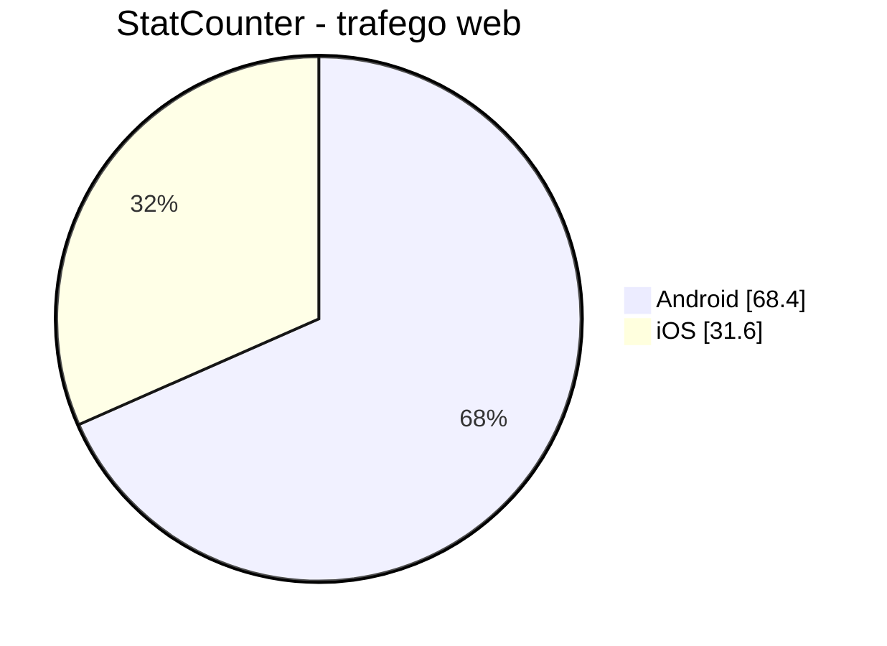
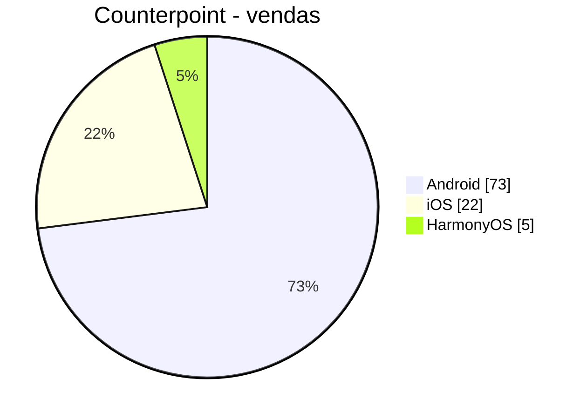
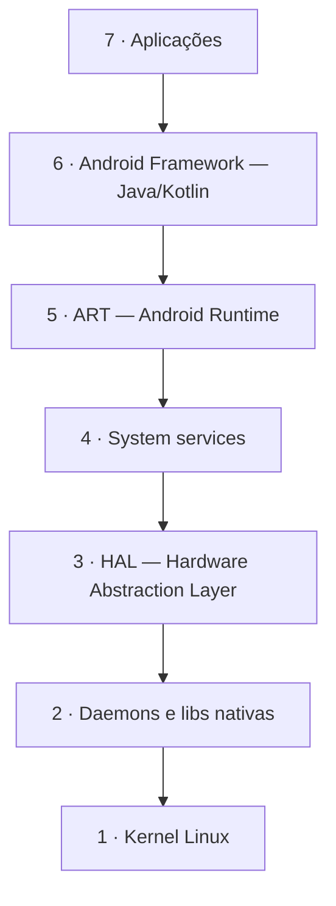
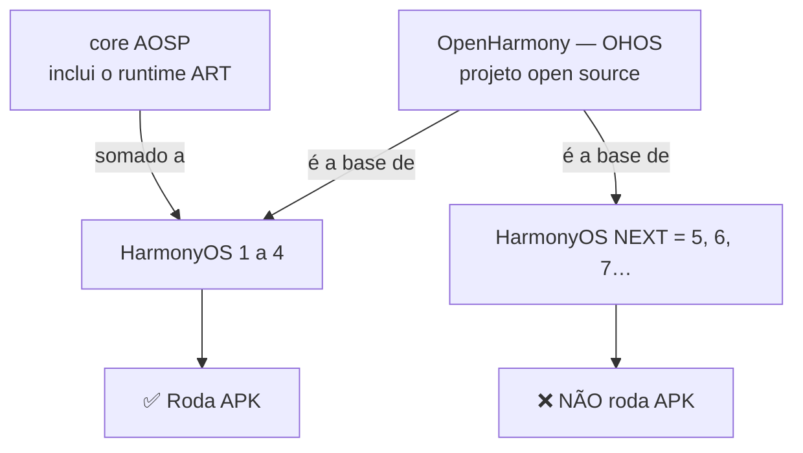
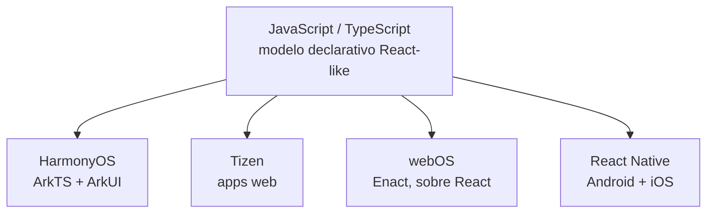
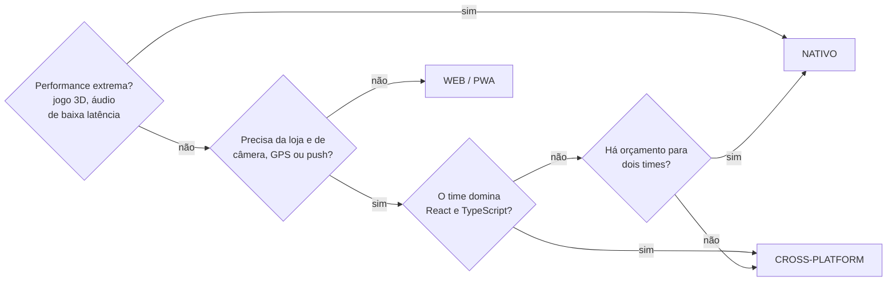
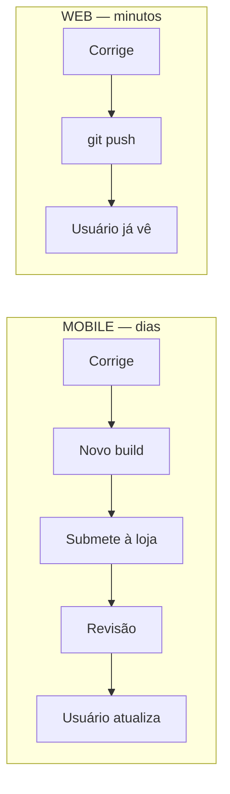
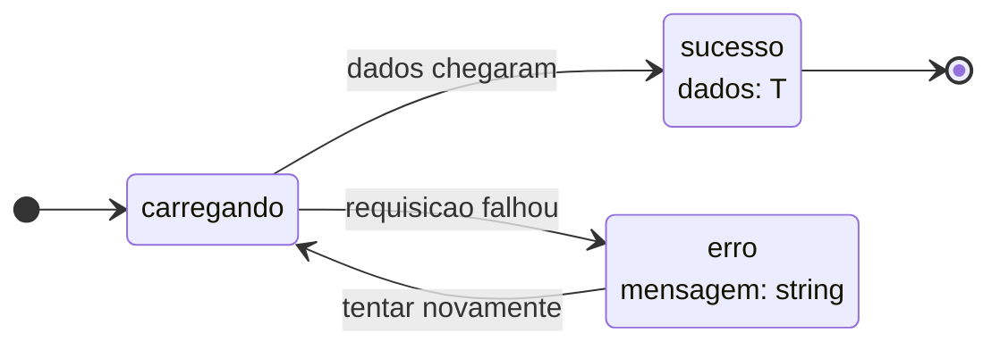

<!--
Slides em Markdown compatíveis com Marp.
Para exportar:  npx @marp-team/marp-cli@latest presentation.md -o aula1.pdf
Os blocos de comentário HTML são notas do apresentador (não aparecem no slide).

>>> PARA PROJETAR EM SALA, USE `presentation.html` (reveal.js). <<<
Este arquivo .md é a fonte em Markdown, para leitura rápida no editor e para
quem preferir Marp. O Marp NÃO renderiza blocos ```mermaid nativamente — os
diagramas aparecem como código. A versão HTML renderiza tudo e ainda tem
modo apresentador, visão geral e navegação por teclado.

ESCOPO: React Native (framework, arquitetura, hands-on) NÃO faz mais parte
desta aula — migrou para a Aula 2. Aqui ficam plataformas, TypeScript e o
checkpoint conceitual. Este arquivo espelha slide a slide o presentation.html
(45 slides).
-->

# Desenvolvimento Mobile

## Aula 1 — Plataformas Móveis, TypeScript e React Native

CESAR School · 2026.2

<!--
Gancho de abertura no próximo slide.
Antes de começar: confirmar que todo mundo tem Node instalado —
quem não tiver, resolver AGORA, não no bloco de hands-on.
-->

---

<!-- _class: lead -->

## Vocês já sabem construir uma aplicação com TypeScript.

### Hoje vamos levar isso para dentro do bolso de bilhões de pessoas.

<!--
Enfatizar: o repertório deles transfere quase inteiro.
TS, componentes, estado, consumo de API — tudo continua valendo.
O que é novo é a PLATAFORMA, não a linguagem.
-->

---

## Agenda — 3 horas

| Bloco | Tempo |
|---|---|
| Abertura: disciplina e projetos | 15 min |
| **1.** Panorama das plataformas móveis | 45 min |
| ☕ Intervalo | 10 min |
| **2.** TypeScript com olhos de mobile | 35 min |
| **3.** Checkpoint conceitual | 10 min |
| Fechamento | 5 min |

---

## O projeto da disciplina

Ao longo do semestre, cada estudante constrói **um** app:

- 🧘 **Rastreador de Micro-hábitos e Condicionamento Físico** — `habit-tracker-expo`

### Hoje: todo mundo cria o projeto Expo que vai usar a partir da próxima aula.

<!--
O repositório já existe com a branch feature/ads025_2026-2, README
e TODOs no App.tsx.
-->

---

## Ao final da aula você deve conseguir

1. **Comparar** as 5 plataformas: Android, iOS, HarmonyOS, Tizen, webOS
2. **Justificar** nativo vs. cross-platform vs. web a partir de restrições reais
3. **Modelar** um domínio em TypeScript: props, estado, unions, generics

---

# Parte 1
## Plataformas Móveis

---

## Quanto vale cada plataforma?

### StatCounter — jul/2026 *(mede tráfego web)*

| | Mundo | Brasil |
|---|---|---|
| Android | **68,4%** | **77,6%** |
| iOS | 31,6% | 22,4% |

### Counterpoint — Q1/2026 *(mede vendas de aparelhos)*

| Android | iOS | **HarmonyOS** |
|---|---|---|
| ~73% | ~22% | **~5%** |

<!--
NÃO explicar ainda. Mostrar os dois quadros e passar para o próximo slide.
A pergunta vem antes da resposta.
-->

---

## O mesmo mercado, duas fotografias





<!--
Perguntar apontando para o gráfico da esquerda:
"Onde está o HarmonyOS aqui?"
A AUSÊNCIA é o argumento. Deixar o silêncio trabalhar.
-->

---

<!-- _class: lead -->

# Os dois estão certos.
# Por que discordam?

<!--
PAUSA de verdade — 60 segundos. Não entregar a resposta.
Conduzir com perguntas:
 - "O que o StatCounter conta exatamente?"
 - "Se eu navego mais, eu peso mais?"
 - "Um aparelho Huawei sem serviços Google — como ele se identifica?"
-->

---

## Metodologia

- **Tráfego web** conta *page views* — quem navega mais, pesa mais
- **Vendas** contam aparelhos que saíram da loja neste trimestre
- **Base instalada** seria uma terceira coisa, diferente das duas

> **StatCounter não desagrega HarmonyOS.**
> Aparelhos Huawei são classificados como "Android" ou "outros" pelo *user-agent*.
> Uma plataforma com ~5% do mercado global fica **invisível**.

### 🎯 Saiba o que o número mede antes de decidir com base nele.

---

## Android

| | |
|---|---|
| **Dono** | Google / AOSP — **open source** |
| **Versão** | 17 "Cinnamon Bun" · API 37 *(jun/2026)* |
| **Linguagem** | **Kotlin** *(Kotlin-first desde 2019)* |
| **UI** | Jetpack Compose *(declarativo)* |
| **IDE** | Android Studio |
| **Play Store** | `targetSdk` ≥ 36 a partir de 31/ago/2026 |

### Dor característica: **fragmentação**

Muitos fabricantes · muitas versões em uso · muitos tamanhos de tela

---

## Android — arquitetura (AOSP atual: 7 camadas)



⚠️ Material antigo mostra **5** camadas. O AOSP hoje documenta **7**.

<!--
Destacar a HAL: é o contrato que permite o mesmo Android rodar em milhares
de aparelhos. O fabricante implementa a HAL; as camadas de cima não sabem
de nada. É a resposta técnica para "como um SO serve tanta gente".
-->

---

## iOS

| | |
|---|---|
| **Dono** | Apple — **fechado**, verticalmente integrado |
| **Versão** | 26.6 *(jul/2026)* · **iOS 27** em beta |
| **Linguagem** | **Swift** |
| **UI** | SwiftUI *(UIKit segue suportado)* |
| **IDE** | Xcode 26.6 — **só roda em macOS** |
| **App Store** | build com Xcode 26+ desde abr/2026 |

**Vantagem:** consistência — poucos aparelhos, atualização rápida
**Restrição prática:** sem Mac, sem desenvolvimento nativo iOS

---

## ⚠️ Sobre aquele diagrama de 4 camadas do iOS

Você vai encontrar em todo lugar:

`Cocoa Touch` → `Media` → `Core Services` → `Core OS`

**Ele vem de um documento da Apple que está arquivado.**

A documentação atual não organiza o iOS assim — descreve o núcleo
Darwin/XNU e os frameworks por domínio.

> Use como **modelo conceitual histórico**, não como arquitetura vigente.

<!--
Vale um minuto: mostra à turma que material didático envelhece, inclusive
o que "todo mundo" reproduz. Bom momento para incentivar checar a fonte.
-->

---

<!-- _class: lead -->

# OpenHarmony / HarmonyOS

# ⚠️ São TRÊS coisas diferentes

### Este é o erro mais comum do assunto.

---

## Os três nomes

| Nome | O que é | Roda APK? |
|---|---|---|
| **OpenHarmony** (OHOS) | Projeto **open source**, OpenAtom Foundation *(2020)* — a base técnica | — |
| **HarmonyOS 1–4** | Produto Huawei = OpenHarmony **+ core AOSP** | ✅ **Sim** |
| **HarmonyOS NEXT** = HarmonyOS 5 *(out/2024)* **e superiores** | Produto Huawei **sem** AOSP | ❌ **Não** |

### A Huawei quebrou a compatibilidade com Android de propósito.

Sem ART, sem camada de compatibilidade. Todo app é **reescrito**.

---

## A diferença está em uma peça só



<!--
Apontar para a caixa do AOSP: é a ÚNICA diferença estrutural.
Presente → roda APK. Ausente → não roda.
-->

---

## HarmonyOS — a stack

| | |
|---|---|
| **Linguagem** | **ArkTS** — *superset do TypeScript* |
| **UI** | ArkUI *(declarativo)* |
| **Compilador** | ArkCompiler *(AOT)* |
| **IDE** | DevEco Studio *(gratuita)* |
| **Versões** | HarmonyOS 6 · SDK 6.1.1 (API 24) · **7 em dev beta** |
| **OpenHarmony** | 6.1 LTS *(mar/2026)* |

### Mercado

**China, Q1/2026: ~19–20%** — à frente do iOS pelo **7º trimestre seguido**
Global: ~5%

---

<!-- _class: lead -->

# A plataforma móvel que cresce mais rápido no mundo

# escolheu **TypeScript** como base da sua linguagem oficial.

<!--
MOMENTO-CHAVE DA AULA. Amarra a Parte 1 na Parte 2 e dá peso real à
revisão de TS que vem a seguir. A aposta deles em TS não é sobre React
Native — é sobre uma tendência de indústria.
Pausar aqui. Deixar assentar.
-->

---

## Tizen (Samsung) — o que ele NÃO é mais

### ❌ Não é o sistema dos celulares Samsung

Celulares Samsung rodam **Android**.

### ❌ Não é mais o sistema dos smartwatches Samsung

Desde o Galaxy Watch 4 *(2021)*: **Wear OS**.
Suporte aos relógios Tizen encerrado no fim de 2025.

<!--
Esta é a correção factual mais provável de gerar surpresa na turma.
Perguntar antes: "Quem aqui acha que o Galaxy Watch roda Tizen?"
-->

---

## Tizen — onde ele realmente vive

**Smart TVs · monitores · signage · eletrodomésticos · IoT**

| | |
|---|---|
| **Versão** | Tizen 10.0 · SDK 10 *(fev/2026)* |
| **Linguagem** | **Web** — HTML/CSS/JS *(engine V8)* |
| **Também** | .NET/Xamarin, C/C++ nativo |
| **Tooling** | migrou de Java para **Node.js + TypeScript**, em VS Code |

> Uma versão maior por ano, junto com a linha de TVs.

---

## webOS (LG)

| | |
|---|---|
| **Onde vive** | TVs LG, monitores, projetores, signage, automotivo |
| **webOS Hub** | licenciado para **200+ marcas** *(Konka, Aiwa, Hyundai…)* |
| **Versão** | webOS TV 26 · engine **Chromium 132** |
| **Linguagem** | **Web** — HTML/CSS/JS |
| **Framework oficial** | **Enact — construído sobre React** |
| **Novidade** | Flutter para webOS agora suportado |
| **SDK** | webOS Studio *(VS Code)*, CLI, Simulator |

---

## Comparativo

| | Android | iOS | HarmonyOS | Tizen | webOS |
|---|---|---|---|---|---|
| **Dono** | Google | Apple | Huawei | Samsung | LG |
| **Modelo** | Aberto | Fechado | Misto | Aberto | OSE aberto |
| **Linguagem** | Kotlin | Swift | **ArkTS** | **Web** | **Web** |
| **UI** | Compose | SwiftUI | ArkUI | Web | **Enact/React** |
| **Onde roda** | Tudo | Apple | Celular, IoT | **TV, IoT** | **TV, auto** |
| **Global** | ~68–73% | ~22–32% | ~5% | nicho | nicho |
| **APK?** | ✅ | ❌ | ❌ | ❌ | ❌ |

<!--
Construir na lousa COM a turma antes de mostrar este slide.
Perguntar coluna por coluna. A tabela pronta é conferência, não descoberta.
-->

---

<!-- _class: lead -->

# 3 das 5 plataformas usam **JS/TS**

HarmonyOS → ArkTS *(superset de TS)*
Tizen → apps web, tooling em TS
webOS → **Enact, sobre React**

### Não é coincidência. É a razão desta disciplina existir.

---

## Uma linguagem, quatro destinos



---

## Nativo, cross-platform ou web?

| | **Nativo** | **Cross-platform** | **Web/PWA** |
|---|---|---|---|
| **Performance** | máxima | muito boa | limitada |
| **Código** | 2 bases | **1 base** | 1 base |
| **Custo** | alto | médio | baixo |
| **Hardware** | total | quase total | restrito |
| **Loja** | sim | sim | não |
| **Quando** | jogos, câmera, áudio de baixa latência | **maioria dos apps de produto** | alcance máximo, orçamento mínimo |

### Escolha pela **restrição mais dura** — não pela tecnologia mais legal.

---

## Árvore de decisão



<!--
Enfatizar: cada losango é uma RESTRIÇÃO do projeto, não uma preferência.
Avisar que esta árvore é a ferramenta da Prática 3 (practice.md).
-->

---

# Parte 2
## TypeScript, com olhos de mobile

### Vocês já usam TS com Node, Express e Next.
### A sintaxe é a mesma. O que muda é o **peso** de cada recurso.

---

## Por que TS pesa mais no mobile

### No web, um bug em produção:

`git push` → resolvido em 10 minutos

### No mobile:

1. Corrige o código
2. Gera novo build
3. Submete para a loja
4. **Espera a revisão** *(horas a dias)*
5. Espera o usuário **atualizar o app**

> O mesmo `undefined is not an object` custa **uma semana**.
> E o usuário final não tem console para te contar o que aconteceu.

---

## O caminho de um bug até o usuário



### Duas dessas etapas não dependem de você.

---

## `type` vs `interface`

```ts
// interface — formas de objeto extensíveis
interface Usuario {
  id: string;
  nome: string;
}
interface Instrutor extends Usuario {
  especialidade: string;
}

// type — uniões, tuplas, funções, utilitários
type StatusHabito = 'pendente' | 'concluido' | 'pulado';
type Duracao = [inicio: string, fim: string];
```

**Regra prática:** `interface` para objetos, `type` para o resto.
Não é regra técnica — é **consistência**.

---

## Antes de ver a solução: uma analogia

Num restaurante existem dois jeitos de pedir:

- **Cardápio fechado** — você escolhe entre os pratos listados. Pediu algo que não existe? O garçom avisa **na hora**.
- **"Traga o que você tiver"** — o garçom aceita qualquer pedido e leva pra cozinha. Só lá — às vezes só quando chega errado à mesa — descobre-se que aquilo não existe.

### Guarde essa imagem. Já voltamos a ela.

<!--
Apresentar esta analogia ANTES do código, não como recurso de
emergência se a turma travar. É o gancho mental que sustenta o
conceito nos próximos dois slides.
-->

---

## Union literais — o recurso mais importante de hoje

```ts
// ❌ status: string — o "traga o que você tiver"
habito.status = 'conclído';      // faltou um "u"
habito.status = 'Pendente';      // maiúscula
habito.status = 'em espera';     // 🤷 valor que ninguém combinou

if (habito.status === 'finalizado') { /* nunca roda, ninguém avisa */ }
```

### Todos esses **compilam sem reclamar**.

<!--
Perguntar: "Quantos de vocês já perderam uma tarde por causa de um
desses?" Quase todo mundo levanta a mão.
-->

---

## A solução

```ts
type StatusHabito = 'pendente' | 'concluido' | 'pulado';

interface Habito {
  status: StatusHabito;
}

habito.status = 'conclído';  // 🔴 erro de compilação
```

### 🍽️ Analogia — o cardápio (retomando)

`string` = "traz o que eu pedir"
Union literal = **cardápio fechado** — só 3 pratos, e o garçom avisa **antes** da cozinha errar

---

## Bônus: exaustividade automática

```ts
function rotuloStatus(status: StatusHabito): string {
  switch (status) {
    case 'pendente':   return 'Pendente';
    case 'concluido':  return 'Concluído';
    case 'pulado':     return 'Pulado';
  }
}
```

### Amanhã alguém adiciona `'atrasado'` ao tipo…

→ **este `switch` passa a dar erro** até você tratar o novo caso.

> O compilador vira uma lista de tarefas automática.

---

## Estado de tela — o jeito frágil

```ts
const [loading, setLoading] = useState(false);
const [habito, setHabito]   = useState<Habito | null>(null);
const [erro, setErro]       = useState<string | null>(null);
```

### Nada impede o estado impossível:

```
loading = true   E   erro = "falhou"   E   habito = {...}
```

### O que a tela mostra?

<!--
Perguntar em voz alta. Deixar o silêncio incomodar um pouco.
Todos já escreveram esse bug.
-->

---

## União discriminada — o jeito robusto

```ts
type EstadoTela<T> =
  | { tipo: 'carregando' }
  | { tipo: 'sucesso'; dados: T }
  | { tipo: 'erro'; mensagem: string };

const [estado, setEstado] =
  useState<EstadoTela<Habito>>({ tipo: 'carregando' });
```

```tsx
switch (estado.tipo) {
  case 'carregando': return <ActivityIndicator />;
  case 'sucesso':    return <CardHabito habito={estado.dados} />;  // ✅
  case 'erro':       return <Erro texto={estado.mensagem} />;      // ✅
}
```

> Os estados impossíveis deixaram de ser **representáveis**.

---

## Três estados. Exatamente três.



### Não existe seta para "carregando **e** com erro".

> Aqui `T` é **um único** `Habito` — sem lista. Listas — `FlatList` e `SectionList` — serão vistas nas **próximas aulas**.

---

## Tipando props

```tsx
type CardHabitoProps = {
  titulo: string;
  status: StatusHabito;
  onPress: () => void;
  destacado?: boolean;          // opcional
};

export function CardHabito({
  titulo, status, onPress,
  destacado = false,            // default
}: CardHabitoProps) {
  /* ... */
}
```

- `children: React.ReactNode` para componentes que envolvem outros
- 📌 **React 19:** `ref` é prop normal — `forwardRef` não é mais necessário

---

## Generics: os dois lugares onde você vai encontrá-los

```ts
// 1. useState<T> — quando o valor inicial não revela o tipo
const [habito, setHabito]   = useState<Habito | null>(null);
const [streak, setStreak]   = useState(0);   // aqui inferir basta

// 2. Funções que embrulham chamadas de API
async function buscarJson<T>(url: string): Promise<T> {
  const r = await fetch(url);
  if (!r.ok) throw new Error(`Falha: ${r.status}`);
  return r.json() as Promise<T>;
}

const habito = await buscarJson<Habito>('/habito-do-dia');
```

⚠️ Aquele `as Promise<T>` é uma **promessa**, não uma verificação.
*(Voltaremos a isso na integração com API — Zod/Valibot)*

---

## Utility types — uma fonte de verdade

```ts
interface Habito {
  id: string; titulo: string;
  categoria: CategoriaHabito; frequencia: FrequenciaHabito;
  status: StatusHabito; streakDias: number; criadoEm: string;
}

// o formulário não envia id/status/streakDias/criadoEm — o servidor gera
type NovoHabito = Omit<Habito, 'id' | 'status' | 'streakDias' | 'criadoEm'>;

// o card da tela só precisa de 4 campos
type ResumoHabito = Pick<Habito, 'id' | 'titulo' | 'status' | 'categoria'>;

type AtualizacaoHabito = Partial<NovoHabito>;
```

### Existe **um** tipo. Os outros são **derivados**.

Adicione um campo à entidade → os derivados acompanham sozinhos.

---

## O que evitar

```ts
// ❌ any desliga o compilador
function processar(dados: any) {
  return dados.qualquer.coisa;   // compila, explode em runtime
}

// ❌ assertion: "confia em mim" — não gera verificação nenhuma
const habito = resposta as Habito;

// ✅ type guard: "eu verifiquei" — gera verificação de verdade
function ehHabito(v: unknown): v is Habito {
  return typeof v === 'object' && v !== null
      && 'id' in v && 'titulo' in v && 'status' in v;
}
```

> `any` não é um tipo flexível. É **abrir mão da verificação**.

---

## ⚠️ Aviso de ambiente: TypeScript 7

### Julho/2026: compilador reescrito em **Go** — **8 a 12× mais rápido**

Type-check do VS Code: ~126s → **~11s**

### Mas: TS 7.0 **ainda não expõe API programática**

`typescript-eslint` · `ts-jest` · `ts-morph` · Vue/Svelte/Astro → **não funcionam**

*(API prevista para o TS 7.1)*

## 👉 Nesta disciplina: fixe o TypeScript na linha **6.x**

> Lição de engenharia: uma versão pode ser tecnicamente superior
> e ainda **não estar pronta** para o seu projeto.

---

# Parte 3
## Checkpoint

### 60 segundos em duplas para cada pergunta

<!--
NÃO PULAR ESTE BLOCO mesmo se estiver atrasado.
Se a turma não souber responder 1 e 3, o resto da aula não gruda.
Melhor voltar 10 minutos do que avançar sobre areia.
-->

---

## Checkpoint

1. Diferença entre **OpenHarmony**, **HarmonyOS 4** e **HarmonyOS NEXT**?
   Qual roda APK?

2. Startup, app de leitura de QR code, **2 devs que sabem TS**, prazo de **2 meses**.
   Nativo, cross-platform ou web? Justifique com **duas** restrições.

3. Por que `status: 'pendente' | 'concluido' | 'pulado'` é melhor que `status: string`?
   **Dê um bug** que o primeiro previne.

4. **Tizen roda em celulares hoje?**

---

## Fechamento

> Vocês já sabiam modelar uma entidade com TypeScript.
> Hoje ela ganhou um destino. **O tipo não mudou — a plataforma mudou.**

### Para a próxima aula

- **Instalar:** Node.js **22.11+** e o app **Expo Go** no celular *(o hands-on da Aula 2 começa com o projeto rodando no seu aparelho)*
- **Ler:** Cap. 1 — História do Desenvolvimento do React Native · TypeScript Handbook — *Narrowing*
- **Fazer:** Exercícios 1 a 6 em `exercises.md` · Práticas 1 a 3 em `practice.md`

### Aula 2 — React Native: o que é, o que não é, e o projeto rodando no seu celular.

`student-notes.md` · `exercises.md` · `practice.md`

<!--
Fechar o arco: retomar a frase de abertura ("levar o TypeScript de vocês
para dentro do bolso de bilhões de pessoas") e mostrar que hoje foi
construído o terreno — plataformas e modelagem — e a tela vem na Aula 2.

Insistir no item "instalar": quem chegar na Aula 2 sem Node 22.11+ perde
o hands-on inteiro. Não há tempo para instalar Node em sala.
-->
