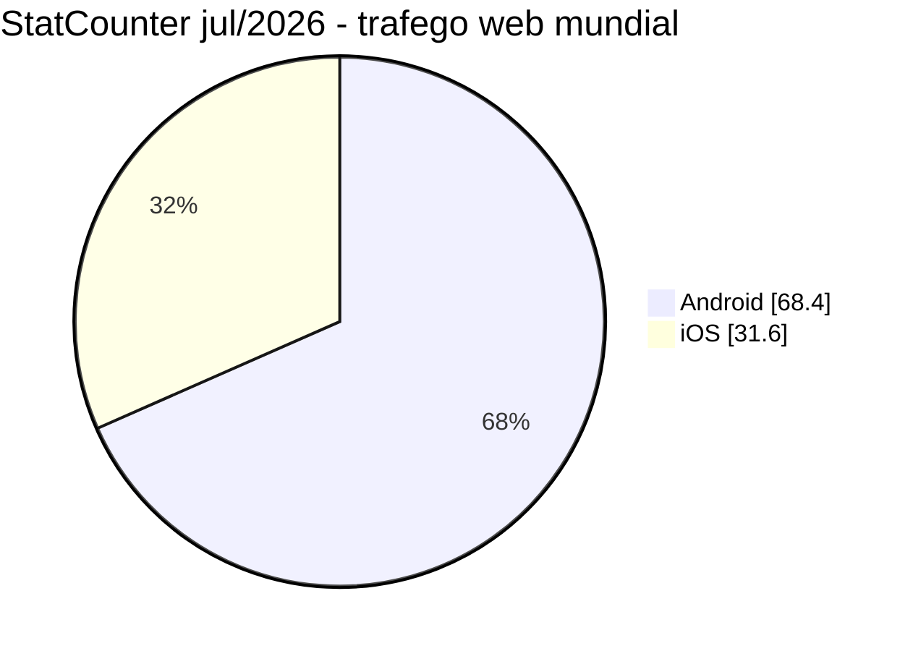
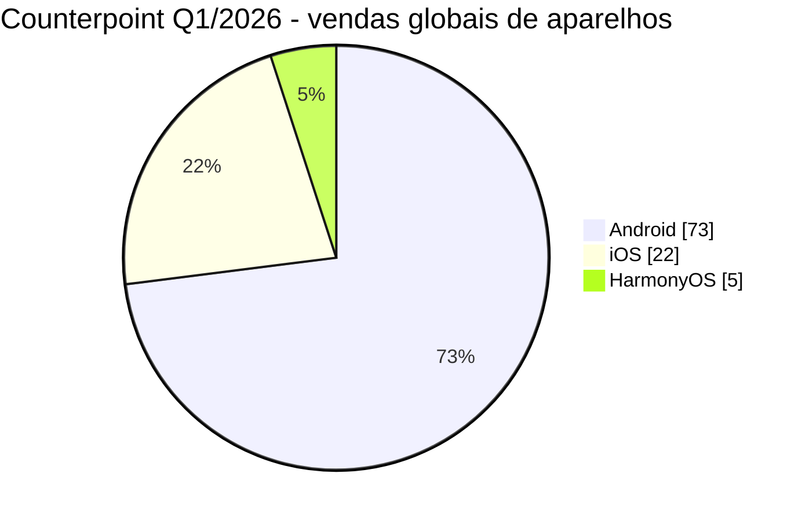
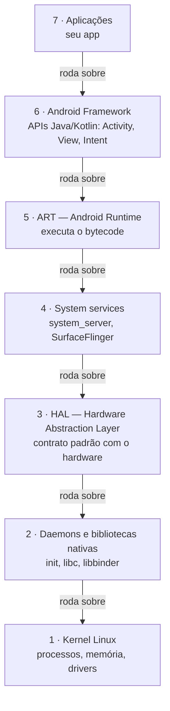
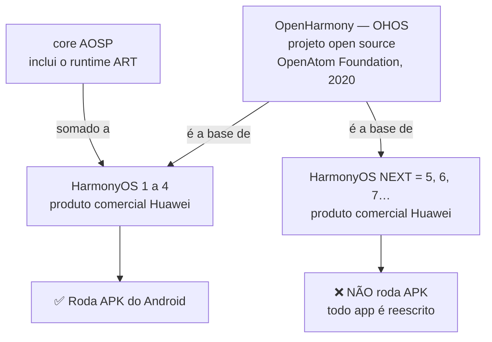
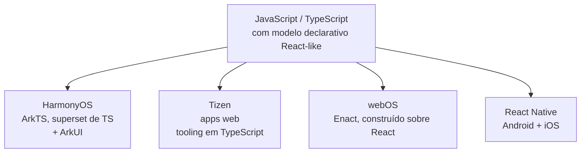
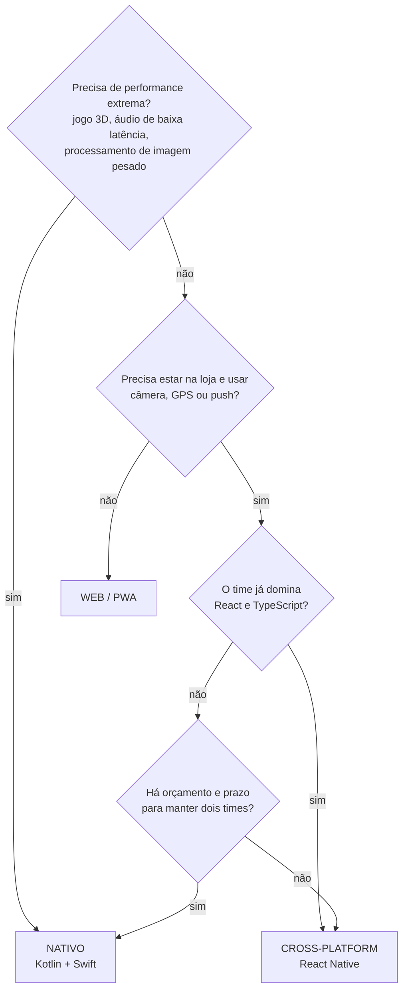
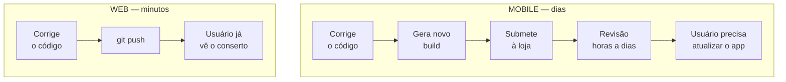
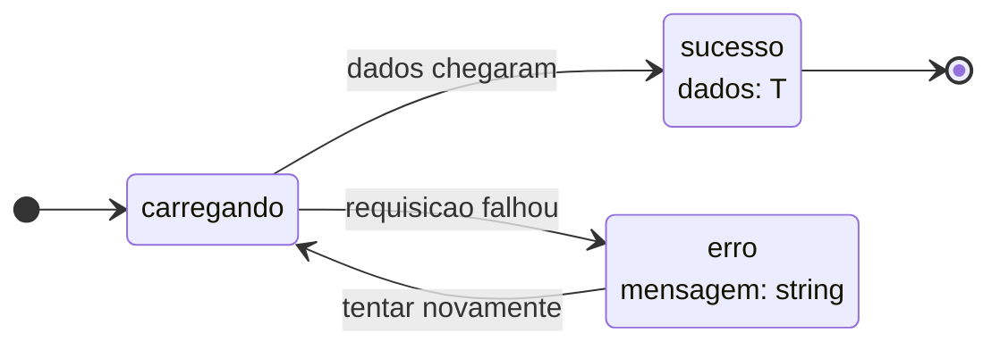

# Notas de Estudo — Aula 1: Plataformas Móveis e TypeScript

> **Disciplina:** Desenvolvimento Mobile (2026.2.DM) — CESAR School
> **Dados de versões e mercado:** conferidos em **7 de agosto de 2026**. Este material envelhece rápido; as fontes estão no final para você conferir por conta própria.

---

## Visão geral

Esta aula responde duas perguntas:

1. **Onde meu app vai rodar?** → panorama das plataformas móveis e embarcadas.
2. **Com que ferramenta eu descrevo esse app?** → TypeScript, revisado com foco em mobile.

A terceira pergunta — **"como eu escrevo uma interface nativa sem escrever Kotlin e Swift?"** — é o assunto da **Aula 2**, quando React Native entra em cena. Aqui construímos o terreno: que plataformas existem, como se decide entre elas, e como modelar o domínio de um app antes de haver qualquer tela.

O fio condutor: você **já sabe** o essencial. TypeScript, componentes, estado, consumo de API — tudo isso transfere do web para o mobile quase intacto. O que muda é a **plataforma** embaixo.

> 📱 **Sobre os exemplos deste material:** o domínio usado nos exemplos de código é o **Rastreador de Micro-hábitos e Condicionamento Físico** — o projeto que você constrói ao longo do semestre, no repositório `habit-tracker-expo`.

---

# Parte 1 — Plataformas móveis

## 1.1 O mercado: dois números certos que discordam

Duas medições, dois resultados:

**StatCounter — julho de 2026** (mede *tráfego web*, por user-agent):

| Sistema | Mundo | Brasil |
|---|---|---|
| Android | 68,4% | 77,6% |
| iOS | 31,6% | 22,4% |
| Outros (Linux, KaiOS…) | ~0,03% | — |



**Counterpoint Research — Q1 de 2026** (mede *vendas de aparelhos*):

| Sistema | Global |
|---|---|
| Android | ~73% |
| iOS | ~22% |
| **HarmonyOS** | **~5%** |



> **Leitura dos gráficos:** os dois medem o mesmo mercado e chegam a fatias diferentes. No segundo, o HarmonyOS aparece com ~5%; no primeiro, ele simplesmente **não existe como categoria**.

### Por que discordam?

Porque medem coisas diferentes:

- **Tráfego web** conta *page views*. Um usuário que navega muito "pesa" mais que um que navega pouco. E usuários de iOS historicamente geram mais tráfego por aparelho — o que infla o iOS nessa metodologia.
- **Vendas** contam aparelhos que saíram da loja neste trimestre. Não diz nada sobre a base instalada (aparelhos antigos ainda em uso).
- **Base instalada** seria uma terceira coisa, diferente das duas.
- E o detalhe mais interessante: **StatCounter não desagrega HarmonyOS**. Aparelhos Huawei acabam classificados como "Android" ou "outros" pelo user-agent. Uma plataforma com ~5% do mercado global fica **invisível** nessa medição.

> 🎯 **A lição que fica:** antes de usar um número de market share para decidir plataforma, saiba **o que ele mede**. Ninguém está mentindo — as perguntas são diferentes.

---

## 1.2 Android

- **Quem governa:** Google, através do **AOSP** (Android Open Source Project) — código aberto, adotado por dezenas de fabricantes.
- **Versão atual:** **Android 17**, codinome "Cinnamon Bun", **API level 37**, estável desde 16/jun/2026.
- **Linguagem oficial:** **Kotlin** (política *Kotlin-first* desde 2019). Java ainda funciona, mas não é mais o caminho recomendado.
- **UI moderna:** **Jetpack Compose** — declarativo, conceitualmente próximo do React.
- **IDE:** Android Studio.
- **Publicação:** Google Play exige `targetSdk` 36 ou superior para apps novos e atualizações a partir de 31/ago/2026.

### Arquitetura em camadas (modelo atual do AOSP)

Muito material antigo mostra 5 camadas. A documentação atual do AOSP descreve **7**, de baixo para cima:



> **Leitura do diagrama:** sete camadas empilhadas, cada uma rodando sobre a de baixo. Seu app está no topo e nunca fala diretamente com o kernel.

**O papel da HAL merece atenção:** ela é o contrato que permite ao mesmo Android rodar em milhares de aparelhos diferentes. O fabricante implementa a HAL para o hardware dele; as camadas de cima não precisam saber de nada.

- **Dor característica:** **fragmentação**. Muitos fabricantes, muitas versões de SO em uso simultâneo, muitos tamanhos de tela. Testar é mais caro.

---

## 1.3 iOS

- **Quem governa:** Apple. Sistema **fechado**, verticalmente integrado — a mesma empresa faz o chip, o aparelho, o SO, a IDE e a loja.
- **Versão atual:** **iOS 26.6** (jul/2026). **iOS 27** foi anunciado na WWDC de junho/2026, com lançamento público previsto para setembro/2026.
- **Linguagem oficial:** **Swift**. **UI:** SwiftUI (declarativo) — UIKit segue suportado e interoperável.
- **IDE:** **Xcode 26.6** (traz Swift 6.3). Xcode 27 em beta.
- **Restrição prática que afeta você:** Xcode **só roda em macOS**. Desenvolvimento nativo iOS exige um Mac.
- **Publicação:** desde 28/abr/2026, uploads para a App Store precisam ser compilados com **Xcode 26 ou superior**.

### Sobre o diagrama de 4 camadas do iOS

Você vai encontrar em muitos lugares o diagrama **Cocoa Touch → Media → Core Services → Core OS**. Ele vem do documento *iOS Technology Overview* da Apple, que hoje está **arquivado**. A documentação atual da Apple não organiza o sistema assim; descreve o núcleo Darwin/XNU e os frameworks por domínio.

Use o diagrama se ele ajudar a pensar, mas saiba que é um **modelo histórico/conceitual**, não a arquitetura oficial vigente.

- **Vantagem característica:** consistência. Poucos aparelhos, adoção rápida de novas versões, comportamento previsível.
- **Dor característica:** curadoria da App Store e dependência do ecossistema Apple.

---

## 1.4 OpenHarmony / HarmonyOS (OHOS)

⚠️ **Aqui está a confusão mais comum do assunto.** São **três coisas diferentes**:

| Nome | O que é | Roda APK do Android? |
|---|---|---|
| **OpenHarmony (OHOS)** | Projeto **open source**, governado pela **OpenAtom Foundation** desde set/2020. É a base técnica. | — (é a base, não um produto) |
| **HarmonyOS 1–4** | Produto comercial da Huawei = OpenHarmony **+ core AOSP** | ✅ **Sim** |
| **HarmonyOS NEXT** (= HarmonyOS 5, out/2024) **e superiores** | Produto Huawei **sem** core AOSP | ❌ **Não** |



> **Leitura do diagrama:** o OpenHarmony é a base dos dois produtos. A diferença está no core AOSP: o HarmonyOS 1–4 o incluía e por isso rodava APK; o NEXT o removeu e por isso não roda.

**Consequência prática enorme:** a partir do HarmonyOS NEXT, a Huawei quebrou a compatibilidade com Android de propósito. Não há ART, não há camada de compatibilidade, APKs de terceiros são rejeitados. Todo app precisa ser **reescrito nativamente** para a plataforma.

### A stack de desenvolvimento

- **ArkTS** — a linguagem oficial. É um **superset do TypeScript**: tipagem estática, declarativa, compilada AOT. Se você sabe TS, está a poucos passos de ler ArkTS.
- **ArkUI** — framework de UI declarativa.
- **ArkCompiler** — compila JS/TS/ArkTS para código de máquina (AOT).
- **DevEco Studio** — IDE oficial, gratuita (Windows/macOS).
- **Cangjie** — linguagem mais recente da Huawei, coexistindo com ArkTS.

### Versões e mercado

- **HarmonyOS 6** — versão ao consumidor (out/nov de 2025). **HarmonyOS 7** teve Developer Beta no HDC de junho/2026, com foco em "agentic AI"; release ao consumidor previsto para o outono de 2026.
- **SDK mais recente:** HarmonyOS 6.1.1 (API 24), jul/2026.
- **OpenHarmony:** 6.1 (mar/2026), versão LTS recomendada.
- **Mercado na China (Q1/2026):** HarmonyOS **~19–20%**, à frente do iOS (~16–17%) pelo **7º trimestre consecutivo**. Global: ~5%.

> 💡 **Por que isto aparece numa disciplina de desenvolvimento mobile com TypeScript?** Porque a plataforma móvel que cresce mais rápido no mundo escolheu **TypeScript** como base da sua linguagem oficial. Não é coincidência: tipagem estática + sintaxe declarativa + ecossistema gigante é uma combinação difícil de bater. A aposta que você faz aprendendo TS vale em mais de uma plataforma.

---

## 1.5 Tizen (Samsung)

**Primeiro, o que Tizen NÃO é mais:**

- ❌ **Não é o sistema dos celulares Samsung.** Os celulares Samsung rodam **Android**. Tizen foi descontinuado em smartphones anos atrás.
- ❌ **Não é mais o sistema dos smartwatches Samsung.** A partir do Galaxy Watch 4 (2021), a Samsung migrou para **Wear OS**. O suporte aos relógios Tizen antigos foi encerrado ao final de 2025.

**Onde Tizen realmente vive hoje:** Smart TVs, monitores, *digital signage*, eletrodomésticos e IoT. A Samsung lança uma versão maior por ano, junto com a linha de TVs.

- **Versão atual:** **Tizen 10.0** (TVs modelo 2026), SDK 10 (fev/2026).
- **Linguagem principal:** **aplicações web** — HTML, CSS, JavaScript. Engine JS: V8. Há também .NET/Xamarin e C/C++ nativo para casos específicos.
- **Detalhe curioso e revelador:** o tooling do Tizen SDK 10 abandonou as ferramentas em Java e passou a rodar sobre **Node.js + TypeScript**, integrado como extensão do **VS Code**.

---

## 1.6 webOS (LG)

- **Onde vive:** Smart TVs LG, monitores, projetores, *signage*, automotivo — e **webOS Hub**, a versão licenciada para terceiros, adotada por **mais de 200 marcas** (Konka, Blaupunkt, Aiwa, Hyundai, entre outras).
- **Versão atual:** **webOS TV 26** (modelos 2026), com engine **Chromium 132**. Para comparação: webOS TV 25 usava Chromium 120; a 22, Chromium 87.
- **Linguagem:** **web** — HTML, CSS, JavaScript.
- **Framework oficial: Enact**, construído **sobre React**, com componentes pensados para tela grande e navegação por controle remoto.
- **Novidade:** **Flutter para webOS TV** passou a ser oficialmente suportado.
- **SDK:** webOS Studio (extensão do VS Code), webOS CLI, webOS TV Simulator, Beanviser (profiling).
- Existe também o **webOS OSE** (Open Source Edition), ativo.

---

## 1.7 Tabela comparativa consolidada

| | **Android** | **iOS** | **HarmonyOS/OHOS** | **Tizen** | **webOS** |
|---|---|---|---|---|---|
| **Dono** | Google / AOSP | Apple | Huawei / OpenAtom | Samsung | LG |
| **Modelo** | Open source | Fechado | OHOS aberto, HarmonyOS fechado | Open source | OSE aberto |
| **Linguagem oficial** | Kotlin | Swift | **ArkTS** (superset de TS) | Web (JS/TS) | Web (JS) |
| **UI** | Jetpack Compose | SwiftUI | ArkUI | Web | **Enact (React)** |
| **IDE** | Android Studio | Xcode (só macOS) | DevEco Studio | VS Code | VS Code |
| **Versão (ago/2026)** | 17 (API 37) | 26.6 | 6 (7 em beta) | 10.0 | TV 26 |
| **Onde roda** | Celular, tablet, TV, auto, wearable | iPhone, iPad… | Celular, tablet, IoT | **TV, IoT** | **TV, auto** |
| **Mercado** | ~68–73% global | ~22–32% global | ~5% global, ~19% China | Nicho (TV) | Nicho (TV) |
| **Roda APK?** | ✅ | ❌ | ❌ *(NEXT+)* | ❌ | ❌ |

### O padrão que emerge

Três das cinco plataformas usam **JavaScript/TypeScript com um modelo declarativo/React-like** como caminho principal de desenvolvimento:

- HarmonyOS → **ArkTS** (superset de TypeScript) + ArkUI
- Tizen → apps web, tooling em TypeScript
- webOS → **Enact, sobre React**



> **Leitura do diagrama:** a mesma base de linguagem alcança quatro destinos diferentes — três plataformas de sistema operacional e um framework cross-platform.

Isso não é acidente. É a razão pela qual esta disciplina existe e por que ela usa TypeScript.

---

## 1.8 Nativo, cross-platform ou web?

| Abordagem | Vantagens | Desvantagens | Quando escolher |
|---|---|---|---|
| **Nativo** (Kotlin/Swift) | Performance máxima, acesso imediato a APIs novas, UX perfeitamente idiomática | Duas bases de código, dois times ou o dobro do tempo, custo alto | Jogos, câmera/foto avançada, áudio de baixa latência, quando a plataforma é uma só |
| **Cross-platform** (React Native, Flutter) | Uma base de código, um time, entrega rápida, componentes nativos reais | Módulo nativo pode ser necessário para casos exóticos; dependência do framework | **A maioria dos apps de produto** — CRUD, formulários, listas, mapas, autenticação |
| **Web / PWA** | Zero instalação, deploy instantâneo, custo mínimo | Acesso limitado a hardware, sem presença na loja, restrições no iOS | Alcance máximo, orçamento mínimo, conteúdo mais que interação |

**Como decidir, na prática:** liste as **restrições** do projeto (público-alvo, hardware que você precisa acessar, prazo, tamanho e habilidades do time, orçamento) e veja qual coluna as satisfaz. Não escolha pela tecnologia "mais legal" — escolha pela restrição mais dura.



> **Leitura do diagrama:** é uma árvore de decisão, não uma receita. Cada losango é uma **restrição do projeto**, não uma preferência técnica. Note que a mesma pergunta sobre o time leva a caminhos diferentes conforme o orçamento.

---

# Parte 2 — TypeScript, revisado com olhos de mobile

Você já usou TypeScript com Node, Express e Next.js. A sintaxe é a mesma. O que muda é **o peso de cada recurso**.

## 2.1 Por que TS pesa mais no mobile

No web, um bug em produção se corrige com um `git push`. No mobile:

1. Você corrige o código.
2. Gera um novo build.
3. Submete para a loja.
4. **Espera a revisão** (horas a dias).
5. Espera o usuário **atualizar o app**.



> **Leitura do diagrama:** o mesmo bug percorre três etapas no web e cinco no mobile — e duas delas não dependem de você.

Um `undefined is not an object` que no web custaria 10 minutos pode custar uma semana no mobile — e enquanto isso o usuário vê a tela quebrada. **O compilador é a defesa mais barata que existe.** Além disso, o usuário final não tem console do navegador para te contar o que aconteceu.

## 2.2 `type` vs `interface`

```ts
// interface: formas de objeto que podem ser estendidas
interface Usuario {
  id: string;
  nome: string;
  email: string;
}

interface Instrutor extends Usuario {
  especialidade: string;
}

// type: uniões, tuplas, utilitários, funções
type StatusHabito = 'pendente' | 'concluido' | 'pulado';
type Duracao = [inicio: string, fim: string];
type Formatador = (valor: Date) => string;
```

**Regra prática:** `interface` para formas de objeto, `type` para todo o resto. Não é uma regra técnica rígida (as duas se sobrepõem muito) — é uma convenção de **consistência**. Escolha uma e mantenha no projeto todo.

## 2.3 Union types literais — o recurso mais importante desta aula

### Antes de começar: uma analogia

Pense num restaurante. Existem dois jeitos de pedir:

- **Cardápio fechado:** você escolhe entre os pratos que estão listados. Se pedir algo que não existe ali, o garçom avisa **na hora** — antes de a cozinha sequer começar a preparar.
- **"Traga o que você tiver":** você não vê a lista. O garçom aceita o pedido, leva para a cozinha, e só lá — às vezes só quando o prato chega errado à mesa — alguém descobre que aquilo não existe no cardápio.

Guarde essa imagem. Ela é exatamente o que diferencia dois jeitos de tipar um campo em TypeScript — e vamos voltar a ela em um parágrafo.

### O problema

```ts
// ❌ Ruim — o "traga o que você tiver"
interface Habito {
  status: string;  // aceita "pendente", "Pendente", "PENDENTE", "banana", ""
}
```

Com `string`, todos estes bugs **compilam sem reclamar**:

```ts
habito.status = 'conclído';    // faltou um "u" — o backend espera "concluido"
habito.status = 'Pendente';    // maiúscula
habito.status = 'em espera';   // valor que nunca foi combinado com ninguém
if (habito.status === 'finalizado') { /* nunca executa, e ninguém avisa */ }
```

### A solução

```ts
// ✅ Bom — o "cardápio fechado"
type StatusHabito = 'pendente' | 'concluido' | 'pulado';

interface Habito {
  status: StatusHabito;
}

habito.status = 'conclído';  // 🔴 erro de compilação — pego na hora
```

### 🍽️ Analogia — o cardápio (retomando)

`string` é chegar num restaurante e dizer "traz o que eu pedir". Union literal é um **cardápio fechado**: só existem três pratos, e se você pedir outro, o garçom te avisa **antes** da cozinha errar. O compilador está fazendo o papel do garçom.

### Bônus: verificação de exaustividade

```ts
function rotuloStatus(status: StatusHabito): string {
  switch (status) {
    case 'pendente':   return 'Pendente';
    case 'concluido':  return 'Concluído';
    case 'pulado':     return 'Pulado';
  }
}
```

Se amanhã alguém adicionar `'atrasado'` ao tipo, **este `switch` passa a dar erro de compilação** até você tratar o novo caso. O compilador vira uma lista de tarefas automática.

## 2.4 União discriminada — o padrão para estado de tela

Este é o padrão que você vai repetir em toda tela da disciplina.

```ts
// ❌ O jeito frágil: três variáveis que podem se contradizer
const [loading, setLoading] = useState(false);
const [habito, setHabito] = useState<Habito | null>(null);
const [erro, setErro] = useState<string | null>(null);

// Nada impede o estado impossível: loading=true E erro="falhou" E habito={...}
// Qual a tela mostra?
```

```ts
// ✅ O jeito robusto: um estado, com um campo discriminante
type EstadoTela<T> =
  | { tipo: 'carregando' }
  | { tipo: 'sucesso'; dados: T }
  | { tipo: 'erro'; mensagem: string };

const [estado, setEstado] = useState<EstadoTela<Habito>>({ tipo: 'carregando' });
```



> **Leitura do diagrama:** existem exatamente três estados, e as setas mostram as únicas transições possíveis. Não há caminho que leve a "carregando e com erro ao mesmo tempo" — porque esse estado não existe no tipo.

O campo `tipo` é o **discriminante**. O TypeScript usa ele para saber, dentro de cada `case`, exatamente quais campos existem:

```tsx
switch (estado.tipo) {
  case 'carregando':
    return <ActivityIndicator />;
  case 'sucesso':
    return <CardHabito habito={estado.dados} />;   // ✅ 'dados' existe aqui
  case 'erro':
    return <MensagemErro texto={estado.mensagem} />;    // ✅ 'mensagem' existe aqui
}
```

Tente acessar `estado.dados` dentro do `case 'erro'` e o compilador recusa. **Os estados impossíveis deixaram de ser representáveis** — é isso que faz esse padrão valer o esforço.

> 📌 Note que `T` aqui é **um único** `Habito`, não uma lista. O mesmo padrão vale para telas de lista (`EstadoTela<Habito[]>`), mas a renderização de listas — `FlatList` e `SectionList` — será vista nas **próximas aulas**.

## 2.5 Tipando props de componentes

> 📌 **Os componentes daqui em diante são ilustração, não conteúdo desta aula.** `View`, `Text`, `Pressable` e `StyleSheet` são React Native — você os aprende na **Aula 2**. O que interessa agora é o **tipo das props**, que é exatamente o mesmo que você já escreve em React no web.

```tsx
import { View, Text, Pressable, StyleSheet } from 'react-native';

type CardHabitoProps = {
  titulo: string;
  status: StatusHabito;
  categoria: string;
  onPress: () => void;
  destacado?: boolean;          // opcional
};

export function CardHabito({
  titulo,
  status,
  categoria,
  onPress,
  destacado = false,            // default
}: CardHabitoProps) {
  return (
    <Pressable onPress={onPress} style={[styles.card, destacado && styles.destaque]}>
      <Text style={styles.titulo}>{titulo}</Text>
      <Text style={styles.meta}>{categoria} · {rotuloStatus(status)}</Text>
    </Pressable>
  );
}
```

Para componentes que envolvem outros:

```tsx
type ContainerProps = {
  children: React.ReactNode;
};
```

> 📌 **Novidade do React 19:** `ref` agora é uma prop normal — `forwardRef` não é mais necessário para repassar refs.

## 2.6 Generics onde você realmente vai encontrá-los

Não precisa dominar teoria de generics. Precisa reconhecer **dois lugares**:

**1. `useState<T>`** — quando o valor inicial não revela o tipo:

```ts
const [habito, setHabito] = useState<Habito | null>(null);   // inferido daria null
const [streak, setStreak] = useState(0);                     // aqui inferir basta
```

**2. Funções que embrulham chamadas de API:**

```ts
async function buscarJson<T>(url: string): Promise<T> {
  const resposta = await fetch(url);
  if (!resposta.ok) {
    throw new Error(`Falha na requisição: ${resposta.status}`);
  }
  return resposta.json() as Promise<T>;
}

// No uso, T é você quem informa:
const habito = await buscarJson<Habito>('https://api.exemplo.com/habito-do-dia');
```

⚠️ **Consciência honesta:** aquele `as Promise<T>` é uma **promessa que você faz ao compilador**, não uma verificação. Se a API devolver outro formato, o TS não vai perceber. Em produção, isso se resolve validando o JSON em runtime (Zod, Valibot). Vamos voltar a esse ponto quando integrarmos com a API.

## 2.7 Utility types — uma fonte de verdade

```ts
interface Habito {
  id: string;
  titulo: string;
  categoria: CategoriaHabito;
  frequencia: FrequenciaHabito;
  status: StatusHabito;
  streakDias: number;
  criadoEm: string;
}

// O formulário não envia id, status, streakDias nem criadoEm — o servidor gera
type NovoHabito = Omit<Habito, 'id' | 'status' | 'streakDias' | 'criadoEm'>;

// O card da tela só precisa de quatro campos
type ResumoHabito = Pick<Habito, 'id' | 'titulo' | 'status' | 'categoria'>;

// Edição parcial
type AtualizacaoHabito = Partial<NovoHabito>;
```

**O princípio:** existe **um** tipo `Habito`. Todos os outros são **derivados** dele. Quando você adicionar um campo à entidade, os tipos derivados acompanham sozinhos. Se você tivesse escrito quatro interfaces à mão, teria quatro lugares para esquecer de atualizar.

## 2.8 O que evitar

### `any`

```ts
// ❌ Desliga o compilador
function processar(dados: any) {
  return dados.qualquer.coisa.aqui;  // compila, explode em runtime
}

// ✅ unknown força você a verificar antes de usar
function processar(dados: unknown) {
  if (typeof dados === 'object' && dados !== null && 'titulo' in dados) {
    // aqui o TS já sabe mais
  }
}
```

`any` não é "um tipo flexível" — é **abrir mão da verificação**. Cada `any` é um buraco no colete.

### Type assertion usada para calar o compilador

```ts
// ❌ Assertion: "confia em mim"
const habito = resposta as Habito;

// ✅ Type guard: "eu verifiquei"
function ehHabito(valor: unknown): valor is Habito {
  return (
    typeof valor === 'object' &&
    valor !== null &&
    'id' in valor &&
    'titulo' in valor &&
    'status' in valor
  );
}

if (ehHabito(resposta)) {
  // agora o TS sabe, porque houve verificação de verdade
}
```

A diferença é real: `as` não gera **nenhum** código de verificação. O type guard gera.

## 2.9 ⚠️ Aviso de ambiente: TypeScript 7

Em julho de 2026 saiu o **TypeScript 7.0**, que é a reescrita completa do compilador em **Go** (projeto "Corsa"). É **8 a 12× mais rápido** — o type-check completo do VS Code caiu de ~126s para ~11s.

**Mas:** o TS 7.0 **ainda não expõe API programática**. Isso significa que `typescript-eslint`, `ts-jest`, `ts-morph` e os type-checkers de Vue/Svelte/Astro **não funcionam** sobre ele. A API está prevista para o TS 7.1.

👉 **Nos laboratórios desta disciplina, fixe o TypeScript na linha 6.x.**

Guarde essa história: ela é uma lição real de engenharia. Uma versão pode ser tecnicamente superior e ainda assim **não estar pronta** para o seu projeto, porque o que importa é o ecossistema inteiro, não a ferramenta isolada.

---

# O que vem na Aula 2

Você modelou o domínio. Falta a tela.

A **Aula 2** responde a pergunta que ficou aberta: como esse `Habito` que você acabou de tipar vira uma interface que roda no celular, sem escrever uma linha de Kotlin ou de Swift. O assunto é **React Native** — o que ele é, o que ele **não** é (não é uma WebView), como funciona por dentro (JSI, Fabric, TurboModules, Hermes) e como se cria um projeto Expo hoje.

Guarde estas três coisas desta aula, porque a Aula 2 se apoia nelas:

1. **Três das cinco plataformas usam JS/TS.** React Native não é uma aposta isolada — é o mesmo movimento que levou a Huawei ao ArkTS e a LG ao Enact.
2. **A união discriminada.** O `EstadoTela<T>` da §2.4 vai virar, literalmente, o `switch` que decide o que a tela desenha.
3. **Union literais em vez de `string`.** Todo status de tudo, o semestre inteiro.

> ⚙️ **Para chegar pronto na Aula 2:** instale o **Node.js 22.11 ou superior** e o app **Expo Go** no seu celular. O hands-on da próxima aula começa com o projeto rodando no seu aparelho, e não haverá tempo para instalar Node em sala.

---

## Erros comuns (consulte antes de pedir ajuda)

| Erro | Causa | Correção |
|---|---|---|
| `typescript-eslint` quebra | TypeScript 7 sem API programática | Fixe TS na linha 6.x (§2.9) |
| Tela mostra loading e erro ao mesmo tempo | Booleanos de estado independentes | União discriminada (§2.4) |
| `undefined is not an object` em runtime | `any` ou `as` escondendo o problema | `unknown` + type guard (§2.8) |
| O `switch` de status não compila mais | Alguém adicionou um valor ao union | É o compilador te avisando — trate o caso novo (§2.3) |
| Erro de digitação em status passa batido | Campo tipado como `string` | Union literal (§2.3) |
| Tipos do formulário e da entidade desalinhados | Interfaces escritas à mão em paralelo | Derive com `Omit`/`Pick`/`Partial` (§2.7) |
| "Confundi HarmonyOS com HarmonyOS NEXT" | São produtos diferentes | Tabela dos três nomes (§1.4) |
| "Achei que o Galaxy Watch rodasse Tizen" | Verdade até 2021 | Wear OS desde o Galaxy Watch 4 (§1.5) |

---

## Perguntas para autoavaliação

Responda sem olhar as notas. Se travar em alguma, releia a seção indicada.

**Plataformas**
1. Por que StatCounter e Counterpoint reportam market shares tão diferentes? (§1.1)
2. Explique a diferença entre OpenHarmony, HarmonyOS 4 e HarmonyOS NEXT. Qual deles roda um APK? (§1.4)
3. Tizen roda em celulares Samsung hoje? Em quais dispositivos ele realmente roda? (§1.5)
4. Qual é o framework de UI oficial do webOS, e sobre qual biblioteca ele é construído? (§1.6)
5. Cite **três** plataformas cujo caminho principal de desenvolvimento é JS/TS. O que isso sugere sobre a sua escolha de aprender TypeScript? (§1.7)
6. Que restrição prática impede alguém com um notebook Windows de desenvolver nativamente para iOS? (§1.3)

**TypeScript**
7. Dê um bug concreto que `status: StatusHabito` previne e `status: string` não. (§2.3)
8. Reconte a analogia do cardápio com suas próprias palavras. O que representa o garçom? E a cozinha? (§2.3)
9. O que é o "discriminante" numa união discriminada, e que problema ela resolve que três `useState` separados não resolvem? (§2.4)
10. Qual a diferença real entre `as Habito` e um type guard `ehHabito()`? Qual dos dois gera código de verificação? (§2.8)
11. Escreva o tipo do payload de criação de um hábito derivando de `Habito` com um utility type. Por que derivar é melhor que escrever à mão? (§2.7)
12. Por que a disciplina recomenda TypeScript 6.x e não 7.x, sendo o 7 mais rápido? (§2.9)

**Decisão de plataforma**
13. Um cliente pede um app que precisa de câmera, GPS e presença na loja, com dois devs que só sabem TypeScript e três meses de prazo. Qual abordagem você recomenda, e quais **duas restrições do enunciado** sustentam sua resposta? (§1.8)
14. Cite um caso em que **nativo** ainda é a resposta certa, mesmo com um time que domina React. (§1.8)

---

## Leitura recomendada

**Obrigatória para a próxima aula**
- Capítulo 1 — História do Desenvolvimento do React Native, em *React Native: Desenvolvimento de aplicativos mobile com React*
- [TypeScript Handbook — Narrowing](https://www.typescriptlang.org/docs/handbook/2/narrowing.html) — a base das uniões discriminadas da §2.4

**Recomendada**
- [React Native — Introduction](https://reactnative.dev/docs/getting-started) — só a página de abertura, para chegar com o vocabulário
- [Expo — Get Started](https://docs.expo.dev/get-started/introduction/)
- [TypeScript Handbook — Utility Types](https://www.typescriptlang.org/docs/handbook/utility-types.html)

**Para quem quiser ir além**
- [AOSP — Architecture](https://source.android.com/docs/core/architecture)
- [Announcing TypeScript 7.0](https://devblogs.microsoft.com/typescript/announcing-typescript-7-0/)
- [ArkTS — visão geral](https://en.wikipedia.org/wiki/ArkTS) — a linguagem oficial do HarmonyOS, para ver o TypeScript virar outra coisa

---

## Fontes dos dados citados

Verificadas em 7 de agosto de 2026.

**Mercado**
- [StatCounter — Mobile OS Worldwide](https://gs.statcounter.com/os-market-share/mobile/worldwide) · [Brasil](https://gs.statcounter.com/os-market-share/mobile/brazil)
- [Counterpoint — China Smartphone Market Q1 2026](https://counterpointresearch.com/en/insights/china-smartphone-market-q1-2026)

**Android**
- [Android 17 — Android Developers](https://developer.android.com/about/versions/17) · [API Levels](https://apilevels.com/) · [AOSP Architecture](https://source.android.com/docs/core/architecture)

**iOS**
- [Xcode 26.6 Release Notes](https://developer.apple.com/documentation/xcode-release-notes/xcode-26_6-release-notes) · [Apple — Upcoming Requirements](https://developer.apple.com/news/upcoming-requirements/)

**HarmonyOS / OpenHarmony**
- [HarmonyOS 5 — Wikipedia](https://en.wikipedia.org/wiki/HarmonyOS_5) · [OpenHarmony](https://en.wikipedia.org/wiki/OpenHarmony) · [ArkTS](https://en.wikipedia.org/wiki/ArkTS) · [Huawei — HarmonyOS 6.1.1 release notes](https://developer.huawei.com/consumer/en/doc/harmonyos-releases/overview-611)

**Tizen**
- [Samsung Smart TV — General Specifications](https://developer.samsung.com/smarttv/develop/specifications/general-specifications.html) · [TV Extension Release History](https://developer.samsung.com/smarttv/develop/tools/tv-extension/release-history.html)

**webOS**
- [webOS TV — Web API and Web Engine](https://webostv.developer.lge.com/develop/specifications/web-api-and-web-engine) · [webOS TV SDK](https://webostv.developer.lge.com/develop/tools/sdk-introduction)

**TypeScript e React**
- [Announcing TypeScript 7.0](https://devblogs.microsoft.com/typescript/announcing-typescript-7-0/)
- [React releases](https://github.com/facebook/react/releases) — a mudança de `ref` para prop normal no React 19 (§2.5)

> As fontes de React Native, Expo e da Nova Arquitetura estão em `aulas/aula-02-react-native/student-notes.md`, onde esse conteúdo passou a morar.
