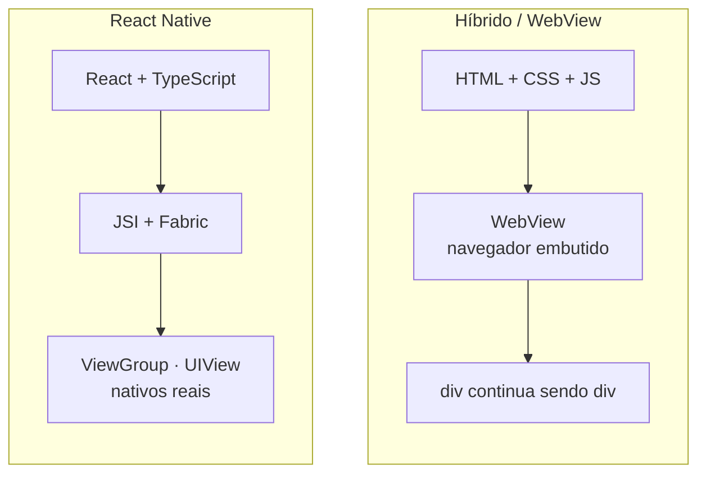
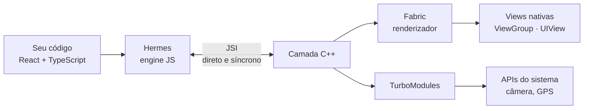
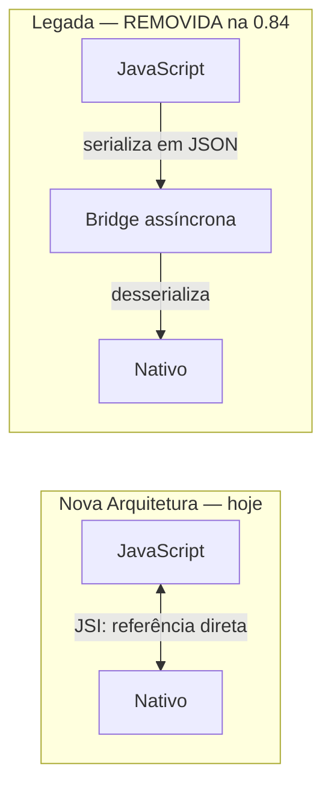
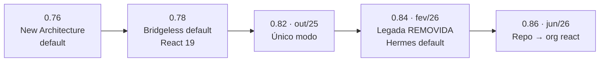

<!--
Slides em Markdown compatíveis com Marp.
Para exportar:  npx @marp-team/marp-cli@latest presentation.md -o aula2.pdf
Os blocos de comentário HTML são notas do apresentador (não aparecem no slide).

>>> PARA PROJETAR EM SALA, USE `presentation.html` (reveal.js, 26 slides). <<<
Este arquivo .md espelha a mesma sequência do HTML, para leitura rápida no
editor e para quem preferir Marp. O Marp NÃO renderiza blocos ```mermaid
nativamente — os diagramas aparecem como código. A versão HTML renderiza
tudo e ainda tem modo apresentador, visão geral e navegação por teclado.

Escopo desta aula: SÓ React Native (o que é, o que não é, a Nova Arquitetura,
como se cria um projeto hoje) + hands-on. Panorama de plataformas e revisão
de TypeScript são da Aula 1.
-->

# Desenvolvimento Mobile

## Aula 2 — React Native

CESAR School · 2026.2

<!--
Gancho de abertura no próximo slide.
Antes de começar: confirmar que todo mundo tem Node instalado —
quem não tiver, resolver AGORA, não no bloco de hands-on.
-->

---

<!-- _class: lead -->

## Vocês já sabem construir uma aplicação com TypeScript.

### Hoje vamos levar isso para dentro do bolso de bilhões de pessoas.

<!--
Enfatizar: o repertório deles transfere quase inteiro.
TS, componentes, estado, consumo de API — tudo continua valendo.
O que é novo é a PLATAFORMA, não a linguagem.
-->

---

## Agenda — 1h05

| Bloco | Tempo |
|---|---|
| **1.** Introdução ao React Native | 35 min |
| **2.** Hands-on: criando o projeto | 25 min |
| Fechamento | 5 min |

---

## Ao final da aula você deve conseguir

1. **Explicar** o que React Native é — e o que ele **não** é
2. **Criar e rodar** um projeto React Native no seu próprio celular

---

# Parte 1
## React Native

---

<!-- _class: lead -->

## React Native é um framework que usa
## **React e TypeScript** para descrever a interface,
## e renderiza **componentes nativos reais**.

### A parte que mais importa: *nativos reais*.

---

## O que React Native NÃO é

### Abordagem WebView *(Cordova, Ionic clássico)*

Seu app é um navegador sem barra de endereço, exibindo o seu site.
`<div>` continua sendo `<div>`.

### React Native

**Não há DOM. Não há HTML. Não há CSS. Não há WebView.**

```tsx
<View />   →  android.view.ViewGroup   |   UIView
<Text />   →  TextView                 |   UILabel
<Image />  →  ImageView                |   UIImageView
```

> É o **mesmo** componente que um app em Kotlin ou Swift usaria.

---

## Dois caminhos, dois destinos



### À esquerda, um navegador desenha a tela. À direita, o sistema operacional.

---

## 🎙️ Analogia: o tradutor simultâneo

Você escreve o discurso em **uma** língua — React + TypeScript.

Um intérprete o entrega, em tempo real, na língua de **cada plateia** —
Android, iOS.

### A plateia não lê legenda.

### Ela ouve alguém falando a língua dela, com o sotaque dela.

---

## Do web para o mobile

| Web | React Native |
|---|---|
| `<div>` | `<View>` |
| `<p>`, `<span>`, `<h1>` | `<Text>` — **todo** texto vai aqui |
| `` | `<Image>` |
| `<button>`, `<a>` | `<Pressable>` |
| `<input>` | `<TextInput>` |
| scroll da página | `<ScrollView>` |
| `className` / CSS | `StyleSheet.create({...})` |

> `<FlatList>`/`<SectionList>` (listas grandes) chegam mais adiante — hoje é componente isolado.
> O catálogo completo e o `StyleSheet` são a Aula 3.

---

## As 4 pegadinhas que pegam todo mundo

```tsx
// 1 · texto solto quebra em RUNTIME  ← o erro nº 1
<View>Olá</View>                  // ❌
<View><Text>Olá</Text></View>     // ✅

// 2 · flexDirection default é 'column', não 'row'
{ flexDirection: 'row' }          // precisa ser explícito

// 3 · números não têm unidade (density-independent pixels)
{ padding: 16 }      // ✅
{ padding: '16px' }  // ❌
{ width: '100%' }    // ✅ percentual em string funciona

// 4 · não há herança de estilo de texto entre Views
```

### E não existe `:hover` — não há mouse.

<!--
Demonstrar o erro nº 1 AO VIVO no projeto. Ver a tela vermelha
vale mais que o slide.
-->

---

## Por dentro: a Nova Arquitetura

### **JSI** — JavaScript Interface

JS e C++ chamam um ao outro **direto e de forma síncrona**, por referência

### **Fabric** — o renderizador

Cria e gerencia a árvore de views nativas

### **TurboModules** — módulos nativos

Carregamento *lazy* + interface tipada, gerada por **Codegen** a partir de **TypeScript**

### **Hermes** — a engine JS

Bytecode pré-compilado no build → startup rápido, menos memória

---

## Como as peças se encaixam



---

## 🔴 A "bridge" não existe mais

### Antes: um canal **assíncrono** que serializava **tudo** em JSON

Cada toque, cada atualização de layout → virava texto → atravessava a ponte → desserializava do outro lado.

**Era o gargalo histórico do React Native.**

### A arquitetura legada foi **removida do código** na versão 0.84 *(fev/2026)*

> Se um artigo explica "a ponte assíncrona do React Native",
> ele descreve software que **já não existe**.
>
> **Excelente detector de material desatualizado.**

---

## Antes e depois



---

<!-- _class: lead -->

## O Codegen gera código C++/Java/Objective-C

## a partir de uma especificação em **TypeScript**.

### O TypeScript de vocês gera código nativo.

<!--
Pausar aqui. É o momento em que o TypeScript da Aula 1 reaparece do outro
lado da máquina. Se alguém ainda achava que TS era "só pra pegar typo",
é agora que cai a ficha.
-->

---

## Linha do tempo



### Hoje: **React Native 0.86.2** com **React 19.2**

RN e React agora sob a **React Foundation** independente.

---

## Começando um projeto em 2026

### A recomendação oficial: **use um framework**. O framework é o **Expo**.

```bash
npx create-expo-app@latest meu-app
cd meu-app
npx expo start
```

Abra o **Expo Go** no celular · escaneie o QR · o app roda **no seu aparelho**

- **Expo SDK 57** *(jun/2026)* = RN 0.86 + React 19.2
- **Não precisa** de Android Studio nem Xcode para começar
- **Requisito: Node.js 22.11+**

Sem framework *(só p/ restrições incomuns)*:
`npx @react-native-community/cli@latest init`

---

<!-- _class: lead -->

# ❌ `npx react-native init`

## Depreciado na 0.75 · **REMOVIDO na 0.77** *(jan/2025)*

> Use isso como filtro de qualidade:
> tutorial que usa esse comando tem 1,5 ano+
> e provavelmente ensina a arquitetura antiga.
> **Confira sempre a data.**

<!--
Este slide economiza horas de frustração da turma.
Repetir em voz alta. Pedir para anotarem.
-->

---

## Primeiro componente: um card, não uma lista

```tsx
export default function App() {
  const [status, setStatus] = useState<StatusHabito>(MOCK.status);
  const concluido = status === 'concluido';

  return (
    <View style={styles.container}>
      <Pressable
        style={styles.card}
        onPress={() => setStatus(concluido ? 'pendente' : 'concluido')}
      >
        <Text style={styles.titulo}>{MOCK.titulo}</Text>
        <View style={styles.linha}>
          <Text style={styles.meta}>{MOCK.categoria}</Text>
          <Text style={styles.meta}>{rotuloStatus(status)}</Text>
        </View>
      </Pressable>
    </View>
  );
}
```

### Sem lista, sem `FlatList` — isso é assunto de aula futura.

<!--
No HTML, as setas → e ← navegam pelos destaques de linha antes de trocar
de slide. Destaque 1: estado tipado. Destaque 2: toque alternando status.
Destaque 3: View e Text de novo, sem lista nenhuma.
-->

---

# Parte 2
## Hands-on

### Ninguém sai da sala sem um app rodando no próprio celular.

---

## Hands-on — 25 min

```bash
node --version              # precisa ser 22.11+

npx create-expo-app@latest sandbox-app
cd sandbox-app
npx expo start              # --tunnel se o Wi-Fi da sala isolar
```

1. Abrir no celular com **Expo Go** *(QR code)* ou emulador
2. Editar `App.tsx` → ver o **Fast Refresh**
3. Exercícios guiados 1 a 3 *(`exercises.md` — domínio Hábito; `practice.md` — domínio Pet)*

### Se travar, chame. Os erros previsíveis já estão mapeados.

<!--
Erros esperados, com resposta pronta:
 - Texto solto fora de <Text> → erro em runtime (o nº 1)
 - Celular e notebook em redes diferentes → npx expo start --tunnel
 - Esperar flexDirection 'row' por default
 - Usar px/% em números de estilo
 - Node desatualizado
CIRCULAR PELA SALA. Não ficar na frente.
-->

---

## Atividade aplicada

### Modelar em TypeScript o domínio de **Hábito** (ou **Pet**)

### e construir a tela do hábito do dia — uma única entidade, sem lista

Enunciado completo, critérios de avaliação e prazo em **`exercises.md`** *(Hábito)* ou **`practice.md`** *(Pet)*

---

<!-- _class: lead -->

# Vocês já sabiam modelar uma entidade com TypeScript.

# Hoje o **mesmo tipo** passou a descrever uma tela nativa.

## O tipo não mudou. A plataforma mudou.

<!--
Fechar o arco da aula. Retomar literalmente o gancho da abertura.
É a última coisa que eles ouvem — vale entregar devagar.
-->

---

## Para a próxima aula

**Leitura obrigatória**
- Cap. 1 — História do Desenvolvimento do React Native
- [React Native — Core Components and APIs](https://reactnative.dev/docs/components-and-apis)

**Recomendada**
- [Expo — Get Started](https://docs.expo.dev/get-started/introduction/)
- [TypeScript Handbook — Narrowing](https://www.typescriptlang.org/docs/handbook/2/narrowing.html)

**Notas completas, com fontes de todos os dados citados:** `student-notes.md`

---

<!-- _class: lead -->

# Perguntas?

### `student-notes.md` · `exercises.md` · `practice.md`

Dados de versões verificados em 07/08/2026 · Fontes completas em `student-notes.md`
