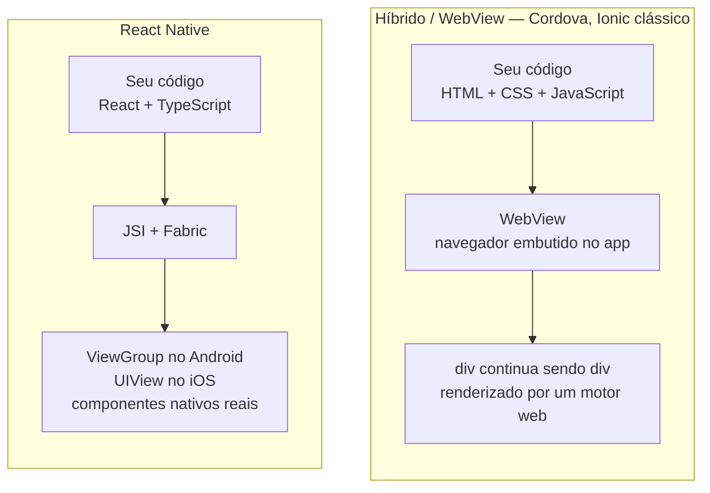
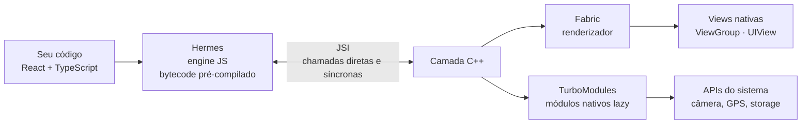
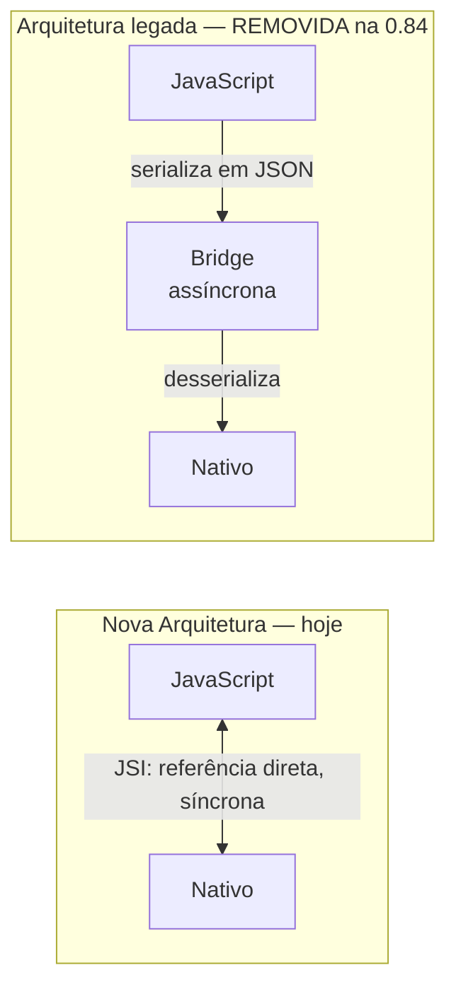
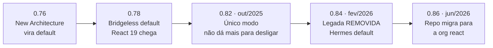

# Notas de Estudo — Aula 2: React Native

> **Disciplina:** Desenvolvimento Mobile (2026.2.DM) — CESAR School
> **Dados de versões:** conferidos em **7 de agosto de 2026**. Este material envelhece rápido; as fontes estão no final para você conferir por conta própria.

---

## Visão geral

Esta aula responde duas perguntas:

1. **Como eu escrevo uma interface nativa sem escrever Kotlin e Swift?** → o que React Native é, o que ele **não** é, e como ele funciona por dentro.
2. **Como eu começo um projeto hoje, em 2026?** → Expo, Expo Go e o comando que já não existe mais.

O fio condutor continua o mesmo da Aula 1: você **já sabe** o essencial. TypeScript, componentes, estado, consumo de API — tudo isso transfere do web para o mobile quase intacto. O que muda é a **plataforma** embaixo.

> 📱 **Sobre os exemplos deste material:** o domínio usado nos exemplos de código é o **Rastreador de Micro-hábitos e Condicionamento Físico** (`Habito`) — os exercícios correspondentes estão em `exercises.md`. Se o seu app é o **App de Gestão e Rotina Pet**, use `practice.md`: mesmos conceitos, mesmos scaffolds, domínio `Pet`, e uma tabela de equivalência no final para traduzir os exemplos daqui.

### O que já ficou para trás (Aula 1)

O panorama das plataformas móveis (Android, iOS, HarmonyOS, Tizen, webOS) e a revisão de TypeScript aplicada ao mobile são da **Aula 1** — estão em `../aula-01-introducao-desenvolvimento-mobile/student-notes.md`. Vale reler antes dos exercícios desta aula, porque eles usam:

| Conceito | Onde está | Por que você precisa dele hoje |
|---|---|---|
| Union types literais | Aula 1, §2.3 | tipar `status` sem usar `string` |
| União discriminada | Aula 1, §2.4 | o estado de tela `carregando / sucesso / erro` |
| Props tipadas | Aula 1, §2.5 | o `CardHabito` do Exercício 2 |
| Utility types (`Pick`, `Omit`, `Partial`) | Aula 1, §2.7 | derivar tipos de uma fonte única |

### O que ainda não chegou

Esta aula para no **primeiro componente**. O catálogo de Core Components (`Image`, `TextInput`, `ScrollView`, `Button`, `Switch`), `StyleSheet` a fundo e Flexbox são a **Aula 3**. Listas (`FlatList`/`SectionList`) e navegação vêm depois.

---

# Parte 1 — React Native

## 1.1 Definição

> **React Native é um framework que usa React e TypeScript para descrever a interface, mas renderiza componentes nativos reais da plataforma.**

A parte que mais importa nessa frase é **"nativos reais"**.

## 1.2 O que React Native NÃO é

Este é o mal-entendido central do assunto, então vamos ser explícitos.

**Abordagem WebView** (Cordova, Ionic clássico): o app é um navegador sem barra de endereço, exibindo o seu site. Seu `<div>` continua sendo um `<div>` dentro de um motor de renderização web.

**React Native:** não existe DOM, não existe HTML, não existe CSS, não existe WebView.

```tsx
<View />    // → android.view.ViewGroup no Android,  UIView no iOS
<Text />    // → TextView no Android,               UILabel no iOS
<Image />   // → ImageView no Android,              UIImageView no iOS
```



> **Leitura do diagrama:** os dois caminhos partem de código que você escreve, mas terminam em lugares diferentes. À esquerda, um navegador desenha a tela; à direita, o próprio sistema operacional desenha.

O componente que aparece na tela é o **mesmo** que um app escrito em Kotlin ou Swift usaria. O usuário não está olhando uma página web disfarçada.

### Analogia: o tradutor simultâneo

Você escreve o discurso em uma língua (React + TypeScript). Um intérprete o entrega, em tempo real, na língua de cada plateia (Android, iOS). A plateia **não lê legenda** — ela ouve alguém falando a língua dela, com o sotaque dela.

## 1.3 Do web para o mobile: o mapa de tradução

| Web | React Native | Observação |
|---|---|---|
| `<div>` | `<View>` | contêiner |
| `<p>`, `<span>`, `<h1>` | `<Text>` | **todo** texto precisa estar aqui dentro |
| `` | `<Image>` | `source={{ uri: '...' }}` ou `require()` |
| `<button>`, `<a>` | `<Pressable>` | há também `TouchableOpacity`, `Button` |
| `<input>` | `<TextInput>` | |
| scroll da página | `<ScrollView>` | não há scroll implícito no `<View>` |
| `className` / arquivo CSS | `StyleSheet.create({...})` | objetos JavaScript |

> 📌 **Hoje esta tabela é só um mapa.** Cada um desses componentes tem regras próprias — e elas são o assunto da **Aula 3**. `<FlatList>`/`<SectionList>`, que resolvem a renderização de **listas grandes** (só desenham o que está visível na tela), vêm mais adiante. Nesta aula trabalhamos com componentes isolados.

### As quatro pegadinhas que pegam todo mundo

```tsx
// 1. Texto solto quebra em runtime
<View>Olá</View>                    // ❌ erro
<View><Text>Olá</Text></View>       // ✅

// 2. flexDirection default é 'column', não 'row'
const styles = StyleSheet.create({
  linha: { flexDirection: 'row' },  // precisa ser explícito
});

// 3. Números não têm unidade — são "density-independent pixels"
{ padding: 16 }        // ✅
{ padding: '16px' }    // ❌
{ width: '100%' }      // ✅ percentual em string funciona

// 4. Não há herança de estilo de texto entre Views
// Definir fontSize numa <View> não afeta o <Text> dentro dela
```

E lembre: **não existe `:hover`** — não há mouse. Há estados de toque (`pressed`).

## 1.4 Como funciona por dentro: a Nova Arquitetura

Todo o React Native atual roda sobre quatro peças:



> **Leitura do diagrama:** seu código roda no Hermes; o JSI é a via de mão dupla entre JavaScript e C++; dali saem dois caminhos — o Fabric desenha a tela, os TurboModules acessam o hardware.

### JSI — JavaScript Interface

Permite que JavaScript e C++ chamem um ao outro **diretamente e de forma síncrona**, por referência a objetos.

Isto substituiu a antiga "**bridge**": um canal assíncrono que serializava **tudo** em JSON entre JS e nativo. Cada toque, cada atualização de layout virava texto, atravessava a ponte e era desserializado do outro lado. Era o gargalo histórico do React Native.



> **Leitura do diagrama:** em cima, três etapas com conversão para texto no meio do caminho. Embaixo, uma única ligação direta nos dois sentidos.

> 🔴 **Importante:** a bridge **não existe mais**. A arquitetura legada foi **removida do código** na versão 0.84 (fevereiro de 2026). Se você encontrar um artigo explicando "a ponte assíncrona do React Native", ele está descrevendo software que já não existe. Isso é um excelente detector de material desatualizado.

### Fabric — o renderizador

Responsável por criar e gerenciar a árvore de views nativas. Trabalha com uma árvore imutável e permite renderização síncrona quando necessário.

### TurboModules — módulos nativos

Módulos nativos com carregamento **lazy** (só sobem quando usados, o que acelera o startup) e interface **fortemente tipada**.

A parte elegante: a interface é gerada pelo **Codegen** a partir de uma especificação escrita em **TypeScript**.

> 💡 **Pare um segundo nisso:** você escreve um arquivo `.ts` descrevendo o módulo, e o Codegen gera o código C++/Java/Objective-C correspondente. **O seu TypeScript gera código nativo.** Todo o cuidado com tipos da Aula 1 reaparece aqui, do outro lado da máquina.

### Hermes — a engine JavaScript

Engine feita especificamente para mobile: o JavaScript é pré-compilado para **bytecode em tempo de build**, o que significa startup mais rápido, menos uso de memória e app menor. É a engine **default** em iOS e Android desde a 0.84.

### Linha do tempo (para citar com precisão)



| Versão | O que aconteceu |
|---|---|
| 0.76 | New Architecture passa a ser **default** |
| 0.78 | **Bridgeless mode** passa a ser default; React 19 chega ao RN |
| 0.82 (out/2025) | New Architecture torna-se o **único modo** |
| 0.84 (fev/2026) | Arquitetura legada **removida**; Hermes default; Node 22.11+ mínimo |
| 0.86 (jun/2026) | Repositório migra da org `facebook` para a org `react` no GitHub |

**Hoje (ago/2026): React Native 0.86.2, rodando React 19.2.**

React Native e React agora estão sob a **React Foundation** independente — daí a mudança de organização no GitHub.

## 1.5 Começando um projeto em 2026

A recomendação oficial de `reactnative.dev` é **usar um framework**, e o framework recomendado é o **Expo**:

```bash
npx create-expo-app@latest meu-app
cd meu-app
npx expo start
```

Abra o app **Expo Go** no seu celular, escaneie o QR code, e o app está rodando **no seu aparelho**.

- **Expo SDK 57** (jun/2026) = React Native 0.86 + React 19.2.
- Com Expo Go você **não precisa instalar Android Studio nem Xcode** para começar. Quem não tem Mac consegue desenvolver e testar em iPhone.
- Requisito: **Node.js 22.11 ou superior**.

### Sem framework (só para restrições incomuns)

```bash
npx @react-native-community/cli@latest init MeuApp
```

### 🔴 O comando que não existe mais

```bash
npx react-native init MeuApp   # ❌ MORTO
```

Depreciado na versão 0.75, **removido na 0.77** (janeiro de 2025).

**Use isto como filtro de qualidade:** se um tutorial, vídeo ou resposta de StackOverflow usa `react-native init`, ele tem pelo menos um ano e meio e provavelmente ensina a arquitetura antiga também. Confira sempre a data.

## 1.6 Primeiro componente: um card, não uma lista

Nesta aula, a prática se limita a um componente isolado — sem lista, sem navegação. É exatamente o que você vai fazer no hands-on e na atividade aplicada (`exercises.md`, domínio Hábito; `practice.md`, domínio Pet).

```tsx
import { useState } from 'react';
import { View, Text, Pressable, StyleSheet } from 'react-native';

type StatusHabito = 'pendente' | 'concluido' | 'pulado';

interface Habito {
  id: string;
  titulo: string;
  categoria: string;
  status: StatusHabito;
  streakDias: number;
}

function rotuloStatus(status: StatusHabito): string {
  switch (status) {
    case 'pendente':   return 'Pendente';
    case 'concluido':  return 'Concluído';
    case 'pulado':     return 'Pulado';
  }
}

const MOCK: Habito = {
  id: '1',
  titulo: 'Beber 2L de água',
  categoria: 'saude',
  status: 'pendente',
  streakDias: 4,
};

export default function App() {
  const [status, setStatus] = useState<StatusHabito>(MOCK.status);
  const concluido = status === 'concluido';

  return (
    <View style={styles.container}>
      <Pressable
        style={styles.card}
        onPress={() => setStatus(concluido ? 'pendente' : 'concluido')}
      >
        <Text style={styles.titulo}>{MOCK.titulo}</Text>
        <View style={styles.linha}>
          <Text style={styles.meta}>{MOCK.categoria}</Text>
          <Text style={styles.meta}>{rotuloStatus(status)}</Text>
        </View>
        <Text style={styles.streak}>
          🔥 {concluido ? MOCK.streakDias + 1 : MOCK.streakDias} dias seguidos
        </Text>
      </Pressable>
    </View>
  );
}

const styles = StyleSheet.create({
  container: { flex: 1, padding: 16, paddingTop: 48, backgroundColor: '#fff' },
  card:      { padding: 16, borderRadius: 8, backgroundColor: '#f2f2f2' },
  titulo:    { fontSize: 18, fontWeight: '600' },
  linha:     { flexDirection: 'row', justifyContent: 'space-between', marginTop: 8 },
  meta:      { fontSize: 12, color: '#666' },
  streak:    { marginTop: 8, fontStyle: 'italic' },
});
```

Note quantas coisas você **já sabia**: `useState`, props, renderização condicional, tipagem. O que é novo são os nomes dos componentes e o `StyleSheet` — e o `StyleSheet` a fundo é a Aula 3. Renderizar **várias** dessas entradas (com `FlatList`) chega mais adiante.

---

## Erros comuns (consulte antes de pedir ajuda)

| Erro | Causa | Correção |
|---|---|---|
| `Text strings must be rendered within a <Text> component` | Texto solto dentro de `<View>` | Envolva em `<Text>` |
| QR code do Expo não conecta | Celular e notebook em redes diferentes | Mesma rede Wi-Fi, ou `npx expo start --tunnel` |
| Layout empilha verticalmente sem querer | `flexDirection` default é `column` | `flexDirection: 'row'` explícito |
| Estilo ignorado | Unidade CSS em valor numérico | Use número puro: `padding: 16` |
| `react-native init` não funciona | Removido na 0.77 | `npx create-expo-app@latest` |
| Erros estranhos no `expo start` | Node antigo | Node 22.11+ |
| Tela mostra loading e erro ao mesmo tempo | Booleanos de estado independentes | União discriminada *(Aula 1, §2.4)* |
| `undefined is not an object` em runtime | `any` ou `as` escondendo o problema | `unknown` + type guard *(Aula 1, §2.8)* |
| "Achei que RN gerava HTML" | Confusão com WebView | `<View>` → `UIView`/`ViewGroup`; não há DOM |
| Tutorial explica a "bridge" | Material anterior a fev/2026 | A arquitetura legada foi removida na 0.84 |

---

## Perguntas para autoavaliação

Responda sem olhar as notas. Se travar em alguma, releia a seção indicada.

1. Complete: "React Native não é uma WebView porque `<View>` se torna ______ no Android e ______ no iOS." (§1.2)
2. Reconte a analogia do tradutor simultâneo. Quem é o intérprete, na prática? (§1.2)
3. Dê **três** traduções do mapa web → mobile e diga qual delas quebra em **runtime** se você errar. (§1.3)
4. Por que `{ padding: '16px' }` não funciona, e o que `{ width: '100%' }` tem de diferente? (§1.3)
5. O que JSI substituiu, e por que a coisa substituída era um problema? (§1.4)
6. Qual a diferença de papel entre **Fabric** e **TurboModules**? (§1.4)
7. O que o Codegen gera, e a partir de qual linguagem? Por que isso é relevante para quem passou a Aula 1 estudando TypeScript? (§1.4)
8. Por que o Hermes deixa o app abrir mais rápido? (§1.4)
9. Em que versão a arquitetura legada foi **removida** — e por que essa data é útil para julgar um tutorial? (§1.4)
10. Qual comando se usa hoje para criar um projeto React Native, e qual comando está morto desde quando? (§1.5)
11. Por que dá para começar sem instalar Android Studio nem Xcode? (§1.5)
12. Por que o primeiro exemplo de componente desta aula usa um card único em vez de uma lista? (§1.6)

---

## Leitura recomendada

**Obrigatória para a próxima aula**
- Capítulo 1 — História do Desenvolvimento do React Native, em *React Native: Desenvolvimento de aplicativos mobile com React*
- [React Native — Core Components and APIs](https://reactnative.dev/docs/components-and-apis)

**Recomendada**
- [React Native — Set Up Your Environment](https://reactnative.dev/docs/set-up-your-environment)
- [Expo — Get Started](https://docs.expo.dev/get-started/introduction/)
- [TypeScript Handbook — Narrowing](https://www.typescriptlang.org/docs/handbook/2/narrowing.html) (a base das uniões discriminadas, usadas na Atividade 1)

**Para quem quiser ir além**
- [React Native 0.84 — remoção da arquitetura legada](https://reactnative.dev/blog/2026/02/11/react-native-0.84)
- [React Native — The New Architecture](https://reactnative.dev/architecture/landing-page)

---

## Fontes dos dados citados

Verificadas em 7 de agosto de 2026.

**React Native / Expo / React**
- [React Native 0.86](https://reactnative.dev/blog/2026/06/11/react-native-0.86) · [0.84](https://reactnative.dev/blog/2026/02/11/react-native-0.84) · [0.77](https://reactnative.dev/blog/2025/01/21/version-0.77)
- [React Native — Environment Setup](https://reactnative.dev/docs/environment-setup)
- [Expo SDK 57](https://expo.dev/changelog/sdk-57)
- [React releases](https://github.com/facebook/react/releases)

> Os dados de mercado das plataformas (StatCounter, Counterpoint) e as fontes de Android, iOS, HarmonyOS, Tizen, webOS e TypeScript estão nas notas da **Aula 1**.
