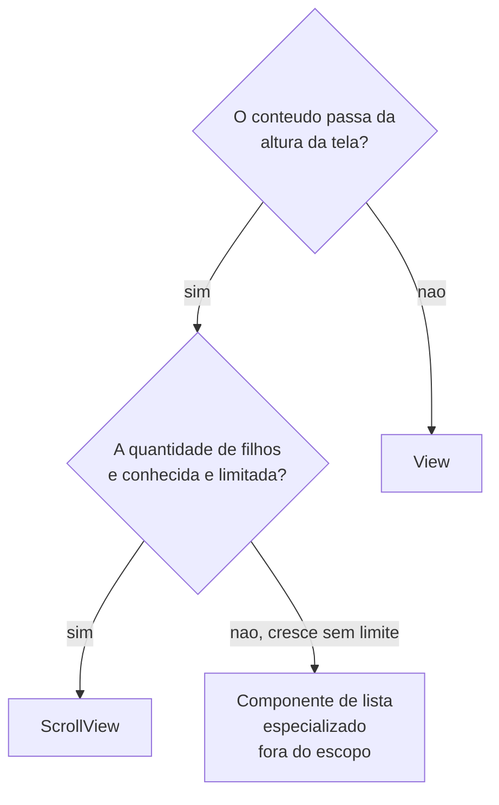
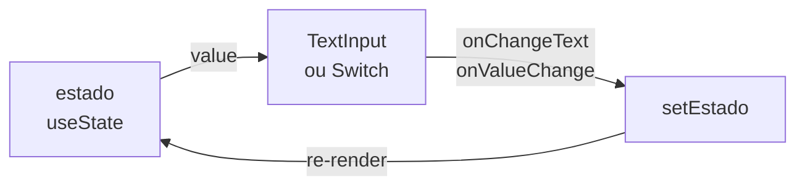
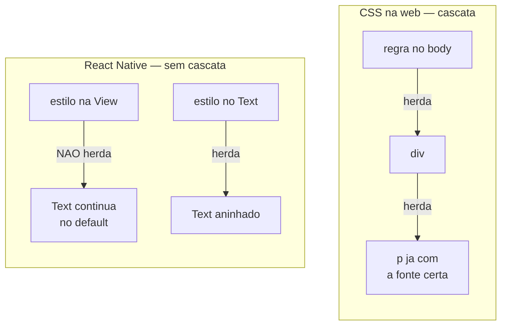
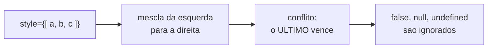
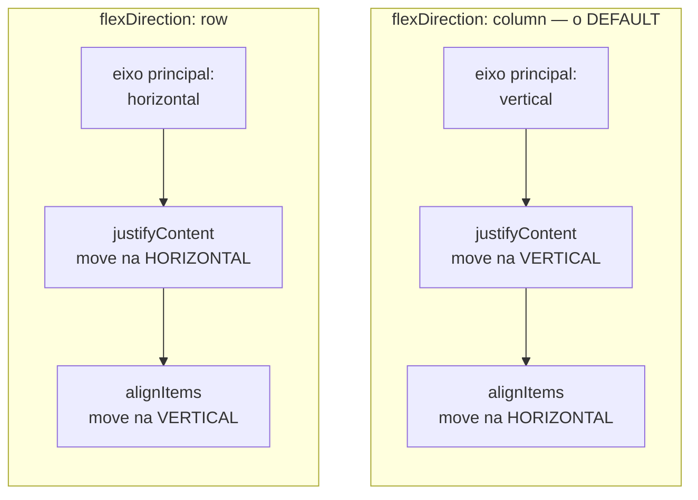
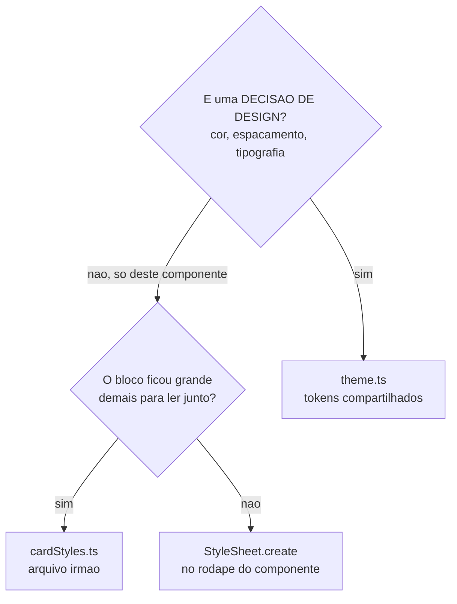

<!--
Slides em Markdown compatíveis com Marp.
Para exportar:  npx @marp-team/marp-cli@latest presentation.md -o aula3.pdf
Os blocos de comentário HTML são notas do apresentador (não aparecem no slide).
Materiais irmãos: student-notes.md · exercises.md · practice.md (equivalência Pet).

>>> PARA PROJETAR EM SALA, USE `presentation.html` (reveal.js). <<<
Este arquivo .md é a fonte em Markdown, para leitura rápida no editor e para
quem preferir Marp. O Marp NÃO renderiza blocos ```mermaid nativamente — os
diagramas aparecem como código. A versão HTML renderiza tudo e ainda tem
modo apresentador, visão geral e navegação por teclado.
-->

# Desenvolvimento Mobile

## Aula 3 — Core Components, StyleSheet e Flexbox

CESAR School · 2026.2

<!--
Antes de começar: confirmar que todo mundo tem o projeto do grupo rodando
com `npx expo start`. Quem estiver travado resolve AGORA, não no bloco de
hands-on.
-->

---

<!-- _class: lead -->

## Na Aula 1 vocês descobriram que `<View>` não é `<div>`.

### Hoje vem a consequência: todo o vocabulário mudou — e a **cascata não existe**.

<!--
A boa notícia: o dicionário novo tem menos de dez palavras.
A má: a ideia mais central da estilização web — a CASCATA — não foi
implementada aqui.
Deixar a segunda frase no ar. Ela é o eixo da aula inteira.
-->

---

## Agenda — 3 horas

| Bloco | Tempo |
|---|---|
| Abertura + o ambiente corrigido | 10 min |
| **1.** O catálogo mínimo: Core Components | 35 min |
| ☕ Intervalo | 10 min |
| **2.** StyleSheet: o estilo que não é CSS | 30 min |
| **3.** Checkpoint conceitual | 10 min |
| **4.** Flexbox: como o espaço é negociado | 35 min |
| **5.** Onde os estilos devem morar | 20 min |
| **6.** Hands-on guiado | 25 min |
| Fechamento | 5 min |

---

## Ao final da aula você deve conseguir

1. **Escolher** o componente certo — e justificar a escolha
2. **Aplicar** estilo com `StyleSheet`: condicional e precedência
3. **Explicar** por que não há cascata, e qual é a única exceção
4. **Ligar estado a interface** com `useState`, `onPress` e componentes controlados
5. **Construir** um layout Flexbox **prevendo** o resultado antes de rodar
6. **Decidir** onde cada estilo do projeto deve morar
7. **Corrigir** o que a maioria dos tutoriais ainda ensina errado

---

# Parte 0
## O ambiente, atualizado

---

## Criar e limpar um projeto

```bash
# SDK atual: 57  =  React Native 0.86.2  +  React 19.2
npx create-expo-app@latest meu-app

cd meu-app
npm run reset-project    # move o exemplo p/ app-example/, deixa app/ limpa
npx expo start
```

Depois do reset você pode **apagar** `app-example/`.

Templates: `default` (recomendado) · `blank` · `blank-typescript` · `tabs` · `bare-minimum`

<!--
O material antigo desta aula fixava --template default@sdk-54. Não precisa mais.
Explicar no próximo slide POR QUE aquela instrução existia.
-->

---

## Expo Go no iPhone: a regra de verdade

| Onde rodar | O que fazer |
|---|---|
| Android (aparelho/emulador) | `expo.dev/go` — build do seu SDK |
| Simulador iOS | `expo.dev/go` |
| **iPhone físico, SDK 55+** | **`sign.expo.dev`** — Apple ID grátis, cert ~7 dias |
| iPhone físico, SDK 54 | Expo Go da App Store |
| iPhone físico, SDK ≤ 53 | Não dá — atualize ou faça dev build |

### A App Store está no 54 porque a build de 57 **aguarda aprovação**.

<!--
Não é limitação técnica — é fila de revisão de loja.
Amarrar com a Aula 1: aquilo que falamos sobre o custo de depender de
revisão de loja, aqui está na prática, atrapalhando a própria aula.
-->

---

## 🔴 Uma correção de comando

```bash
# ❌ O que o material antigo mandava
npm install react-dom@19.2.0 react-native-web@^0.21.0

# ✅ O certo
npx expo install react-dom react-native-web @expo/metro-runtime
npx expo start --web
```

### `npx expo install` resolve a versão **compatível com o seu SDK**.

`npm install` pega a mais recente do npm — que pode ser de um SDK futuro.

<!--
Regra para levar: dependência que acompanha o SDK se instala com
`npx expo install`.
O erro que o npm install produz não PARECE ter relação com o seu código —
é por isso que custa horas de depuração.
-->

---

# Parte 1
## Core Components

---

## O dicionário de tradução

| Web | React Native | Lembrar |
|---|---|---|
| `<div>` | `View` | não tem scroll implícito |
| `<p>` `<span>` `<h1>` | `Text` | **todo** texto vive aqui |
| `` | `Image` | remota **precisa** de dimensão |
| `<input type="text">` | `TextInput` | `value` + `onChangeText` |
| `<input type="checkbox">` | `Switch` | `value` + `onValueChange` |
| scroll da página | `ScrollView` | renderiza **tudo**; duas props de estilo |
| `<button>` | `Button` | do sistema, **não aceita `style`** |
| `className` / `.css` | `StyleSheet.create` | objetos JS |

### São **sete**. O dicionário da aula cabe numa mão e meia.

<!--
Dizer o "são sete" em voz alta. Reduz a ansiedade da turma: o vocabulário
novo é pequeno; o que é difícil é o ESTILO.

Interação, nesta aula, sai de três lugares — todos aqui dentro:
onPress no Button, onPress no Text, onChangeText/onValueChange.
-->

---

<!-- _class: lead -->

## 🧭 O dicionário de viagem

### Você já fala a língua. Recebeu um dicionário menor, com palavras diferentes para as mesmas ideias.

E algumas palavras não têm tradução: não existe `<h1>` — existe `<Text>` com um estilo.

---

## `Text` — regra 1

```tsx
<View>Beber água</View>                     // ❌ quebra em runtime
<View><Text>Beber água</Text></View>        // ✅
```

### `Text strings must be rendered within a <Text> component`

Você vai ver esse erro. Todo mundo vê.

<!--
DEMONSTRAR AO VIVO. Quebrar de propósito, mostrar a tela vermelha,
corrigir na frente deles.
Vale 30 segundos e economiza uma hora de suporte no hands-on.
-->

---

## `Text` — regra 2: a única herança que existe

```tsx
// A View NÃO passa fontSize para o Text
<View style={{ fontSize: 24 }}>          // ❌ não faz nada
  <Text>Continuo no tamanho default</Text>
</View>

// Text dentro de Text, sim
<Text style={{ fontSize: 24 }}>
  Grande <Text style={{ fontWeight: 'bold' }}>e em negrito</Text>
</Text>
```

### `<Text>` dentro de `<Text>` é a **única** herança de estilo em React Native.

---

## `Image` — a que precisa de dimensão

```tsx
// Local: o bundler já sabe o tamanho em tempo de build
<Image source={require('../assets/habito.png')} />

// Remota: VOCÊ precisa informar
<Image
  source={{ uri: 'https://exemplo.com/habito.png' }}
  style={{ width: 64, height: 64, borderRadius: 32 }}
/>
```

### Sem `width`/`height`, a imagem remota tem tamanho **zero**.

Nada aparece. E **não há erro no console**.

<!--
Demonstrar. O SILÊNCIO é o que faz esse bug custar caro: o aluno acha
que a URL está errada, quando o problema é o estilo.
Mesma família do bug da View sem width (exercício 4, item E).
-->

---

## `Image` — existe algo melhor no Expo

```bash
npx expo install expo-image
```

- Cache em **disco e memória**
- **Transição** suave na troca de imagem (sem flicker)
- Placeholders **BlurHash / ThumbHash**
- WebP, AVIF, HEIC, SVG, GIF animado

A doc do React Native **não** deprecia o `Image` nativo — mas para imagem de rede em produção, `expo-image` é o caminho.

---

## `TextInput` — a entrada controlada

```tsx
const [titulo, setTitulo] = useState('');

<TextInput
  style={styles.input}          // sem estilo, ele é INVISÍVEL
  value={titulo}
  onChangeText={setTitulo}      // recebe a string, não um evento
  placeholder="Ex.: Beber 2L de água"
  maxLength={60}
/>
```

- É **`onChangeText`** — sem `e.target.value`
- **Não tem borda por default.** Se você não estilizar, não vê nada
- Úteis: `keyboardType` · `secureTextEntry` · `multiline`

---

## `ScrollView` — a pegadinha das DUAS props de estilo

```tsx
<ScrollView
  style={styles.tela}                        // a JANELA de rolagem
  contentContainerStyle={styles.conteudo}    // o CONTEÚDO que rola
>
```

| Quer isso | Vai em |
|---|---|
| `padding` no conteúdo | `contentContainerStyle` |
| centralizar os filhos | `contentContainerStyle` |
| altura / fundo da janela | `style` |

### `alignItems` no `style` de um `ScrollView` não faz **nada**.

<!--
Um dos bugs mais confusos de depurar, porque o resultado é o SILÊNCIO:
o código parece certo e a tela não muda.
-->

---

## `View` ou `ScrollView`?



`ScrollView` monta **todos** os filhos de uma vez. Com 20, ok. Com 2.000, o app engasga.

Caso típico de `ScrollView`: um **formulário** — campos conhecidos, quantidade fixa.

<!--
Se alguém perguntar qual é o "componente especializado": estacionar.
Renderização de listas NÃO é assunto desta aula.
-->

---

## `Button` — o botão do sistema

```tsx
<Button title="Salvar" onPress={salvar} color="#FF6002" disabled={false} />
```

São **essas** as props: `title` · `onPress` · `color` · `disabled`

| Plataforma | O que `color` tinge |
|---|---|
| iOS | o **texto** do botão |
| Android | o **fundo** do botão |

### O mesmo `color` produz dois botões diferentes. Teste nas duas.

<!--
Bom exemplo de "componente do sistema entrega a aparência do sistema".
Serve para: protótipo, caixa de diálogo, tela de configuração,
ação de formulário.
-->

---

<!-- _class: lead -->

# `Button` não aceita `style`.

### Ele entrega o botão do **sistema**. Você escolhe texto, ação e uma cor.

<!--
PAUSA aqui.
Não é limitação acidental — é o PROJETO do componente.

A pergunta que vem em seguida, garantido:
"e se eu quiser um botão com fundo laranja e canto arredondado?"
RESPOSTA: "ótima pergunta, e não é o assunto de hoje."

Componentes de toque estilizáveis estão FORA do escopo desta aula.
Não abrir esse tópico — o orçamento de hoje é estilo e layout.

O ponto didático a extrair: a escolha do componente vem ANTES
da estilização.
-->

---

## O que dá para fazer hoje: estilizar em volta

```tsx
<View style={styles.areaBotao}>
  <Button title="Marcar concluído" onPress={concluir} color={cores.primaria} />
</View>

// ...
areaBotao: {
  borderRadius: 8,
  overflow: 'hidden',      // no Android, recorta o fundo no raio
  marginTop: espaco.sm,    // margin EM VOLTA do grupo: uso legítimo
}
```

### Você não controla o botão. Controla o espaço dele.

---

## `Text` com `onPress` — toque dentro do escopo

```tsx
const [concluido, setConcluido] = useState(false);

<Text
  style={[styles.titulo, concluido && styles.tituloConcluido]}
  onPress={() => setConcluido((anterior) => !anterior)}
>
  Beber 2L de água
</Text>
```

### Toque muda o estado → estado muda o array de estilos → a tela reflete.

Você já conhece as duas primeiras partes. A terceira é a novidade de hoje.

<!--
Este é o padrão que sustenta metade dos exercícios.
Note o setConcluido((anterior) => !anterior): quando o novo estado deriva
do anterior, a forma de função é a segura.
-->

---

## `Switch` — o liga/desliga

```tsx
const [lembrete, setLembrete] = useState(false);

<View style={styles.linha}>
  <Text>Lembrete diário</Text>
  <Switch
    value={lembrete}
    onValueChange={setLembrete}    // entrega o booleano novo direto
    trackColor={{ false: '#ccc', true: '#FFB132' }}
  />
</View>
```

`onValueChange={setLembrete}` funciona sem função intermediária — mesmo padrão do `onChangeText`.

---

## O laço do componente controlado



O componente **não guarda** o valor. O estado é a fonte de verdade.

### Esqueceu o `value`? O usuário mexe e a tela volta ao valor anterior.

<!--
Esse é o bug clássico do componente controlado pela metade: o aluno põe
o onValueChange e esquece o value. O Switch "não funciona" e ele acha que
o componente está quebrado.
Vale demonstrar ao vivo — apagar o value e mostrar o Switch voltando.
-->

---

<!-- _class: lead -->

# ☕ Intervalo

### 10 minutos

---

# Parte 2
## StyleSheet

---

<!-- _class: lead -->

# Não existe cascata.

### Não existe herança de estilo. *(exceto `Text` em `Text`)*

<!--
Se a turma sair com UMA ideia desta aula, é esta.
Deixar o slide no ar alguns segundos antes de explicar.
-->

---

## 👔 A analogia do código de vestimenta

**No CSS** você anuncia a regra para o prédio inteiro:
*"todo texto deste site é Arial, 16px"*.
Todo mundo lá dentro **herda** o anúncio.

**Em React Native não existe alto-falante.**
Cada componente **se veste sozinho**.

### Cinco textos iguais = cinco vezes o estilo.

<!--
Enfatizar: repetir estilo aqui é NORMAL, não é falta de habilidade.
E é justamente por isso que a Parte 5 (tokens) existe — ela é a
resposta de ENGENHARIA para a ausência da cascata.
Essa amarração é importante: senão a Parte 5 parece arbitrária.
-->

---

## Cascata vs. sem cascata



No bloco do CSS o estilo desce sozinho pela árvore. No bloco do React Native, a única seta de herança vai de `Text` para `Text`.

---

## As outras diferenças de fundo

```tsx
{ padding: 16 }         // ✅ número puro — são dp
{ padding: '16px' }     // ❌ unidade CSS não existe
{ width: '100%' }       // ✅ percentual funciona, como string
{ fontSize: '1.5rem' }  // ❌ não há rem, em, vh, vw
```

- **Sem seletores** — nada de `.classe`, `#id`, `>`, `:first-child`
- **Sem `:hover`** — não há mouse. Há `pressed`
- **`camelCase`** — `backgroundColor`, não `background-color`
- **Subconjunto** do CSS

---

## As formas de passar `style`

```tsx
<View style={styles.card} />                                 // objeto

<View style={[styles.card, styles.destacado]} />             // array

<Text style={[styles.texto, ativo && styles.ativo]} />       // condicional

<View style={[styles.badge, { backgroundColor: cor }]} />    // runtime

<View style={[styles.card,                                   // vários
  concluido && styles.cardConcluido,
  urgente && styles.cardUrgente]} />
```

---

## Precedência: o último vence



```tsx
<Text style={[{ color: 'blue' }, { color: 'red' }]}>Que cor?</Text>
```

### Vermelho. É `Object.assign({}, a, b)`.

<!--
PERGUNTAR antes de revelar. Deixar a turma responder em voz alta.
Quem lembrar de Object.assign nunca mais erra isso.
-->

---

## O que `StyleSheet.create` faz

✅ **Valida em tempo de tipo** e dá autocomplete
→ `backgroundColour` vira erro de compilação

❌ **Não** faz mágica de performance

A história antiga: ele registrava os estilos e passava só um **ID pela ponte**.
A ponte **não existe mais** — foi removida na **0.84** (Aula 1, §3.4).

### Hoje o ganho é **validação e organização**.

---

## 🔴 Fato zumbi: o `as const`

```tsx
// ❌ O que o material antigo escrevia
StyleSheet.create({
  container: { justifyContent: 'center' as const },
});

// ✅ O que basta
StyleSheet.create({
  container: { justifyContent: 'center' },
});
```

A assinatura de `create` **já preserva os literais**.

**Onde ele importa:** objeto solto, fora de `create` — aí o TS alarga `'center'` para `string`.

### Aprenda a distinção, não a receita.

---

## 🔴 Fato zumbi: a sombra

```tsx
// ❌ Cinco props, resultado diferente em cada plataforma
{ shadowColor: '#000', shadowOffset: { width: 0, height: 2 },
  shadowOpacity: 0.1, shadowRadius: 4, elevation: 5 }

// ✅ Uma linha, as duas plataformas
{ boxShadow: '0px 2px 8px rgba(0, 0, 0, 0.12)' }
```

`boxShadow` funciona na **New Architecture** — o **único modo** desde a **0.82**, e desde a **0.84**
a arquitetura legada nem existe mais no código.

Também chegou `filter`: blur, brightness, saturate.

<!--
Amarrar com a Aula 1: eles aprenderam que a arquitetura legada foi
removida do código na 0.84 — e que desde a 0.82 a New Architecture já era o único
modo possível. Aqui está a consequência PRÁTICA e visível disso —
propriedades de estilo novas que só existem na New Architecture.
-->

---

# Parte 3
## Checkpoint

---

## Responda em dupla — 60 segundos cada

1. Coloquei `fontSize: 24` na `View` e o texto não mudou. **Por quê?**

2. Onde vai o `padding` de um `ScrollView`? **Por que não no `style`?**

3. Quero um botão com fundo gradiente e canto arredondado. **`<Button>`?**

4. Em `style={[a, b]}`: `a` diz `color:'blue'`, `b` diz `color:'red'`. **Qual vence?** E se `b` for `false`?

<!--
NÃO avançar para Flexbox sem isso.
Se travarem: retomar o CÓDIGO DE VESTIMENTA, não inventar analogia nova.
Se a dúvida for de precedência: escrever Object.assign({}, a, b) na lousa —
a maioria reconhece na hora.
-->

---

# Parte 4
## Flexbox

---

## 🚶 A analogia da fila

- **`flexDirection`** — em que direção a fila anda?
- **`justifyContent`** — como as pessoas se distribuem **ao longo** da fila?
- **`alignItems`** — onde elas ficam **na largura** da fila?

### Toda dúvida de Flexbox se resolve com uma pergunta:

## *"Qual é o eixo principal aqui?"*

<!--
Apresentar a analogia ANTES de qualquer propriedade.
Ela é o gancho que eles vão usar para lembrar disso depois.
-->

---

## Os eixos trocam de lugar



Não existe "`justifyContent` é horizontal". **Depende da direção.**

---

<!-- _class: lead -->

# `flexDirection` default é `column`.

### Na web é `row`.

Este é o bug de layout nº 1 do semestre.

<!--
ESCREVER NA LOUSA E NÃO APAGAR até o fim da aula.
Toda vez que alguém no hands-on disser "não está indo para o lado",
apontar para a lousa em vez de responder.
-->

---

## O que acontece na prática

```tsx
// Você quer categoria e status lado a lado
linha: {
  justifyContent: 'space-between',   // ❌ distribui na VERTICAL
}

// Corrigido
linha: {
  flexDirection: 'row',              // ✅
  justifyContent: 'space-between',
}
```

### Se algo "não vai para o lado", checar `flexDirection` **primeiro**.

**Segundo default que surpreende:** `alignItems` é **`stretch`** — filho sem largura ocupa a largura toda.

---

## `justifyContent` — no eixo principal

| Valor | Efeito |
|---|---|
| `flex-start` *(default)* | tudo no começo |
| `center` | tudo no meio |
| `flex-end` | tudo no fim |
| `space-between` | pontas nas bordas, sobra dividida no meio |
| `space-around` | espaço em volta de cada item — bordas com metade |
| `space-evenly` | vãos **exatamente** iguais, bordas incluídas |

`alignItems` — no eixo cruzado: `stretch` *(default)* · `flex-start` · `center` · `flex-end` · `baseline`

---

## Centralizar no meio da tela

```tsx
tela: {
  flex: 1,                    // ← SEM isto, nada acontece
  justifyContent: 'center',   // centro vertical  (eixo principal)
  alignItems: 'center',       // centro horizontal (eixo cruzado)
}
```

### Sem `flex: 1`, a `View` tem só a altura do **conteúdo**.

Centralizar dentro de uma caixa do tamanho exato do conteúdo não muda nada — **não há sobra para distribuir**.

<!--
A frase para eles levarem: Flexbox distribui ESPAÇO QUE EXISTE.
Antes de mexer em justifyContent, perguntar: este contêiner tem tamanho?
É o item C do exercício 4.
-->

---

## `flex`, `flexGrow`, `flexBasis`

```tsx
{ flex: 1 }        // "ocupe o que sobrar"
                   // = flexGrow:1 + flexShrink:1 + flexBasis:0

{ flexGrow: 2 }    // proporção da SOBRA
{ flexGrow: 1 }    // → 2:1:1
{ flexGrow: 1 }

{ flexBasis: 100 } // tamanho INICIAL no eixo principal
```

- **`flexBasis`** = ponto de partida
- **`flexGrow`** = como a sobra é dividida

📌 Em RN, `flexShrink` default é **`0`** (na web é `1`). Por default os itens **não** encolhem.

---

## Grade: `flexWrap` + `gap`

```tsx
grade: {
  flexDirection: 'row',
  flexWrap: 'wrap',
  gap: 12,
},
celula: {
  flexBasis: '30%',
  flexGrow: 1,           // absorve a sobra da linha
  aspectRatio: 1,        // quadrado sem calcular altura
}
```

`aspectRatio` poupa a conta de altura. `flexGrow` faz as células fecharem a largura **sem percentual na mão** — sobrevive a mudança de tamanho de tela.

---

## 🔴 Fato zumbi: espaçar com `margin`

```tsx
// ❌ margem em cada filho
celula: { margin: 5 }
```

Entre dois vizinhos as margens **somam**: 5 + 5 = **10px**.
Contra a borda há só **uma**: **5px**.
→ vão interno é o dobro do externo. Layout irregular.

```tsx
// ✅ gap no contêiner: espaço só ENTRE os filhos
grade: { gap: 10 }
```

### `gap` · `padding` · `margin` = **entre** irmãos · **dentro** do contêiner · **em volta** do grupo

---

## Flexbox: React Native vs CSS

| | React Native | CSS |
|---|---|---|
| `flexDirection` default | **`column`** | `row` |
| `flexShrink` default | **`0`** | `1` |
| `alignContent` default | `flex-start` | `stretch` |
| Unidades | número (dp) ou `'%'` | `px`, `rem`, `vh`… |
| `display: grid` | **não existe** | existe |
| `float` | **não existe** | existe |
| `position` | `relative` `absolute` `static` | + `fixed` `sticky` |

🐸 **Para casa:** [Flexbox Froggy](https://flexboxfroggy.com/) (~20 min). Mas ele é **CSS** — lá o default é `row`.

---

# Parte 5
## Onde os estilos devem morar

---

## A decisão, em duas perguntas



### Estilo específico fica junto do componente. **Decisão de design** vira token.

---

## O default: no rodapé do componente

```tsx
export function CardHabito({ titulo, categoria }: CardHabitoProps) {
  return (
    <View style={styles.card}>
      <Text style={styles.titulo}>{titulo}</Text>
      <Text style={styles.meta}>{categoria}</Text>
    </View>
  );
}

const styles = StyleSheet.create({
  card:   { padding: 16, borderRadius: 12, backgroundColor: '#fff' },
  titulo: { fontSize: 18, fontWeight: '600' },
  meta:   { fontSize: 12, color: '#666' },
});
```

É o padrão da comunidade e da doc oficial. **Comece sempre por aqui.**

---

## `theme.ts` — tokens

```tsx
export const cores = {
  fundo: '#FEF7EE', cartao: '#FFFFFF', texto: '#191919',
  textoFraco: '#6b6459', primaria: '#FF6002', sucesso: '#2e7d32',
} as const;

export const espaco = { xs: 4, sm: 8, md: 16, lg: 24, xl: 32 } as const;

export const tipografia = {
  titulo:  { fontSize: 20, fontWeight: '600' },
  corpo:   { fontSize: 16 },
  legenda: { fontSize: 12, color: cores.textoFraco },
} as const;
```

📌 **Aqui o `as const` faz sentido** — é objeto solto, fora de `create`. Sem ele, `'600'` alarga para `string`, que não é um `fontWeight` válido.

---

<!-- _class: lead -->

# Tokens são **valores**.

### Não são layouts prontos.

`cores.primaria` ✅ · `espaco.md` ✅
`globalStyles.container` ❌

---

## O anti-padrão que quase todo mundo comete

```tsx
// ❌ Isso não é design system — é folha de estilo global com outro nome
export default StyleSheet.create({
  container: { flex: 1, padding: 20 },
  text: { fontSize: 18, color: '#333' },
  button: { backgroundColor: 'blue', padding: 10, borderRadius: 5 },
});
```

**Por que dói:** `container` é **layout**, não decisão de design.

Quando uma tela precisar de `padding: 8`, você cria `container2` — ou sobrescreve com `[globalStyles.container, {padding: 8}]` e perde a rastreabilidade.

### Você acoplou telas que não têm nada a ver uma com a outra.

Quer compartilhar um card? Compartilhe um **componente** `<Card>`, não um objeto de estilo.

---

## Objeto inline: quando é legítimo

```tsx
// ✅ O valor só existe em runtime
<View style={[styles.badge, { backgroundColor: corDoStatus(status) }]} />

// ❌ Valores fixos soltos no JSX
<View style={{ padding: 16, borderRadius: 12, backgroundColor: '#fff' }} />
```

O objeto é recriado a cada render. Num card isolado ninguém nota; numa tela com centenas de elementos, pesa.

Mas o problema principal **não é performance** — é o número mágico espalhado pelo JSX, longe de qualquer decisão de design.

---

## E o Tailwind? *(contexto, fora do escopo)*

| Opção | Situação em ago/2026 |
|---|---|
| **NativeWind v4** | Estável — mas exige **Tailwind v3** |
| **NativeWind v5** | Preview, mira Tailwind v4 — não estável |
| **Uniwind** | Novo, para Tailwind v4, API `className` compatível |

### A disciplina usa `StyleSheet`.

É o que a doc oficial ensina, é o que existe em qualquer código base, e é **a base sobre a qual essas bibliotecas são construídas**.

<!--
Mesma lição do TypeScript 7 na Aula 1:
VERSÃO MAIS NOVA ≠ VERSÃO RECOMENDADA.
E o argumento decisivo: quem aprende StyleSheet entende o que o Tailwind
faz por baixo. O contrário não é verdade.
Se estiver atrasado, este slide é o primeiro a cortar.
-->

---

# Juntando tudo
## O card estilizado

---

## O card estilizado — o estilo

```tsx
const styles = StyleSheet.create({
  tela: { flex: 1, backgroundColor: cores.fundo },
  conteudo: {                                        // ← ScrollView: padding AQUI
    padding: espaco.md, paddingTop: 48,
    gap: espaco.lg,                                  // ← gap, não margin
  },
  card: {
    padding: espaco.md, borderRadius: 12,
    backgroundColor: cores.cartao,
    boxShadow: '0px 2px 8px rgba(0,0,0,0.10)',       // ← uma linha
    gap: espaco.sm,
  },
  cardConcluido: { backgroundColor: '#f2f8f2' },
  tituloConcluido: { textDecorationLine: 'line-through' },
  linha: {
    flexDirection: 'row',                            // ← explícito
    justifyContent: 'space-between',
    alignItems: 'center',
  },
  areaBotao: { borderRadius: 8, overflow: 'hidden' },
});
```

---

## O card estilizado — o componente

```tsx
export default function TelaHabitoDoDia() {          // ← sem JSX.Element
  const [status, setStatus] = useState<StatusHabito>(MOCK.status);
  const [lembrete, setLembrete] = useState(false);

  const concluido = status === 'concluido';
  const alternar = () => setStatus(concluido ? 'pendente' : 'concluido');

  return (
    <ScrollView style={styles.tela} contentContainerStyle={styles.conteudo}>
      <View style={[styles.card, concluido && styles.cardConcluido]}>
        <Text
          style={[styles.titulo, concluido && styles.tituloConcluido]}
          onPress={alternar}
        >
          {MOCK.titulo}
        </Text>
        <View style={styles.linha}>
          <Text style={styles.meta}>Lembrete diário</Text>
          <Switch value={lembrete} onValueChange={setLembrete} />
        </View>
        <View style={styles.areaBotao}>
          <Button title={concluido ? 'Desmarcar' : 'Marcar concluído'} onPress={alternar} />
        </View>
      </View>
    </ScrollView>
  );
}
```

---

## Sete coisas nesse código

1. **`gap`** no card e no conteúdo — nenhuma `margin` para espaçar irmãos
2. **`boxShadow`** em uma linha, no lugar do quarteto + `elevation`
3. **`flexDirection: 'row'`** explícito na linha
4. O `padding` foi para **`contentContainerStyle`**, não para o `style`
5. **Um estado, dois efeitos visuais** — `concluido` aparece em **dois** arrays
6. **`Text` com `onPress`** e **`Button` embrulhado numa `View`** estilizada
7. **Nenhum `as const`** dentro de `create` e **nenhum `: JSX.Element`**

<!--
O item 5 é o mais importante: UM estado gerando DOIS efeitos visuais,
sem nenhum if no JSX. É a ideia central da Parte 2 aplicada.
-->

---

## Os fatos zumbis desta aula

| O material antigo ensina | O que vale hoje |
|---|---|
| `JSX.Element` como tipo de retorno | React 19 removeu o `JSX` global — omita a anotação |
| `as const` dentro de `create` | Desnecessário; `create` preserva literais |
| `--template default@sdk-54` fixo | SDK **57**; iPhone com SDK 55+ via `sign.expo.dev` |
| `npm install react-dom@19.2.0` | **`npx expo install`** |
| Quarteto `shadow*` + `elevation` | **`boxShadow`** |
| `margin: 5` em cada filho | **`gap`** |
| `Button` com `color` igual nas duas plataformas | iOS tinge o **texto**, Android o **fundo** |
| "Estilize o `<Button>`" | `Button` **não aceita `style`** |
| `flexDirection` default `row` | Em RN é **`column`** |
| "`create` otimiza performance" | Valida tipos e organiza |

<!--
Ler alguns em voz alta. Eles VÃO bater nesse material velho na internet —
é melhor chegarem lá vacinados.
Este slide é o resumo mais útil para revisão antes da prova.
-->

---

## Hands-on — 25 min

**Exercícios 1 a 6 de `exercises.md`**, no projeto do seu grupo.

1. **1 e 2** — associação + caça ao erro *(sem computador, 8 min)*
2. **3** — `Card` com `boxShadow` e `gap` *(7 min)*
3. **4** — previsão de Flexbox: **desenhe antes de rodar** *(5 min)*
4. **5** — estilo condicional com `useState`, `Text onPress` e `Switch` *(7 min)*

### No exercício 4, prever errado é o melhor momento da aula.

<!--
Circular pela sala. Erros previsíveis, com resposta pronta:
texto solto · justifyContent sem row · imagem sem dimensão ·
esperar herança da View · style na prop do Button · JSX.Element copiado ·
'16px' · flex:1 sem pai com altura.
-->

---

## Atividade aplicada

**Estilizar de verdade a tela do projeto** — `exercises.md`, Atividade 1

- `theme.ts` com **tokens**: cores, espaço, tipografia
- `Card` reutilizável com `destacado?` via array de estilos
- Formulário: `TextInput` + `Switch` em `ScrollView`, `Button` que desabilita com o campo vazio
- Um layout Flexbox não trivial, espaçado **só com `gap`**

**Proibido:** `JSX.Element` · `as const` em `create` · `margin` entre irmãos · quarteto `shadow*` · componente fora dos sete da aula · `any` · cor ou espaço mágico no componente

---

<!-- _class: lead -->

## Vocês entraram com uma tela que funcionava e um estilo espalhado.

### Saem com uma tela apresentável e um lugar definido para cada decisão de design.

## E sem cascata — porque ela nunca existiu aqui.

---

## Para a próxima aula

### Leitura obrigatória
- Cap. 4 — Criando os primeiros componentes
- Cap. 5 — Componentes estilizados
- Cap. 6 — O básico de layout com o Flexbox
- [React Native — Core Components and APIs](https://reactnative.dev/docs/components-and-apis)

### Recomendada
- [Flexbox](https://reactnative.dev/docs/flexbox) · [StyleSheet](https://reactnative.dev/docs/stylesheet) · [Layout Props](https://reactnative.dev/docs/layout-props)
- 🐸 [Flexbox Froggy](https://flexboxfroggy.com/) — ~20 min

**Notas completas, com fontes de todos os dados citados:** `student-notes.md`

---

<!-- _class: lead -->

# Perguntas?

`student-notes.md` · `exercises.md`

<!--
Dados de versões e ferramentas verificados em 18/08/2026.
Fontes completas em student-notes.md.
-->
