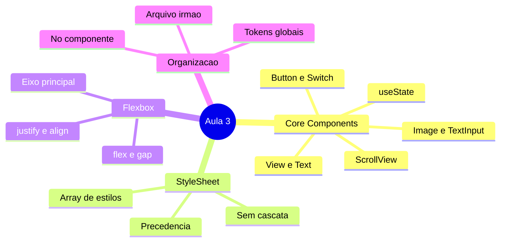
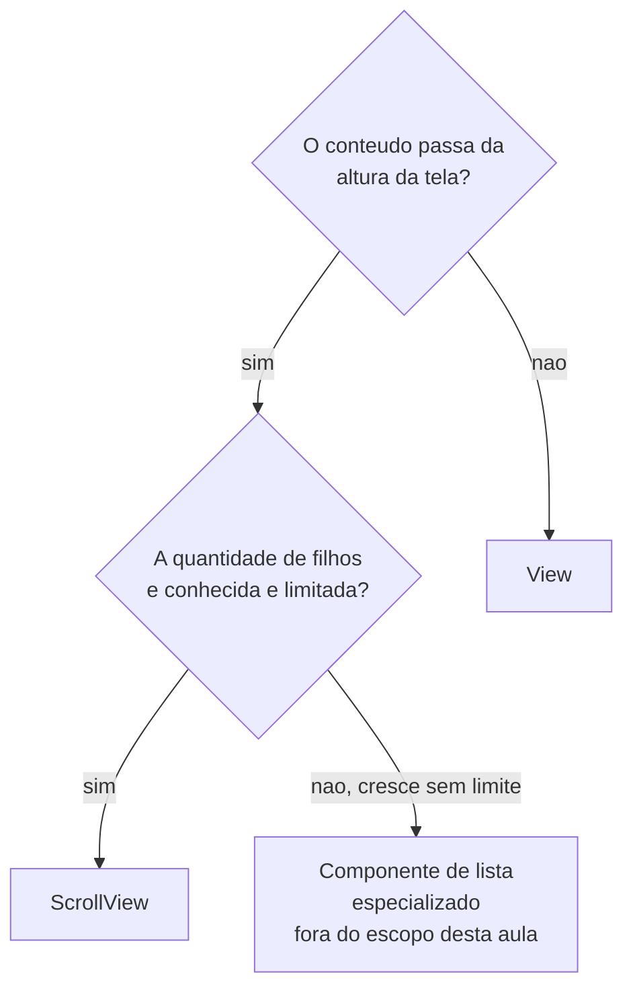
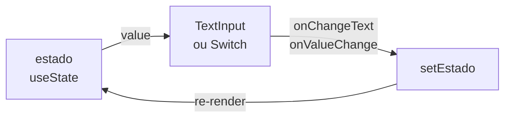
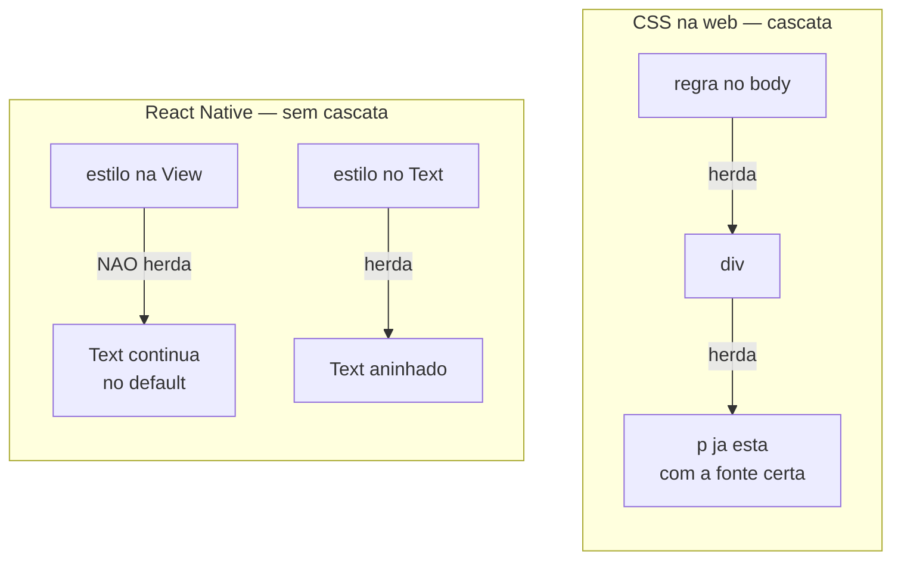
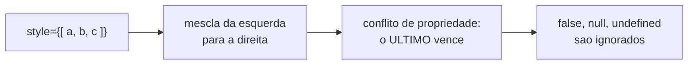
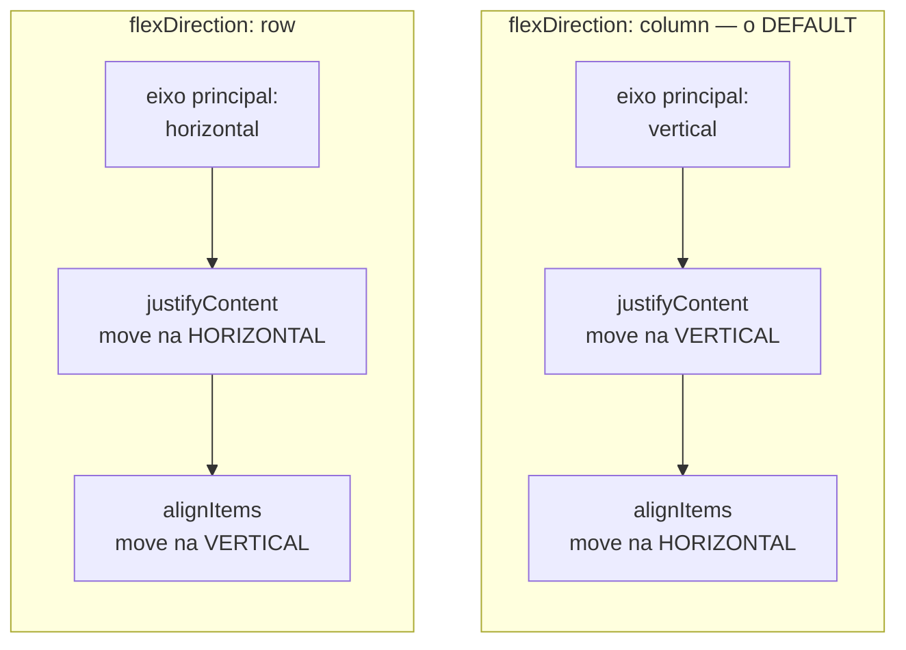
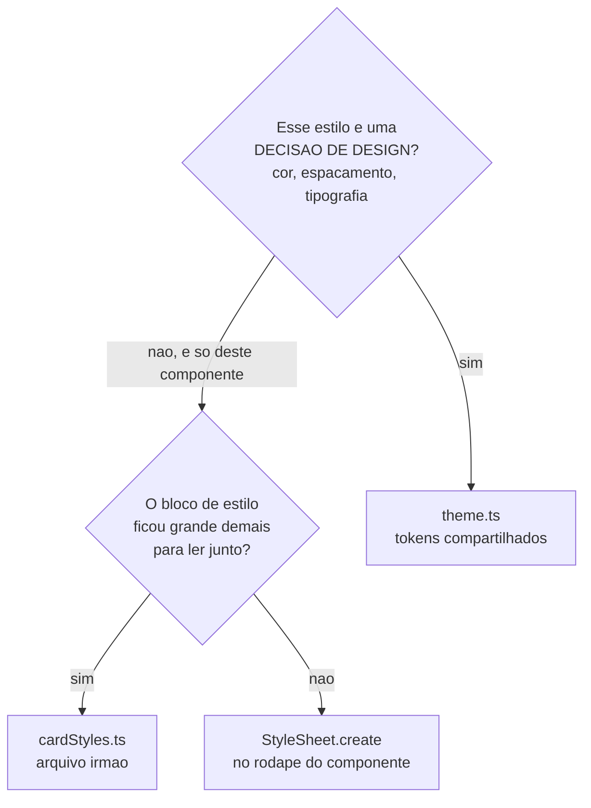

# Notas de Estudo — Aula 3: Core Components, StyleSheet e Flexbox

> **Disciplina:** Desenvolvimento Mobile (2026.2.DM) — CESAR School
> **Dados de versões e ferramentas:** conferidos em **18 de agosto de 2026**. Este material envelhece rápido; as fontes estão no final para você conferir por conta própria.

---

## Visão geral

Esta aula responde três perguntas:

1. **Com que peças eu monto uma tela?** → os Core Components.
2. **Como eu deixo isso com a aparência certa?** → `StyleSheet`, e por que ele não é CSS.
3. **Como eu distribuo o espaço da tela?** → Flexbox.

O fio condutor: na Aula 1 você aprendeu que `<View>` **não** é `<div>`. Esta aula é a consequência prática disso. Todo o vocabulário mudou, e a ideia mais central da estilização web — a **cascata** — simplesmente não existe aqui.



> **Leitura do diagrama:** o mapa mostra os quatro blocos da aula. Os três primeiros são o caminho "o que existe → como estilizar → como posicionar"; o quarto é a decisão de engenharia sobre onde guardar tudo isso.

> 📱 **Sobre os exemplos deste material:** o domínio é o **Rastreador de Micro-hábitos** (`Habito`) — um dos dois projetos da disciplina. Se o seu grupo ficou com o **App de Gestão e Rotina Pet**, a tabela de equivalência está em `exercises.md`.

---

# Parte 1 — O ambiente, atualizado

Antes do conteúdo, três correções de comandos que circulam em material antigo da disciplina.

## 1.1 Criar e limpar um projeto

```bash
# Cria o projeto (SDK atual: 57 = React Native 0.86.2 + React 19.2)
npx create-expo-app@latest meu-app

# Limpa o boilerplate: move o exemplo para app-example/ e deixa app/ com um index.tsx vazio
cd meu-app
npm run reset-project

# Roda
npx expo start
```

Depois do `reset-project` você pode apagar a pasta `app-example/` — ela não faz parte do app.

Templates disponíveis em `--template`: `default` (o recomendado, já com Expo Router e TypeScript), `blank`, `blank-typescript`, `tabs`, `bare-minimum`.

## 1.2 Expo Go no iPhone: o assunto que confunde todo mundo

A regra não é "o Expo Go só vai até o SDK 54". É mais específica que isso:

| Onde você quer rodar | O que fazer |
|---|---|
| Android (aparelho ou emulador) | Pegar o build do seu SDK em [expo.dev/go](https://expo.dev/go) |
| Simulador iOS | Idem — [expo.dev/go](https://expo.dev/go) |
| **iPhone físico, SDK 55+** | [sign.expo.dev](https://sign.expo.dev/) — instala com o provisionamento **gratuito** da sua Apple ID. O certificado vale **~7 dias**; depois é reinstalar |
| **iPhone físico, SDK 54** | Expo Go da App Store |
| iPhone físico, SDK 53 ou anterior | Não dá. Atualize o SDK ou faça um *development build* |

Por que a App Store está em 54? Porque a Expo **submeteu a build do SDK 57 e ainda aguarda aprovação**. É burocracia de loja, não limitação técnica — e é um exemplo concreto daquilo que a Aula 1 falou sobre o custo de depender de revisão de loja.

## 1.3 Rodar no navegador

```bash
# ✅ Certo
npx expo install react-dom react-native-web @expo/metro-runtime
npx expo start --web
```

```bash
# ❌ Errado (o que o material antigo mandava fazer)
npm install react-dom@19.2.0 react-native-web@^0.21.0
```

**Por que importa:** `npx expo install` consulta o seu SDK e instala a versão **compatível com ele**. `npm install` instala a mais recente do npm, que pode ser de um SDK futuro — e aí o app quebra com um erro que não tem nada a ver com o seu código. Guarde a regra: **dependência que acompanha o SDK se instala com `npx expo install`.**

---

# Parte 2 — Core Components

## 2.1 O dicionário de tradução

Você já sabe fazer interface. O que muda são as palavras.

| Web | React Native | O que você precisa lembrar |
|---|---|---|
| `<div>` | `<View>` | Contêiner. **Não** tem scroll implícito |
| `<p>`, `<span>`, `<h1>` | `<Text>` | **Todo** texto vive aqui. É o único que herda estilo. Aceita `onPress` |
| `` | `<Image>` | Imagem remota **precisa** de `width`/`height` |
| `<input type="text">` | `<TextInput>` | `value` + `onChangeText` |
| `<input type="checkbox">` | `<Switch>` | `value` + `onValueChange` (booleano) |
| scroll da página | `<ScrollView>` | Renderiza **todos** os filhos de uma vez. Duas props de estilo |
| `<button>` | `<Button>` | Botão do sistema. **Não aceita `style`** |
| `className` / arquivo `.css` | `StyleSheet.create({...})` | Objetos JavaScript |

São **sete componentes**. O dicionário inteiro desta aula cabe numa mão e meia.

> 📌 **Sobre o escopo:** componentes de toque estilizáveis (aqueles em que você desenha o próprio botão) **não são assunto desta aula**. Aqui a interação sai de três lugares, todos dentro da lista acima: `onPress` no `Button`, `onPress` no `Text`, e `onValueChange`/`onChangeText` nos componentes controlados. O foco de hoje é **estilo e layout**, não interação.

### 🧭 Analogia: o dicionário de viagem

Você já fala a língua — sabe formar frases, sabe gramática (React, estado, props). Alguém te deu um **dicionário menor**, com palavras diferentes para as mesmas ideias. `<div>` virou `<View>`. E algumas palavras simplesmente não têm tradução: não existe `<h1>`; existe `<Text>` com um estilo maior.

## 2.2 `View` — a caixa

```tsx
<View style={styles.container}>
  {/* filhos */}
</View>
```

- É um contêiner Flexbox. **Sempre.** Não existe `display: block` aqui.
- Não rola. Se o conteúdo passar da tela, ele é **cortado** — silenciosamente, sem aviso.
- Não pode conter texto solto.

## 2.3 `Text` — o único que herda

```tsx
<Text style={styles.titulo}>
  Beber 2L de água
  <Text style={styles.destaque}> · 4 dias seguidos</Text>
</Text>
```

Dois fatos que valem o semestre inteiro:

**1. Todo texto precisa estar dentro de `<Text>`.**

```tsx
<View>Beber água</View>                       // ❌ erro em runtime
<View><Text>Beber água</Text></View>          // ✅
```

O erro é `Text strings must be rendered within a <Text> component`. Você vai vê-lo. Todo mundo vê.

**2. `<Text>` dentro de `<Text>` herda estilo — e essa é a única herança que existe em React Native.**

```tsx
// A View NÃO passa fontSize para o Text dentro dela
<View style={{ fontSize: 24 }}>        // ❌ não faz nada
  <Text>Continuo no tamanho default</Text>
</View>

// Text dentro de Text, sim
<Text style={{ fontSize: 24 }}>
  Grande <Text style={{ fontWeight: 'bold' }}>e grande em negrito</Text>
</Text>
```

## 2.4 `Image` — a que precisa de dimensão

```tsx
import { Image } from 'react-native';

// Imagem local: o bundler sabe as dimensões em tempo de build
<Image source={require('../assets/habito.png')} />

// Imagem remota: você PRECISA informar as dimensões
<Image
  source={{ uri: 'https://exemplo.com/habito.png' }}
  style={{ width: 64, height: 64, borderRadius: 32 }}
/>
```

**Por que a diferença?** Com `require()`, o Metro (o bundler) lê o arquivo em tempo de build e já sabe quanto ele mede. Com uma URL, ninguém sabe o tamanho até a imagem baixar — então o layout precisaria "pular" quando ela chegasse. O React Native resolve exigindo que **você** informe.

**Erro clássico:** imagem remota sem `width`/`height` → o componente fica com tamanho zero e **você não vê nada**. Não há erro no console. Só um vazio.

Prop útil: `resizeMode` (`cover`, `contain`, `stretch`, `center`, `repeat`).

> 💡 **Existe uma opção melhor no Expo:** o pacote `expo-image` (`npx expo install expo-image`) traz cache em disco e memória, transição suave na troca de imagem ("no more flickering"), placeholders com BlurHash/ThumbHash e suporte a WebP, AVIF, HEIC e SVG. A documentação do React Native **não** deprecia o `Image` nativo — mas para app de produção com imagens vindas de rede, `expo-image` é o caminho.

## 2.5 `TextInput` — a entrada controlada

```tsx
import { useState } from 'react';
import { TextInput, StyleSheet } from 'react-native';

function CampoTitulo() {
  const [titulo, setTitulo] = useState('');

  return (
    <TextInput
      style={styles.input}
      value={titulo}                      // o estado manda no que aparece
      onChangeText={setTitulo}            // note: onChangeText, não onChange
      placeholder="Ex.: Beber 2L de água"
      placeholderTextColor="#999"
      maxLength={60}
      autoCapitalize="sentences"
    />
  );
}

const styles = StyleSheet.create({
  input: {
    borderWidth: 1,
    borderColor: '#ddd',
    borderRadius: 8,
    padding: 12,
    fontSize: 16,
  },
});
```

Diferenças que pegam quem vem da web:

- É **`onChangeText`**, e ele recebe a **string** direto — não um evento. Sem `e.target.value`.
- `<TextInput>` **não** tem borda por default no Android nem no iOS moderno. Se você não estilizar, ele é invisível.
- Props úteis: `keyboardType` (`numeric`, `email-address`), `secureTextEntry`, `multiline`, `autoCorrect`, `returnKeyType`.

## 2.6 `ScrollView` — quando o conteúdo passa da tela

```tsx
<ScrollView style={styles.tela} contentContainerStyle={styles.conteudo}>
  <Text>Muito conteúdo…</Text>
</ScrollView>
```

⚠️ **A pegadinha das duas props de estilo:**

- `style` estiliza o **contêiner externo** (a janela de rolagem).
- `contentContainerStyle` estiliza o **conteúdo que rola dentro** dela.

Quer `padding` no conteúdo? Vai em `contentContainerStyle`. Quer centralizar os filhos? Também. Colocar `alignItems: 'center'` no `style` de um `ScrollView` é um dos bugs mais confusos de depurar, porque *nada acontece*.

### `View` ou `ScrollView`?



> **Leitura do diagrama:** duas perguntas. Se o conteúdo cabe na tela, `View` basta. Se passa da tela e a quantidade de filhos é conhecida, `ScrollView`. Se a quantidade cresce sem limite, o caso pede um componente de lista especializado — que não é assunto desta aula.

**O motivo técnico:** `ScrollView` **monta todos os filhos de uma vez**, mesmo os que estão fora da tela. Com 20 filhos, tudo bem. Com 2.000, o app engasga no primeiro render.

Caso de uso típico de `ScrollView`: um **formulário** — campos conhecidos, quantidade fixa, mas que não cabem na tela com o teclado aberto. É exatamente o que você vai construir na Atividade 1.

## 2.7 `Button` — o botão do sistema

```tsx
<Button title="Salvar" onPress={salvar} color="#FF6002" disabled={false} />
```

São **essas** as props: `title`, `onPress`, `color`, `disabled` (mais as de acessibilidade). **Não existe `style`.**

Isso não é uma limitação acidental — é o projeto do componente. `Button` entrega o **botão do sistema operacional**, com a aparência que o sistema define. Você escolhe o texto, a ação e uma cor.

⚠️ **E até a cor se comporta diferente em cada plataforma:**

| Plataforma | O que `color` tinge |
|---|---|
| iOS | o **texto** do botão |
| Android | o **fundo** do botão |

Ou seja, o mesmo `color="#FF6002"` produz dois botões visualmente diferentes. Teste nas duas plataformas antes de decidir que "ficou errado".

**Quando `Button` é a escolha certa:** protótipo, caixa de diálogo, tela de configuração, ação de formulário — qualquer lugar em que a aparência do sistema é aceitável, ou desejável.

> 📌 **Se o requisito pede fundo, borda, raio de canto, sombra ou ícone**, `Button` não resolve — nenhuma dessas coisas passa por `title`/`color`. O componente adequado para desenhar o próprio botão **não é assunto desta aula**; você vai chegar nele mais adiante na disciplina. Por hoje, quando precisar de aparência própria em algo tocável, use `<Text onPress={...}>` com estilo (próxima seção).

### O que dá para fazer hoje: estilizar em volta

Uma saída legítima e muito usada: o `Button` fica dentro de uma `View` estilizada. Você não controla o botão, mas controla o espaço dele.

```tsx
<View style={styles.areaBotao}>
  <Button title="Marcar concluído" onPress={concluir} color={cores.primaria} />
</View>

// ...
areaBotao: {
  borderRadius: 8,
  overflow: 'hidden',      // no Android, recorta o fundo do botão no raio
  marginTop: espaco.sm,
},
```

## 2.8 `Text` com `onPress` — toque dentro do escopo

`Text` aceita `onPress`. É assim que, nesta aula, um elemento com **aparência própria** reage ao toque:

```tsx
const [concluido, setConcluido] = useState(false);

<Text
  style={[styles.titulo, concluido && styles.tituloConcluido]}
  onPress={() => setConcluido((anterior) => !anterior)}
>
  Beber 2L de água
</Text>
```

Aqui está o padrão que sustenta metade dos exercícios: **toque muda o estado → estado muda o array de estilos → a tela reflete**. Você já conhece as duas primeiras partes do React; a terceira é a novidade de hoje.

Note `setConcluido((anterior) => !anterior)`: quando o novo estado deriva do anterior, a forma de função é a segura — não depende do valor capturado naquele render.

## 2.9 O laço do componente controlado

`TextInput` e `Switch` seguem o mesmo desenho, e vale ver o ciclo inteiro de uma vez:



> **Leitura do diagrama:** é um laço fechado. O estado alimenta o `value` do componente; a interação do usuário dispara o callback; o callback grava o novo estado; o novo estado re-renderiza e volta ao `value`. O componente **não guarda** o valor por conta própria — o estado é a fonte de verdade.

É por isso que `onValueChange={setLembrete}` funciona sem função intermediária: o componente entrega exatamente o valor novo, e o setter aceita exatamente esse valor. Se você esquecer o `value`, o componente vira só um enfeite: o usuário mexe, o estado não muda, e a tela volta ao valor anterior.

## 2.10 `Switch` — o liga/desliga

```tsx
import { useState } from 'react';
import { View, Switch, Text, StyleSheet } from 'react-native';

export default function PreferenciasHabito() {
  const [lembrete, setLembrete] = useState(false);

  return (
    <View style={styles.linha}>
      <Text style={styles.rotulo}>Lembrete diário</Text>
      <Switch
        value={lembrete}                 // booleano
        onValueChange={setLembrete}      // recebe o booleano novo direto
        trackColor={{ false: '#ccc', true: '#FFB132' }}
        thumbColor="#FF6002"
      />
    </View>
  );
}

const styles = StyleSheet.create({
  linha: {
    flexDirection: 'row',
    justifyContent: 'space-between',
    alignItems: 'center',
    paddingVertical: 12,
  },
  rotulo: { fontSize: 16 },
});
```

Repare no padrão: `onValueChange={setLembrete}` funciona direto porque o `Switch` entrega o **booleano novo**, e `setLembrete` aceita exatamente um booleano. É o mesmo padrão do `onChangeText` do `TextInput`.

---

# Parte 3 — StyleSheet: o estilo que não é CSS

## 3.1 A ideia central: não existe cascata

### 👔 Analogia: o código de vestimenta

No CSS, você anuncia a regra para o prédio inteiro: *"todo texto deste site é Arial, 16px"*. Todo mundo lá dentro herda o anúncio, sem precisar ser avisado individualmente. É a **cascata**.

Em React Native **não existe alto-falante**. Cada componente **se veste sozinho**. Se você quer que cinco textos tenham o mesmo tamanho, os cinco precisam receber o estilo — de um jeito ou de outro.



> **Leitura do diagrama:** no bloco do CSS, o estilo desce pela árvore sozinho — de `body` para `div` para `p`. No bloco do React Native, o estilo posto na `View` **não** chega ao `Text`; a única seta de herança que existe vai de `Text` para `Text` aninhado.

**A consequência prática:** repetir estilo de texto em React Native é normal, não é falta de habilidade. E é exatamente por isso que a Parte 5 (tokens compartilhados) existe — ela é a resposta de engenharia para a ausência da cascata.

## 3.2 As outras diferenças de fundo

```tsx
{ padding: 16 }        // ✅ número, sem unidade — são dp (density-independent pixels)
{ padding: '16px' }    // ❌ unidade CSS não existe
{ width: '100%' }      // ✅ percentual funciona, como string
{ fontSize: '1.5rem' } // ❌ não há rem, em, vh, vw
```

- **Sem seletores.** Não há `.classe`, não há `#id`, não há `>` nem `:first-child`.
- **Sem `:hover`.** Não há mouse. O que existe é estado seu, guardado com `useState`.
- **`camelCase`:** `backgroundColor`, não `background-color`.
- **Subconjunto do CSS.** Muita propriedade da web simplesmente não existe.

## 3.3 As formas de passar `style` — e a precedência

```tsx
// 1. Objeto único
<View style={styles.card} />

// 2. Array — o ÚLTIMO vence no conflito
<View style={[styles.card, styles.cardDestacado]} />

// 3. Array com condicional — false e undefined são ignorados
<Text style={[styles.texto, ativo && styles.textoAtivo]} />

// 4. Array com valor calculado em runtime
<View style={[styles.badge, { backgroundColor: corDoStatus(status) }]} />

// 5. Vários condicionais ao mesmo tempo
<View style={[styles.card, concluido && styles.cardConcluido, urgente && styles.cardUrgente]} />
```

### A regra de precedência



> **Leitura do diagrama:** o array é mesclado da esquerda para a direita; quando dois objetos definem a mesma propriedade, o que está mais à direita ganha; valores falsos são descartados sem erro.

```tsx
<Text style={[{ color: 'blue' }, { color: 'red' }]}>Que cor?</Text>
// Vermelho. É o mesmo comportamento de Object.assign({}, a, b).
```

Se você lembrar de **`Object.assign`**, nunca mais vai errar essa.

## 3.4 O que `StyleSheet.create` faz — e o que não faz

```tsx
const styles = StyleSheet.create({
  container: {
    flex: 1,
    justifyContent: 'center',    // ✅ sem `as const`
    alignItems: 'center',
  },
  titulo: {
    fontSize: 20,
    fontWeight: '600',
  },
});
```

**O que ele faz:** valida em tempo de tipo e dá autocomplete. Escreva `backgroundColour` (grafia britânica) e o compilador reclama; num objeto solto, ele não necessariamente reclamaria.

🔴 **Fato zumbi importante — o `as const`:**

```tsx
// ❌ O que o material antigo (inclusive a versão anterior desta aula) escrevia
const styles = StyleSheet.create({
  container: {
    justifyContent: 'center' as const,
    alignItems: 'center' as const,
  },
});

// ✅ O que basta
const styles = StyleSheet.create({
  container: {
    justifyContent: 'center',
    alignItems: 'center',
  },
});
```

**Por quê?** A assinatura de `StyleSheet.create` é genérica e já preserva os tipos literais do objeto que você passa. O `as const` não acrescenta nada.

Onde ele **pode** ser necessário: num objeto solto, fora de `create`, atribuído a uma variável antes de ser usado — aí o TypeScript pode alargar `'center'` para `string`, que não é um `FlexAlignType` válido.

```tsx
// Aqui sim o as const (ou uma anotação de tipo) resolve algo
const estiloSolto = { justifyContent: 'center' } as const;
```

Aprenda a **distinção**, não a receita.

**Sobre "performance":** você vai ler que `StyleSheet.create` "otimiza". Historicamente ele registrava os estilos e passava só um ID pela ponte — e a ponte não existe mais (Aula 1, §3.4). Hoje o ganho real é **validação e organização**. Objetos inline funcionam; o problema deles é criar um objeto novo a cada render e espalhar números mágicos pelo JSX.

## 3.5 Sombra: `boxShadow` em vez do quarteto antigo

```tsx
// ❌ O jeito antigo: quatro props iOS + uma Android, e resultados diferentes
const styles = StyleSheet.create({
  card: {
    shadowColor: '#000',
    shadowOffset: { width: 0, height: 2 },
    shadowOpacity: 0.1,
    shadowRadius: 4,
    elevation: 5,          // só Android
  },
});

// ✅ O jeito atual: uma propriedade, sintaxe de CSS, as duas plataformas
const styles = StyleSheet.create({
  card: {
    boxShadow: '0px 2px 8px rgba(0, 0, 0, 0.12)',
  },
});
```

`boxShadow` está documentado em View Style Props e funciona na **New Architecture** — que é a **única** arquitetura desde a versão 0.82 (Aula 1, §3.4). Ou seja: no projeto de vocês, funciona.

Também chegou `filter` (blur, brightness, saturate), com a mesma condição.

O quarteto antigo continua funcionando, e você vai encontrá-lo em todo tutorial. Não é erro — é idade.

---

# Parte 4 — Flexbox

## 4.1 A analogia da fila

Três propriedades, três perguntas:

- **`flexDirection`** — em que direção a fila anda?
- **`justifyContent`** — como as pessoas se distribuem **ao longo** da fila?
- **`alignItems`** — onde elas ficam **na largura** da fila?

Toda dúvida de Flexbox se resolve com uma pergunta: **"qual é o eixo principal aqui?"**



> **Leitura do diagrama:** os dois blocos mostram que `justifyContent` e `alignItems` **trocam de eixo** conforme o `flexDirection`. Não existe "justifyContent é horizontal" — depende da direção.

## 4.2 🔴 O default que custa mais tempo na turma

**Em React Native, `flexDirection` default é `column`.** Na web, é `row`.

```tsx
// Você quer categoria e status lado a lado
const styles = StyleSheet.create({
  linha: {
    justifyContent: 'space-between',   // ❌ distribui na VERTICAL
  },
});

// Corrigido
const styles = StyleSheet.create({
  linha: {
    flexDirection: 'row',              // ✅ agora sim
    justifyContent: 'space-between',
  },
});
```

Esse é o bug de layout nº 1 do semestre. Se algo "não está indo para o lado", a primeira coisa a checar é se você declarou `flexDirection: 'row'`.

**Segundo default que surpreende:** `alignItems` default é **`stretch`**. Um filho sem largura própria ocupa **toda** a largura do pai. É por isso que sua caixinha às vezes aparece esticada de ponta a ponta sem você ter pedido.

## 4.3 As propriedades, na ordem em que se usam

### `flexDirection`

`'column'` (default) · `'row'` · `'column-reverse'` · `'row-reverse'`

### `justifyContent` — no eixo principal

| Valor | Efeito |
|---|---|
| `flex-start` (default) | tudo no começo |
| `center` | tudo no meio |
| `flex-end` | tudo no fim |
| `space-between` | primeiro na borda, último na borda, sobra dividida no meio |
| `space-around` | espaço igual em volta de cada item (bordas com metade) |
| `space-evenly` | espaço **exatamente** igual em todos os vãos, bordas incluídas |

### `alignItems` — no eixo cruzado

`stretch` (default) · `flex-start` · `center` · `flex-end` · `baseline`

### Centralizar no meio da tela

```tsx
const styles = StyleSheet.create({
  tela: {
    flex: 1,                      // ocupa a tela toda — sem isso, nada acontece
    justifyContent: 'center',     // centro vertical (eixo principal = column)
    alignItems: 'center',         // centro horizontal (eixo cruzado)
  },
});
```

⚠️ **Sem `flex: 1`, a `View` tem só a altura do conteúdo** — e centralizar dentro de uma caixa do tamanho do conteúdo não muda nada visualmente. Esse é outro clássico.

### `flex`, `flexGrow` e `flexBasis`

```tsx
// flex: 1 = "ocupe todo o espaço que sobrar"
{ flex: 1 }
// equivale a: flexGrow: 1, flexShrink: 1, flexBasis: 0

// Proporção: a primeira caixa fica com metade, as outras com um quarto cada
{ flexGrow: 2 }   // caixa 1
{ flexGrow: 1 }   // caixa 2
{ flexGrow: 1 }   // caixa 3

// flexBasis = tamanho INICIAL no eixo principal, antes de crescer ou encolher
{ flexBasis: 100 }
```

**A diferença que a prova cobra:** `flexBasis` é o **ponto de partida**; `flexGrow` é como a **sobra** é dividida. Um item com `flexBasis: 200` e `flexGrow: 0` fica com 200 e não cresce. Com `flexGrow: 1`, começa em 200 e ainda pega parte do que sobrou.

> 📌 Detalhe que difere do CSS: em React Native, `flexShrink` default é **`0`**; na web é `1`. Ou seja, por default os itens **não** encolhem.

### `flexWrap` + largura percentual = grade

```tsx
const styles = StyleSheet.create({
  grade: {
    flexDirection: 'row',
    flexWrap: 'wrap',
    gap: 12,                 // ✅ espaçamento entre os itens
  },
  celula: {
    width: '30%',            // 3 por linha
    aspectRatio: 1,          // quadrado, sem precisar calcular altura
    backgroundColor: '#F3E9DC',
  },
});
```

### `gap` — pare de espaçar com `margin`

```tsx
// ❌ O jeito antigo: margem em cada filho
celula: { margin: 5 }
// Problema: gera margem também nas BORDAS externas, e entre dois vizinhos
// as margens somam (5 + 5 = 10), então o vão interno fica diferente da borda.

// ✅ gap no contêiner: espaço só ENTRE os filhos
grade: { gap: 12 }
```

`gap`, `rowGap` e `columnGap` estão documentados em Layout Props. Só aceitam número (pixels/dp).

**Regra prática:** `gap` para o espaço **entre** irmãos; `padding` para o espaço **dentro** do contêiner; `margin` para o espaço **em volta** do grupo inteiro.

## 4.4 Onde Flexbox no RN difere do CSS — resumo

| | React Native | CSS |
|---|---|---|
| `flexDirection` default | **`column`** | `row` |
| `flexShrink` default | **`0`** | `1` |
| `alignContent` default | `flex-start` | `stretch` |
| Unidades | número (dp) ou `'%'` | `px`, `rem`, `vh`… |
| `display: grid` | **não existe** | existe |
| `float` | **não existe** | existe |
| `position` | `relative`, `absolute`, `static` | + `fixed`, `sticky` |

> 🐸 **Para praticar:** o [Flexbox Froggy](https://flexboxfroggy.com/) (~20 min) é excelente para construir intuição de eixo. Só lembre que ele é **CSS**, então lá o default é `row`. Use para o raciocínio, não como referência de defaults.

---

# Parte 5 — Onde os estilos devem morar

Quatro estratégias. A pergunta não é "qual é a melhor", é **"qual serve para este caso"**.



> **Leitura do diagrama:** duas perguntas decidem tudo. Decisão de design compartilhada vira token; estilo local fica junto do componente, e só sai para um arquivo irmão quando o volume atrapalha a leitura.

## 5.1 O default: `StyleSheet.create` no rodapé do componente

É o padrão da comunidade e da documentação oficial. Estilo que só existe naquele componente fica **junto** dele — você lê o JSX e o estilo sem trocar de arquivo.

```tsx
export function CardHabito({ titulo, categoria }: CardHabitoProps) {
  return (
    <View style={styles.card}>
      <Text style={styles.titulo}>{titulo}</Text>
      <Text style={styles.meta}>{categoria}</Text>
    </View>
  );
}

const styles = StyleSheet.create({
  card:   { padding: 16, borderRadius: 12, backgroundColor: '#fff' },
  titulo: { fontSize: 18, fontWeight: '600' },
  meta:   { fontSize: 12, color: '#666' },
});
```

## 5.2 Arquivo irmão: quando o volume atrapalha

```tsx
// cardStyles.ts
import { StyleSheet } from 'react-native';

export default StyleSheet.create({ /* … 60 linhas … */ });
```

```tsx
// CardHabito.tsx
import styles from './cardStyles';
```

**Critério honesto:** faça isso quando o `StyleSheet.create` ficou grande o suficiente para você ter que rolar para achar o JSX. Não faça por princípio — cada arquivo extra é mais um lugar para abrir a cada leitura.

## 5.3 Tokens compartilhados: a resposta à ausência de cascata

Este é o ponto mais importante da Parte 5.

```tsx
// theme.ts — VALORES, não componentes montados
export const cores = {
  fundo: '#FEF7EE',
  texto: '#191919',
  textoFraco: '#6b6459',
  primaria: '#FF6002',
  sucesso: '#2e7d32',
  erro: '#c62828',
} as const;

export const espaco = {
  xs: 4,
  sm: 8,
  md: 16,
  lg: 24,
  xl: 32,
} as const;

export const tipografia = {
  titulo:   { fontSize: 20, fontWeight: '600' },
  corpo:    { fontSize: 16 },
  legenda:  { fontSize: 12, color: cores.textoFraco },
} as const;
```

```tsx
// No componente
import { cores, espaco, tipografia } from '../theme';

const styles = StyleSheet.create({
  card: {
    padding: espaco.md,
    backgroundColor: cores.fundo,
    gap: espaco.sm,
  },
  titulo: tipografia.titulo,
});
```

> 📌 **Aqui o `as const` faz sentido** — diferente de dentro de `StyleSheet.create`. Estes são objetos soltos, e sem `as const` o TypeScript alargaria `fontWeight: '600'` para `string`, que não é um valor válido de `fontWeight`.

### 🔴 O erro que quase todo mundo comete

```tsx
// ❌ Isso NÃO é design system — é folha de estilo global com outro nome
// globalStyles.ts
export default StyleSheet.create({
  container: { flex: 1, padding: 20 },
  text: { fontSize: 18, color: '#333' },
  button: { backgroundColor: 'blue', padding: 10, borderRadius: 5 },
});
```

**Por que é ruim:** `container` é um **layout**, não uma decisão de design. No momento em que uma tela precisar de `padding: 8` em vez de 20, você vai criar `container2` — ou pior, sobrescrever com `[globalStyles.container, {padding: 8}]` e perder a rastreabilidade. Você acoplou telas que não têm nada a ver uma com a outra.

**A regra:** tokens compartilhados são **valores** (`cores.primaria`, `espaco.md`), não **layouts prontos** (`container`, `card`, `button`). Layout é decisão local; valor é decisão do produto.

Se você quer compartilhar um *card* de verdade, compartilhe um **componente** (`<Card>`), não um objeto de estilo.

## 5.4 Objeto inline: só para protótipo ou valor calculado

```tsx
// Legítimo: o valor só existe em runtime
<View style={[styles.badge, { backgroundColor: corDoStatus(status) }]} />

// Evitar: valores fixos soltos no JSX
<View style={{ padding: 16, borderRadius: 12, backgroundColor: '#fff' }} />
```

Um objeto inline é recriado a cada render. Em um card isolado, ninguém percebe. Numa tela com centenas de elementos, começa a pesar. Mas o problema principal não é performance — é que o número mágico ficou espalhado no JSX, longe de qualquer decisão de design.

## 5.5 E o Tailwind? (contexto, fora do escopo)

Existem bibliotecas que trazem `className` de Tailwind para React Native:

| Opção | Situação em ago/2026 |
|---|---|
| **NativeWind v4** | Estável, mas exige **Tailwind v3** |
| **NativeWind v5** | Em preview, mira Tailwind v4 — ainda não estável |
| **Uniwind** | Novo, feito para Tailwind v4, API `className` compatível |

**A disciplina usa `StyleSheet`.** Três motivos: é o que a documentação oficial ensina, é o que você vai achar em qualquer código base existente, e é a base sobre a qual todas essas bibliotecas são construídas — quem aprende `StyleSheet` entende o que o Tailwind está fazendo por baixo; o contrário não é verdade.

> 💡 Note que essa comparação repete a lição do **TypeScript 7** da Aula 1: existe versão mais nova (NativeWind v5, Uniwind) e existe versão que o ecossistema sustenta hoje. **Versão mais nova não é automaticamente a versão recomendada.**

---

# Parte 6 — Juntando tudo: o card estilizado

Este é o exemplo que amarra a aula. Compare com o card da Aula 1 (§3.6) e veja o que mudou: agora há tokens, `gap`, `boxShadow`, estilo condicional ligado ao estado, e nenhum `JSX.Element`. **Todos os componentes usados estão na lista das sete palavras** de §2.1.

```tsx
import { useState } from 'react';
import { View, Text, ScrollView, Switch, Button, StyleSheet } from 'react-native';

// --- tokens (em projeto real, isto vem de theme.ts) ---
const cores = {
  fundo: '#FEF7EE',
  cartao: '#FFFFFF',
  texto: '#191919',
  textoFraco: '#6b6459',
  primaria: '#FF6002',
  sucesso: '#2e7d32',
} as const;

const espaco = { sm: 8, md: 16, lg: 24 } as const;

// --- domínio (Aula 1) ---
type StatusHabito = 'pendente' | 'concluido' | 'pulado';

interface Habito {
  id: string;
  titulo: string;
  categoria: string;
  status: StatusHabito;
  streakDias: number;
}

function rotuloStatus(status: StatusHabito): string {
  switch (status) {
    case 'pendente':  return 'Pendente';
    case 'concluido': return 'Concluído';
    case 'pulado':    return 'Pulado';
  }
}

const MOCK: Habito = {
  id: '1',
  titulo: 'Beber 2L de água',
  categoria: 'saúde',
  status: 'pendente',
  streakDias: 4,
};

// Sem anotação de retorno: o TypeScript infere.
// (JSX.Element não existe mais como tipo global no React 19.)
export default function TelaHabitoDoDia() {
  const [status, setStatus] = useState<StatusHabito>(MOCK.status);
  const [lembrete, setLembrete] = useState(false);

  const concluido = status === 'concluido';
  const alternarStatus = () => setStatus(concluido ? 'pendente' : 'concluido');

  return (
    <ScrollView style={styles.tela} contentContainerStyle={styles.conteudo}>
      <Text style={styles.tituloTela}>Hábito do dia</Text>

      <View style={[styles.card, concluido && styles.cardConcluido]}>
        {/* Text aceita onPress: toque muda o estado, estado muda o estilo */}
        <Text
          style={[styles.titulo, concluido && styles.tituloConcluido]}
          onPress={alternarStatus}
        >
          {MOCK.titulo}
        </Text>

        <View style={styles.linha}>
          <Text style={styles.meta}>{MOCK.categoria}</Text>
          <Text style={[styles.meta, concluido && styles.metaConcluido]}>
            {rotuloStatus(status)}
          </Text>
        </View>

        <Text style={styles.streak}>
          🔥 {concluido ? MOCK.streakDias + 1 : MOCK.streakDias} dias seguidos
        </Text>

        <View style={styles.linha}>
          <Text style={styles.meta}>Lembrete diário</Text>
          <Switch value={lembrete} onValueChange={setLembrete} />
        </View>

        {/* Button não aceita style — estilizamos a View em volta */}
        <View style={styles.areaBotao}>
          <Button
            title={concluido ? 'Desmarcar' : 'Marcar concluído'}
            onPress={alternarStatus}
            color={concluido ? cores.textoFraco : cores.primaria}
          />
        </View>
      </View>
    </ScrollView>
  );
}

const styles = StyleSheet.create({
  tela: {
    flex: 1,
    backgroundColor: cores.fundo,
  },
  conteudo: {                       // ScrollView: o padding vai AQUI
    padding: espaco.md,
    paddingTop: 48,                 // em projeto real: useSafeAreaInsets()
    gap: espaco.lg,
  },
  tituloTela: {
    fontSize: 24,
    fontWeight: '700',
    color: cores.texto,
  },
  card: {
    padding: espaco.md,
    borderRadius: 12,
    backgroundColor: cores.cartao,
    boxShadow: '0px 2px 8px rgba(0, 0, 0, 0.10)',
    gap: espaco.sm,                 // espaça os filhos, sem margin
  },
  cardConcluido: {
    backgroundColor: '#f2f8f2',
  },
  titulo: {
    fontSize: 18,
    fontWeight: '600',
    color: cores.texto,
  },
  tituloConcluido: {
    textDecorationLine: 'line-through',
    color: cores.textoFraco,
  },
  linha: {
    flexDirection: 'row',           // sem isto, os dois textos empilham
    justifyContent: 'space-between',
    alignItems: 'center',
  },
  meta: {
    fontSize: 12,
    color: cores.textoFraco,
  },
  metaConcluido: {
    color: cores.sucesso,
    fontWeight: '600',
  },
  streak: {
    fontStyle: 'italic',
    color: cores.textoFraco,
  },
  areaBotao: {
    borderRadius: 8,
    overflow: 'hidden',
    marginTop: espaco.sm,           // margin EM VOLTA do grupo: uso legítimo
  },
});
```

**Oito coisas para notar nesse código:**

1. `gap` no `card` e no `conteudo` — nenhuma `margin` para espaçar irmãos.
2. `boxShadow` em uma linha, no lugar do quarteto `shadow*` + `elevation`.
3. `flexDirection: 'row'` explícito em `linha` — sem ele, tudo empilha.
4. O `padding` foi para **`contentContainerStyle`**, não para o `style` do `ScrollView`.
5. Array com condicional em **três** lugares: `card`, `titulo` e `meta`. Um estado, três efeitos visuais.
6. `Text` com `onPress` — o toque dentro do escopo desta aula.
7. `Button` embrulhado numa `View` estilizada, porque ele não aceita `style`. Note que ali o `marginTop` é **espaço em volta do grupo** — uso legítimo de `margin`, diferente de espaçar irmãos.
8. Nenhum `as const` dentro de `StyleSheet.create` (mas há nos tokens) e nenhuma anotação `: JSX.Element`.

---

## Erros comuns (consulte antes de pedir ajuda)

| Erro | Causa | Correção |
|---|---|---|
| `Text strings must be rendered within a <Text> component` | Texto solto dentro de `<View>` | Envolver em `<Text>` |
| `fontSize` na `View` não afeta o texto | Não há cascata nem herança | Estilo vai no próprio `<Text>` |
| Itens empilhados quando deveriam ficar lado a lado | `flexDirection` default é `column` | `flexDirection: 'row'` |
| `justifyContent: 'space-between'` "distribui errado" | Está atuando no eixo vertical | Declarar `flexDirection: 'row'` |
| Caixa esticada de ponta a ponta sem querer | `alignItems` default é `stretch` | `alignItems: 'flex-start'` ou dar largura |
| `justifyContent: 'center'` não centraliza | O contêiner tem só a altura do conteúdo | `flex: 1` no contêiner |
| Imagem remota invisível, sem erro no console | Falta `width`/`height` | Definir dimensões no `style` |
| `padding` do `ScrollView` não aparece | Foi para o contêiner externo | Usar `contentContainerStyle` |
| `<Button style={...}>` não estiliza | `Button` não aceita `style` | Usar `color`, ou estilizar a `View` em volta |
| `Button` com cor "errada" em uma das plataformas | `color` tinge o texto no iOS e o fundo no Android | Testar nas duas; é o comportamento esperado |
| `Cannot find namespace 'JSX'` | React 19 removeu o `JSX` global | Remover a anotação, ou `React.JSX.Element` |
| `padding: '16px'` ignorado | Unidade CSS não existe | `padding: 16` |
| Espaçamento irregular entre itens | `margin` em cada filho soma entre vizinhos | `gap` no contêiner |
| `Switch` não muda ao ser tocado | Falta o `value` ligado ao estado | `value={x}` + `onValueChange={setX}` |
| `react-native-web` quebrou o build | Versão incompatível com o SDK | `npx expo install`, não `npm install` |
| Erro de tipo em `justifyContent` fora de `create` | TS alargou `'center'` para `string` | `as const` ou anotação de tipo |
| Expo Go no iPhone diz versão incompatível | App Store está no SDK 54 | `sign.expo.dev` para SDK 55+ |

---

## Perguntas para autoavaliação

Responda sem olhar as notas. Se travar, releia a seção indicada.

**Core Components**
1. Por que `<View>Olá</View>` quebra, e qual é a única situação em que estilo de texto é herdado? (§2.3)
2. Por que uma `<Image>` com `require()` funciona sem `width`/`height`, mas uma com `uri` remoto não? (§2.4)
3. Qual a diferença entre `style` e `contentContainerStyle` num `ScrollView`? Onde vai o `padding`? (§2.6)
4. Quando `View` basta e quando você precisa de `ScrollView`? Qual é o critério? (§2.6)
5. Quais são as quatro props do `<Button>`? Por que não dá para deixá-lo com canto arredondado? (§2.7)
6. O que a prop `color` do `Button` tinge no iOS? E no Android? (§2.7)
7. Como se faz um trecho de texto reagir ao toque usando só o catálogo desta aula? (§2.8)
8. Descreva o laço do componente controlado. O que acontece se você esquecer o `value`? (§2.9)
9. Por que `onValueChange={setLembrete}` funciona sem função intermediária no `Switch`? (§2.10)

**StyleSheet**
10. Reconte a analogia do código de vestimenta. O que representa o alto-falante que não existe? (§3.1)
11. Em `style={[{color:'blue'}, {color:'red'}]}`, qual cor aparece? Que função do JavaScript tem o mesmo comportamento? (§3.3)
12. O que acontece com `false` dentro de um array de estilos? (§3.3)
13. Por que `as const` é desnecessário **dentro** de `StyleSheet.create`, mas útil num `theme.ts`? (§3.4 e §5.3)
14. O que `StyleSheet.create` realmente entrega hoje, agora que a bridge não existe mais? (§3.4)
15. Escreva uma sombra de card usando a propriedade atual, não o quarteto antigo. (§3.5)

**Flexbox**
16. Qual o default de `flexDirection` em React Native? E no CSS? Que bug isso causa? (§4.2)
17. Se `flexDirection` é `'row'`, `alignItems` mexe em qual eixo? (§4.1)
18. Por que `justifyContent: 'center'` às vezes "não faz nada"? (§4.3)
19. Qual a diferença entre `flexBasis: 200` e `flexGrow: 1`? (§4.3)
20. Por que `gap: 12` é melhor que `margin: 6` em cada filho? (§4.3)
21. Cite duas coisas do Flexbox no CSS que **não** existem em React Native. (§4.4)

**Organização**
22. Qual a pergunta que decide se um estilo vai para `theme.ts` ou fica no componente? (§5)
23. Por que `globalStyles.container` é uma má ideia, se `cores.primaria` é uma boa? (§5.3)
24. Quando um objeto de estilo inline é legítimo? (§5.4)
25. Por que a disciplina ensina `StyleSheet` e não NativeWind? (§5.5)

---

## Leitura recomendada

**Obrigatória para a próxima aula**
- Capítulo 4 — Criando os primeiros componentes
- Capítulo 5 — Componentes estilizados
- Capítulo 6 — O básico de layout com o Flexbox
  *(todos em* React Native: Desenvolvimento de aplicativos mobile com React*)*
- [React Native — Core Components and APIs](https://reactnative.dev/docs/components-and-apis)

**Recomendada**
- [React Native — Flexbox](https://reactnative.dev/docs/flexbox)
- [React Native — StyleSheet](https://reactnative.dev/docs/stylesheet)
- [React Native — Layout Props](https://reactnative.dev/docs/layout-props) (a referência de `gap` e dos defaults)
- [Flexbox Froggy](https://flexboxfroggy.com/) — ~20 min, para intuição de eixo

**Para quem quiser ir além**
- [React Native — View Style Props](https://reactnative.dev/docs/view-style-props) (`boxShadow`, `filter`)
- [Expo — `expo-image`](https://docs.expo.dev/versions/latest/sdk/image/)
- [React 19 Upgrade Guide](https://react.dev/blog/2024/04/25/react-19-upgrade-guide) (por que `JSX.Element` sumiu)
- [Expo — Tailwind guide](https://docs.expo.dev/guides/tailwind/) · [NativeWind](https://www.nativewind.dev/) · [Uniwind](https://uniwind.dev/)

---

## Fontes dos dados citados

Verificadas em **18 de agosto de 2026**.

**Expo**
- [Expo SDK 57 — changelog](https://expo.dev/changelog/sdk-57) — React Native 0.86, React 19.2, `eas go`, build da App Store aguardando aprovação
- [Create a project](https://docs.expo.dev/get-started/create-a-project/) — comando de criação
- [create-expo-app](https://docs.expo.dev/more/create-expo/) — valores de `--template`
- ["Project is incompatible with this version of Expo Go"](https://docs.expo.dev/troubleshooting/expo-go-version-mismatch/) — `sign.expo.dev`, certificado de ~7 dias, SDK 54 vs 55+, `eas go`
- [Set up your environment](https://docs.expo.dev/get-started/set-up-your-environment/)
- [Tutorial — create your first app](https://docs.expo.dev/tutorial/create-your-first-app/) — `reset-project` e `app-example/`
- [`expo-image`](https://docs.expo.dev/versions/latest/sdk/image/) — cache, transição, BlurHash, formatos

**React Native**
- [Layout Props](https://reactnative.dev/docs/layout-props) — `gap`/`rowGap`/`columnGap`; `flexDirection` default `column`; `alignItems` default `stretch`
- [View Style Props](https://reactnative.dev/docs/view-style-props) — `boxShadow` e `filter` (New Architecture)
- [Flexbox](https://reactnative.dev/docs/flexbox) · [StyleSheet](https://reactnative.dev/docs/stylesheet)
- [View](https://reactnative.dev/docs/view) · [Text](https://reactnative.dev/docs/text) · [Image](https://reactnative.dev/docs/image) · [TextInput](https://reactnative.dev/docs/textinput) · [ScrollView](https://reactnative.dev/docs/scrollview) · [Button](https://reactnative.dev/docs/button) · [Switch](https://reactnative.dev/docs/switch)
- [Core Components and APIs](https://reactnative.dev/docs/components-and-apis)

**React**
- [React 19 Upgrade Guide](https://react.dev/blog/2024/04/25/react-19-upgrade-guide) — remoção do namespace global `JSX`

**Tailwind para React Native (contexto)**
- [NativeWind](https://www.nativewind.dev/) · [Uniwind](https://uniwind.dev/) · [Uniwind vs NativeWind](https://uniwind.dev/vs-nativewind) *(fonte do próprio fornecedor — ler com ressalva)* · [Expo — Tailwind](https://docs.expo.dev/guides/tailwind/)
