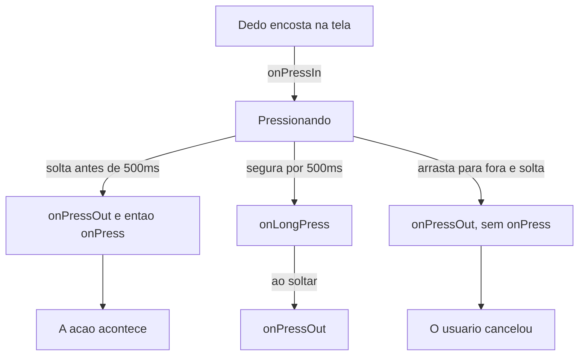
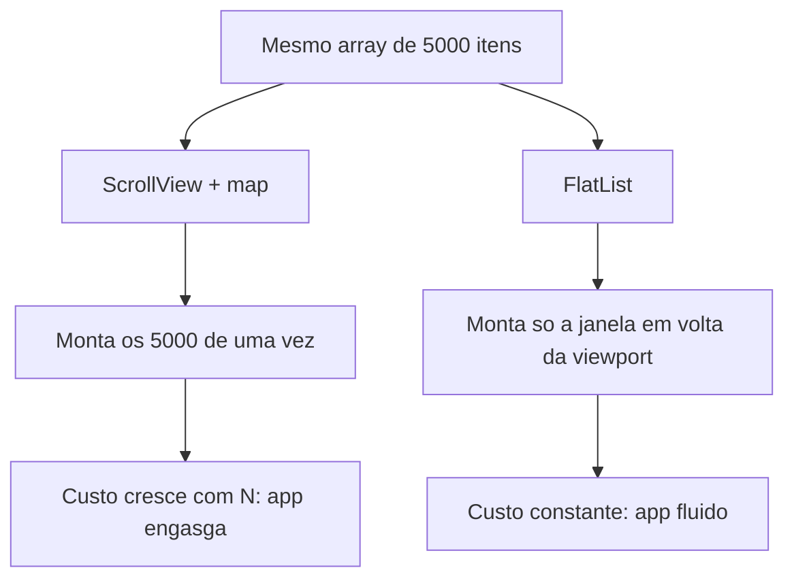
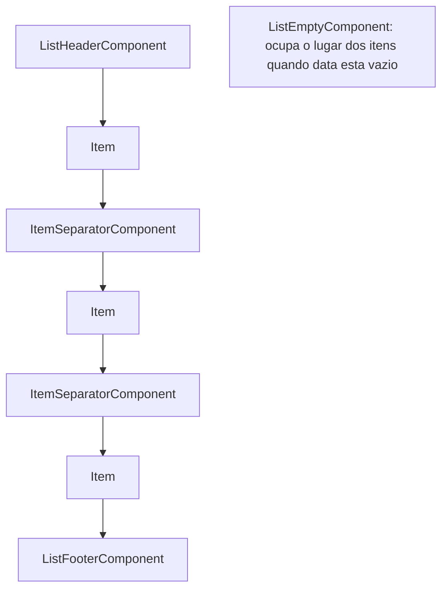
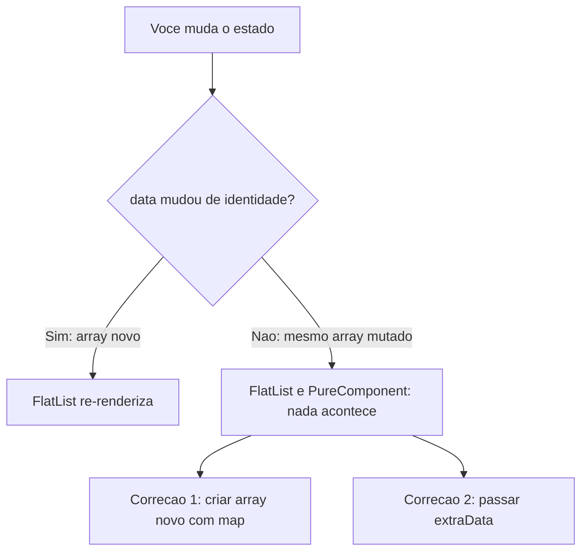
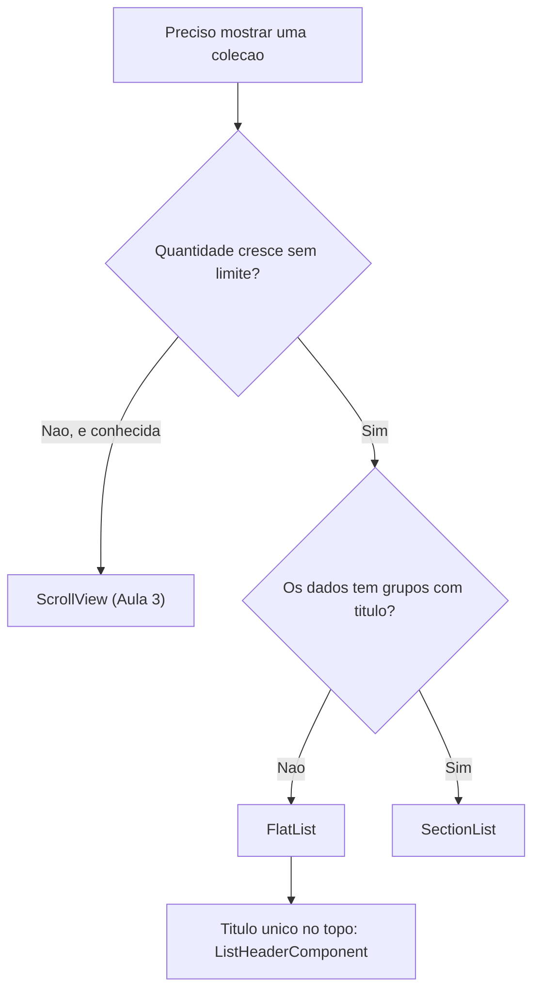

<!--
Slides em Markdown compatíveis com Marp.
Para exportar:  npx @marp-team/marp-cli@latest presentation.md -o aula4.pdf
Os blocos de comentário HTML são notas do apresentador (não aparecem no slide).
Materiais irmãos: student-notes.md · exercises.md · practice.md (equivalência Pet).

>>> PARA PROJETAR EM SALA, USE `presentation.html` (reveal.js). <<<
Este arquivo .md é a fonte em Markdown, para leitura rápida no editor e para
quem preferir Marp. O Marp NÃO renderiza blocos ```mermaid nativamente — os
diagramas aparecem como código. A versão HTML renderiza tudo e ainda tem
modo apresentador, visão geral e navegação por teclado.

Para gerar o PDF com a identidade visual preservada:
    node tools/slides-to-pdf.mjs "aulas/aula-04-pressable-listas/presentation.html"
-->

# Desenvolvimento Mobile

## Aula 4 — `Pressable`, `FlatList` e `SectionList`

CESAR School · 2026.2

<!--
Antes de começar: confirmar que todo mundo tem o projeto do grupo rodando
com `npx expo start`. Quem estiver travado resolve AGORA, não no bloco de
hands-on.

Dizer também qual arquivo cada grupo segue: exercises.md (Hábito) ou
practice.md (Pet).
-->

---

<!-- _class: lead -->

## Na Aula 3 eu te dei um **remendo**.

### O `Button` não aceita `style`, então usamos `<Text onPress>`. Hoje devolvo o componente de verdade.

<!--
E, de quebra, resolvo o outro problema que ficou aberto:
a tela que mostra TRÊS hábitos funciona; a que mostra TRÊS MIL trava.

Deixar as duas dívidas no ar. São o eixo da aula inteira.
-->

---

## Agenda — 3 horas

| Bloco | Tempo |
|---|---|
| Abertura + o problema do dia | 10 min |
| **1.** `Pressable`: o toque que você desenha | 35 min |
| ☕ Intervalo | 10 min |
| **2.** Checkpoint — toque | 8 min |
| **3.** `FlatList`: só renderiza o que se vê | 42 min |
| **4.** `SectionList`: quando o dado vem agrupado | 20 min |
| **5.** Checkpoint — listas | 7 min |
| **6.** Hands-on guiado | 38 min |
| Atividade aplicada + fechamento | 10 min |

---

## Ao final da aula você deve conseguir

1. **Construir** um controle tocável com aparência própria e feedback visual
2. **Descrever** o ciclo de vida do toque e escolher o callback certo
3. **Ajustar** área e tempo do toque com `hitSlop` e companhia
4. **Explicar** por que uma lista longa não pode ser um `.map()` em `ScrollView`
5. **Renderizar** uma `FlatList` completa — chave, molduras, estado vazio
6. **Diagnosticar** os três defeitos clássicos de lista
7. **Escolher** entre `FlatList` e `SectionList` pelo formato do dado
8. **Prever** a diferença de sticky header entre iOS e Android

---

<!-- _class: lead -->

# Parte 1

## `Pressable` — o toque que você desenha

---

## O que você tinha, e o limite de cada um

| O que você tinha | O limite |
|---|---|
| `Button` | aparência do sistema; **não aceita `style`** |
| `<Text onPress>` | funciona, mas o alvo é só o texto e não há feedback |
| `Switch` | é um liga/desliga, não uma ação |
| **`Pressable`** | **envolve qualquer coisa** e reporta o toque |

### A frase-chave: `Pressable` **não desenha nada**.

<!--
Ele é uma casca que detecta o toque no que estiver dentro dele.
Toda a aparência continua vindo do StyleSheet e do Flexbox da Aula 3.

Consequência prática que vale dizer em voz alta: um Pressable VAZIO
é invisível e parece quebrado. Ele PRECISA de filhos.
-->

---

<!-- _class: lead -->

# 🚪 O tapete sensor da porta automática

### O tapete não tem aparência própria e não abre porta nenhuma. Ele só avisa: *"alguém pisou aqui"*.

O que acontece depois é decisão sua.

<!--
Levar a analogia até o fim:
- o tapete = Pressable
- o que a pessoa VÊ = a View estilizada por dentro
- o que acontece depois = onPress

Se alguém perguntar "então ele é só um wrapper?" — sim, exatamente.
E é por isso que ele é flexível.
-->

---

## O mínimo funcional

```tsx
<Pressable onPress={onSalvar} style={styles.botao}>
  <Text style={styles.rotulo}>Salvar hábito</Text>
</Pressable>
```

```tsx
const styles = StyleSheet.create({
  botao: {
    paddingVertical: 14, paddingHorizontal: 20,
    borderRadius: 12, backgroundColor: '#FF6002', alignItems: 'center',
  },
  rotulo: { color: '#FFFFFF', fontSize: 16, fontWeight: '600' },
});
```

### Nada aí é novo além do `Pressable`.

<!--
Apontar: o StyleSheet.create é o mesmo da Aula 3. O alignItems é o mesmo
Flexbox. A Aula 4 ACRESCENTA; não substitui.
-->

---

## O ciclo de vida do toque



<!--
DESENHAR NA LOUSA ANTES de mostrar o slide. É o conteúdo que mais rende
no semestre inteiro, porque explica bugs que eles vão encontrar sozinhos.

Leitura em voz alta: o toque começa em onPressIn, e daí saem TRÊS caminhos.
Solta antes de 500ms: onPressOut e então onPress — a ação acontece.
Segura mais que isso: onLongPress, e onPressOut ainda dispara ao soltar.
Arrasta para fora e solta lá: só onPressOut — o usuário CANCELOU, e esse
terceiro caminho é o slide seguinte.
-->

---

<!-- _class: lead -->

## `onPress` dispara quando o dedo **SOLTA**.

### Ação vai em `onPress`. Feedback vai no `pressed`.

<!--
Este slide é uma pausa retórica. Deixar no ar.

Quem coloca a ação em onPressIn cria DOIS bugs de uma vez:
1. a ação acontece cedo demais
2. o usuário perde a chance de CANCELAR arrastando o dedo para fora

O gesto de cancelar é universal em interface de toque, e todo mundo
usa sem pensar. Se você põe a ação no onPressIn, você tira isso do usuário.
-->

---

## Qual callback usar

| Callback | Quando usar |
|---|---|
| **`onPress`** | **a ação.** Salvar, marcar, abrir, alternar |
| `onPressIn` | efeito instantâneo e **reversível** (som, vibração leve) |
| `onPressOut` | desfazer algo que começou no `onPressIn` |
| `onLongPress` | ação secundária: menu, excluir, seleção múltipla |
| `onPressMove` | arrastar; quase nunca na disciplina |

---

## A única sintaxe nova da aula: `style` como função

```tsx
// Aula 3 — array com condicional vinda do SEU estado
<View style={[styles.card, concluido && styles.cardConcluido]} />

// Aula 4 — o MESMO array; quem decide agora é o framework
<Pressable style={({ pressed }) => [styles.card, pressed && styles.cardPressionado]}>
  <Text>Beber água</Text>
</Pressable>
```

### Mesma precedência da Aula 3: o último vence, `false` é descartado.

<!--
PERGUNTAR antes de explicar: "o que mudou aqui?"
A resposta que você quer ouvir: mudou QUEM entrega o booleano.

Não é uma regra nova de estilo. É a regra da Aula 3, com uma fonte
diferente para a condição.
-->

---

## O que isso substitui

<div class="colunas">
<div>

**Na web**

```css
.card:active {
  background: #F3E9DC;
}
```

Pseudo-classe. O navegador aplica.

</div>
<div>

**No React Native**

```tsx
style={({ pressed }) => [
  styles.card,
  pressed && styles.cardPressionado,
]}
```

Parâmetro. Você aplica.

</div>
</div>

### Não existe `:active`. E não existe `:hover` — não existe mouse.

<!--
Mesma lição da Aula 3: o CSS não foi portado, foi substituído.
O estado do toque chega POR PARÂMETRO, não por seletor.
-->

---

## `children` também aceita função

```tsx
<Pressable onPress={marcarConcluido}>
  {({ pressed }) => <Text>{pressed ? 'Soltando...' : 'Marcar concluído'}</Text>}
</Pressable>
```

Use quando o **conteúdo** muda, não só o estilo.

### Na maioria dos casos, mudar o estilo basta.

---

## `hitSlop` — o mais útil e o menos usado

```tsx
<Pressable onPress={remover} hitSlop={12}>
  <Text style={styles.iconeRemover}>✕</Text>
</Pressable>
```

Aumenta a área **sensível** — **sem** mudar nada do layout.

### 🔴 O erro correspondente: aumentar o `padding` "para o toque pegar".

<!--
`padding` empurra os vizinhos, quebra o alinhamento e cria buracos no gap.
`hitSlop` deixa o desenho intacto.

padding = aparência. hitSlop = área de toque. São coisas diferentes.

Aceita número (quatro lados) ou objeto {top,bottom,left,right}.
-->

---

## Área e tempo: o catálogo

| Sintoma | Prop | Default |
|---|---|---|
| Alvo pequeno, o usuário erra | `hitSlop` | nenhum |
| O toque cancela se o dedo escorrega | `pressRetentionOffset` | `{t:20, l:20, r:20, b:30}` |
| O item pisca enquanto eu rolo | `unstable_pressDelay` | nenhum |
| 500 ms de long press é muito/pouco | `delayLongPress` | `500` |

### `unstable_pressDelay` é a prop que você vai querer na Parte 3.

<!--
Guardar o nome: quando o Pressable estiver DENTRO DE UMA LISTA,
um atraso de ~80ms evita o item acender enquanto o dedo só está
iniciando a rolagem.

`unstable_` avisa que o NOME pode mudar. A função, não.

pressRetentionOffset já vem generoso — é por isso que "arrastar um
pouquinho" não cancela o toque.
-->

---

## Android: `android_ripple`

```tsx
<Pressable
  onPress={marcar}
  android_ripple={{ color: '#FFB132', borderless: false }}
  style={({ pressed }) => [styles.card, pressed && styles.cardPressionado]}
>
```

- No **iOS não faz nada** — e isso é o esperado, não um bug
- Aceita `PlatformColor`: a ondinha acompanha claro/escuro do sistema
- `android_disableSound` desliga o som do toque

### Prop com prefixo de plataforma é um **contrato honesto**.

<!--
O framework está dizendo, no próprio NOME, "isto só existe de um lado".
Muito melhor que uma prop que silenciosamente não faz nada em metade
dos aparelhos.

Guardar esse fio: na Parte 4 vem o contra-exemplo — uma prop cujo
DEFAULT difere entre plataformas sem avisar ninguém.
-->

---

## Acessibilidade em duas props

```tsx
<Pressable
  onPress={marcarConcluido}
  accessibilityRole="button"
  accessibilityLabel="Marcar hábito Beber água como concluído"
  disabled={carregando}
>
```

- `accessibilityRole="button"` — sem isso, o leitor anuncia um agrupamento sem propósito
- `accessibilityLabel` — escreva a **ação**, não o desenho
- `disabled` — desliga o toque **e** informa o estado

<!--
Existe também a prop `role`, mais nova, que tem PRECEDÊNCIA sobre
accessibilityRole e usa o mesmo valor "button".

Duas props, uma frase cada, seguir. Não virar aula de acessibilidade.
-->

---

## 🔴 O que você vai encontrar por aí

Praticamente todo tutorial monta botões com **`TouchableOpacity`**.

A documentação oficial **do próprio `TouchableOpacity`** avisa, no topo da página:

> *"If you're looking for a more extensive and future-proof way to handle touch-based input, check out the **Pressable** API."*

### Quando você encontrar um exemplo com ele: troque pelo `Pressable`.

<!--
Mostrar de onde vem e PARAR AÍ. Não abrir a API do Touchable* —
não é o assunto de hoje.

O que a turma precisa saber é QUAL usar, não como usar o antigo.

A pergunta que vai aparecer: "e a animação de encolher quando aperta?"
Resposta: "ótima pergunta, e não é o assunto de hoje."
-->

---

<!-- _class: lead -->

# ✋ Checkpoint 1

### 60 segundos em duplas, e a gente responde em voz alta.

1. `onPressIn` × `onPress`: onde vai a ação de salvar, e por quê?
2. Ícone de 16×16 e o usuário erra o toque: `padding` ou outra coisa?
3. Escreva a assinatura do `style` que escurece o card enquanto pressionado.
4. `android_ripple` no iPhone: o que acontece?

<!--
Não avançar sem isso.

Se travar: voltar ao TAPETE SENSOR, não inventar analogia nova.
Se a confusão for no `style`, escrever na lousa a versão da Aula 3 e a
de hoje, uma embaixo da outra. A maioria vê na hora que é o mesmo array.
-->

---

<!-- _class: lead -->

# Parte 2

## `FlatList` — a lista que só renderiza o que se vê

---

## Você já sabe montar uma lista

```tsx
// ❌ Funciona com 5 itens. Trava com 5 000.
<ScrollView>
  {habitos.map((h) => <CardHabito key={h.id} habito={h} />)}
</ScrollView>
```

### Isso não está errado por princípio.

A `ScrollView` cumpre o contrato dela: **montar todos os filhos de uma vez**.

O erro é usá-la para conteúdo que **cresce sem limite**.

<!--
DEMONSTRAR AO VIVO. Dois arquivos prontos, alt-tab entre eles:
A) ScrollView + map com 5000 itens — mostrar o tempo até aparecer
B) o MESMO array em FlatList — abre na hora

PERGUNTAR ANTES DE EXPLICAR: "os dois mostram a mesma coisa.
Por que um trava?"
-->

---

<!-- _class: lead -->

# 🚄 A janela do trem

### A paisagem tem 300 km. A janela tem um metro.

O trem não carrega a paisagem inteira — mostra o pedaço que passa,
mais um pouco antes e um pouco depois.

Acelerou demais? Você vê **borrão**.

<!--
O borrão é a "área em branco" — o vocabulário oficial que vem no
próximo slide.
-->

---

## O que muda



<!--
Leitura: à esquerda o custo cresce junto com o dado. À direita, o custo
não depende de quantos itens existem no total.

O nome disso é VIRTUALIZAÇÃO.
-->

---

## O vocabulário oficial

| Termo | O que é |
|---|---|
| **Viewport** | a área visível na tela |
| **Janela** (*window*) | a área em que os itens ficam montados — bem maior |
| **Área em branco** | o vazio quando você rola mais rápido do que ela renderiza |
| **`VirtualizedList`** | o componente **por baixo** do `FlatList` e do `SectionList` |

### Com esses quatro termos você **descreve** o bug, em vez de dizer "está lento".

<!--
VirtualizedList: citar o nome porque ele APARECE NA MENSAGEM DE ERRO
mais comum de listas — que vem daqui a alguns slides.
Não abrir a API dele.
-->

---

## O mínimo funcional

```tsx
// Declarada FORA do componente: criada uma vez, não a cada render.
function renderHabito({ item }: { item: Habito }) {
  return (
    <View style={styles.item}>
      <Text style={styles.titulo}>{item.titulo}</Text>
      <Text style={styles.legenda}>{item.categoria} · {item.streakDias} dias</Text>
    </View>
  );
}

<FlatList style={styles.lista} data={HABITOS} renderItem={renderHabito} />
```

### O corpo do `renderItem` é **o mesmo** que ia dentro do `map`.

<!--
O que mudou é QUEM CHAMA a função e QUANDO — agora é a lista,
sob demanda, conforme você rola.

renderItem recebe { item, index, separators }. Na prática, quase
sempre só `item`.
-->

---

<!-- _class: lead -->

## 🔴 "Sempre defina `keyExtractor`."

### Não. A documentação diz o contrário.

O extractor padrão checa **`item.key`**, depois **`item.id`**, e só então o índice.

<!--
Este é um dos fatos zumbis mais repetidos do ecossistema.

Consequência prática: se o seu objeto tem `id` — e o Habito tem —
você NÃO PRECISA ESCREVER NADA. Escrever keyExtractor={(i) => i.id}
é ruído: repete o default.
-->

---

## Então quando escrever `keyExtractor`?

```tsx
<FlatList
  data={habitos}
  renderItem={renderHabito}
  keyExtractor={(item) => item.codigo}   // não é `key` nem `id`
/>
```

### O que é de fato errado: cair no **índice** numa lista que reordena, filtra ou remove.

<!--
Sintoma inconfundível: você marca o segundo hábito como concluído,
aplica um filtro, e o "concluído" aparece no item errado.

É a mesma discussão de `key` em .map() que eles já viram em React na web.
A regra é a mesma: a chave identifica o DADO, não a POSIÇÃO.
-->

---

## As molduras da lista



<!--
Leitura: cabeçalho antes de todos, rodapé depois de todos, separador
ENTRE os itens e nunca nas pontas. O componente de vazio é o único que
não convive com os itens.
-->

---

## As molduras — para que serve cada uma

| Prop | Para quê |
|---|---|
| `ListHeaderComponent` | título, busca, filtros — **rola junto** |
| `ListFooterComponent` | total, aviso de fim, "carregando mais" |
| **`ListEmptyComponent`** | **estado vazio** |
| `ItemSeparatorComponent` | a linha entre itens |
| `contentContainerStyle` | `padding` e `gap` do conteúdo que rola |

---

<!-- _class: lead -->

## Lista vazia é **estado de produto**, não caso de borda.

### Primeiro acesso · filtro sem resultado · busca sem match

Uma tela em branco parece **bug** para quem está usando.

<!--
Isso ENTRA NOS CRITÉRIOS DE AVALIAÇÃO da atividade aplicada.
Dizer isso em voz alta agora, para não ser surpresa depois.

E a atividade cobra mais: o vazio de BUSCA não pode ter o mesmo texto
do vazio de PRIMEIRO ACESSO. São situações diferentes para o usuário.
-->

---

## 🔴 Dois erros nas molduras

```tsx
// ❌ sobra margem depois do último item
item: { paddingVertical: 12, marginBottom: 8 }

// ✅ o separador não existe nas pontas
ItemSeparatorComponent={Separador}

// ✅ ou: gap no contêiner (é uma View flex — Aula 3)
contentContainerStyle={{ gap: 8, padding: 16 }}
```

```tsx
// ❌ tipo de componente novo a cada render → remonta
<FlatList ListHeaderComponent={() => <Cabecalho />} />

// ✅ passe o elemento, ou uma referência estável
<FlatList ListHeaderComponent={<Cabecalho />} />
```

<!--
O sintoma do segundo erro é assustador e parece não ter explicação:
você põe um TextInput de busca no cabeçalho, e ELE PERDE O FOCO A CADA
TECLA DIGITADA. É o cabeçalho sendo remontado a cada render.

Vale contar essa história — eles vão bater nisso na Atividade 1.
-->

---

## A lista que não atualiza



<!--
É o bug de lista número 1 do semestre.

A documentação é explícita: FlatList é um PureComponent — "não
re-renderiza se as props continuarem shallow-equal".

Se travar no checkpoint: escrever na lousa `arrayAntigo === arrayNovo`
e perguntar o que o === responde depois de um push.
-->

---

## Mutar × criar

```tsx
// ❌ mutou: `habitos` continua sendo o MESMO array. A lista não muda.
const alvo = habitos.find((h) => h.id === id);
if (alvo) alvo.status = 'concluido';
setHabitos(habitos);

// ✅ array novo, objeto novo: a identidade muda, a lista re-renderiza
setHabitos((atuais) =>
  atuais.map((h) => (h.id === id ? { ...h, status: 'concluido' } : h)),
);
```

### E quando o dado que muda **não está** em `data`? Aí sim: `extraData`.

<!--
extraData conserta o SINTOMA. A imutabilidade conserta a CAUSA.
A própria descrição da prop na doc usa a palavra "immutably".

O outro lado do mesmo contrato: o ESTADO INTERNO de um item não é
preservado quando ele sai da janela. Se você guardar "está expandido"
dentro do componente do item, isso se perde ao rolar para longe e voltar.
-->

---

<!-- _class: lead -->

## A pergunta que decide:

### isso é **dado do domínio** ou **estado de tela**?

Dado do domínio → imutabilidade.
Estado de tela → `extraData`.

<!--
"Está concluído" é propriedade do hábito → imutabilidade.
"Está selecionado nesta tela" é propriedade da TELA → extraData.

Essa distinção é o Exercício 7. Vale plantar aqui.
-->

---

## Colunas, carrossel e recarregar

```tsx
<FlatList numColumns={2} columnWrapperStyle={{ gap: 12 }} ... />
```

- `numColumns` — só com `horizontal={false}`, e os itens precisam ter **a mesma altura**
- `horizontal` — carrossel
- `refreshing` + `onRefresh` — puxar para atualizar, sem componente extra
- `onEndReached` + `onEndReachedThreshold` — rolagem infinita

### Hoje, com array local. Buscar de uma API é assunto das Aulas 10 a 12.

<!--
A doc é explícita: masonry não é suportado no numColumns.
Se alguém quiser Pinterest, "ótima pergunta, não é o assunto de hoje".
-->

---

## 🔴 Erro 1: `FlatList` dentro de `ScrollView`

```
VirtualizedLists should never be nested inside plain ScrollViews with the
same orientation because it can break windowing and other functionality —
use another VirtualizedList-backed container instead.
```

**Por que acontece:** você quer que "a tela inteira role".

**Por que é grave:** a `ScrollView` dá altura infinita à lista → a janela deixa de fazer sentido → **tudo** é montado.

### Você reintroduziu exatamente o problema que veio resolver.

<!--
Correção: não aninhe. O que vinha antes da lista vira ListHeaderComponent;
o que vinha depois, ListFooterComponent.

QUEBRAR AO VIVO para eles verem o warning. Vale 30 segundos.
-->

---

## 🔴 Erro 2: `renderItem` anônimo no JSX

```tsx
// ❌ função nova a cada render
<FlatList renderItem={({ item }) => <ItemHabito habito={item} />} />

// ✅ declarada fora do componente: criada uma vez só
function renderHabito({ item }: { item: Habito }) { ... }
<FlatList renderItem={renderHabito} />
```

### 🧩 Nota honesta: existe uma ferramenta do React feita exatamente para isso.

Ela **não é assunto de hoje** — chega na **Aula 6, sobre Hooks**.

<!--
DIZER ISSO COM TODAS AS LETRAS. Não fingir que o problema não existe,
e não ensinar a ferramenta fora de hora.

Gancho pronto para a Aula 6: "lembram do renderItem que a gente teve
que empurrar para fora do componente? Hoje eu mostro a ferramenta que
deixa ele ficar dentro."
-->

---

## 🔴 Erro 3: lista sem altura

```tsx
// ❌ nada aparece
<View>
  <FlatList data={habitos} renderItem={renderHabito} />
</View>

// ✅
<View style={{ flex: 1 }}>
  <FlatList data={habitos} renderItem={renderHabito} />
</View>
```

### Mesma regra da Aula 3: **Flexbox distribui espaço que existe**.

<!--
Antes de culpar a lista, pergunte se o contêiner tem tamanho.
É literalmente a mesma frase do Passo 4.3 da Aula 3.
-->

---

## Os botões de ajuste

| Prop | Default | O que faz |
|---|---|---|
| `initialNumToRender` | `10` | itens no primeiro lote |
| `windowSize` | `21` | tamanho da janela, em múltiplos da viewport |
| `maxToRenderPerBatch` | `10` | itens por lote a cada rolagem |
| `updateCellsBatchingPeriod` | `50` ms | intervalo entre lotes |
| `removeClippedSubviews` | `true` no Android | desanexa views fora da viewport |
| `getItemLayout` | — | dispensa a medição, se a altura é fixa |

### A regra: **não mexa antes de medir**. Todo ajuste é uma troca.

<!--
windowSize maior → menos branco, mais memória.
maxToRenderPerBatch maior → menos branco, mais JS travando a interface.
initialNumToRender menor → abre mais rápido, pode abrir com branco.

getItemLayout é o único quase sempre vantajoso — QUANDO a altura é fixa.
-->

---

## 🔴 `removeClippedSubviews` não é otimização grátis

A própria documentação avisa:

> *"this implementation can have bugs, such as missing content (mainly observed on iOS)… this does not save significant memory because the views are not deallocated, only detached."*

### Conteúdo sumindo no iOS. E a economia de memória que não existe.

<!--
Esse é um caso perfeito de leitura crítica de documentação: a prop está
lá, tem default true no Android, e a própria doc que a descreve avisa
que ela pode quebrar sua tela.

Ler a doc inteira, não só o nome da prop.
-->

---

<!-- _class: lead -->

# Parte 3

## `SectionList` — quando o dado já vem agrupado

---

## O critério de escolha, em uma pergunta

### Os meus dados têm **grupos com título**?

**Sim** → `SectionList`
**Não** → `FlatList`

Hábitos por período · contatos por letra · tarefas por status · mensagens por data

### O que **não** justifica trocar: querer um título no topo. Isso é `ListHeaderComponent`.

---

## O formato de `sections`

```tsx
const SECOES = [
  { title: 'Manhã', data: [habito1, habito2] },
  { title: 'Noite', data: [habito3] },
];
```

### 🔴 "A seção precisa ter `title`." **Não precisa.**

A documentação define **`data`** como o campo obrigatório.
`title` é um campo **seu**.

<!--
RENOMEAR AO VIVO: trocar `title` por `periodo` no array e no
renderSectionHeader, e mostrar que continua funcionando.
A ficha cai na hora.

Detalhe útil: o renderItem do SectionList recebe também `section` —
dá para renderizar o item diferente conforme o grupo.
-->

---

## Cabeçalhos, rodapés e os **dois** separadores

| Componente | Onde aparece |
|---|---|
| `renderSectionHeader` | no topo de cada seção |
| `renderSectionFooter` | no fim de cada seção |
| `ItemSeparatorComponent` | **entre** itens, nunca nas pontas |
| `SectionSeparatorComponent` | **no topo e no fim** de cada seção |

### `Item...` cuida do espaço **dentro** do grupo. `Section...`, **em volta** dele.

<!--
Essa é a confusão clássica. Vale desenhar na lousa.
-->

---

<!-- _class: lead -->

## 🔴 O bug "funciona no meu celular"

### `stickySectionHeadersEnabled`

| iOS | Android |
|---|---|
| default **`true`** | default **`false`** |

<!--
O aluno com iPhone vê o cabeçalho grudar. O com Android, não.
NENHUM DOS DOIS está com o app quebrado — os dois estão com o app
INDEFINIDO.

Ter os dois aparelhos à mão para este slide. A diferença só convence
quando se vê lado a lado.
-->

---

## A correção: declarar

```tsx
<SectionList
  sections={SECOES}
  renderItem={renderHabito}
  stickySectionHeadersEnabled
/>
```

### Default de plataforma é **decisão de produto disfarçada de omissão**.

<!--
Vale muito além desta prop. Toda vez que você omite uma prop cujo
default difere entre iOS e Android, você entregou a decisão para o
sistema operacional — e o seu app virou dois apps diferentes.

Contraste com o android_ripple da Parte 1: lá o NOME avisava.
Aqui, não avisa nada.
-->

---

## De dados planos para seções

```tsx
function agruparPorStatus(habitos: Habito[]): Secao[] {
  const rotulos: Record<StatusHabito, string> = {
    pendente: 'Pendentes', concluido: 'Concluídos', pulado: 'Pulados',
  };
  const ordem: StatusHabito[] = ['pendente', 'concluido', 'pulado'];

  return ordem
    .map((s) => ({ title: rotulos[s], data: habitos.filter((h) => h.status === s) }))
    .filter((secao) => secao.data.length > 0);   // não mostrar grupo vazio
}
```

### JavaScript comum. **O `SectionList` não agrupa nada.**

<!--
Agrupar é TRANSFORMAÇÃO DE DADO, e acontece antes de chegar no JSX.
Confundir isso é a origem de metade da confusão com esse componente.

O .filter no final é decisão de produto: seção vazia com cabeçalho é
ruído visual.

A ORDEM dos grupos também é decisão: 'pendente' primeiro coloca o que
exige ação do usuário em cima. Alfabética enterraria isso no meio.
-->

---

## A árvore de decisão



<!--
Leitura: duas perguntas decidem tudo. A primeira separa ScrollView de
lista virtualizada — o critério é se a quantidade cresce sem limite.
A segunda separa FlatList de SectionList — o critério é se o dado
tem grupos.

Um título único no topo NÃO É GRUPO. É cabeçalho de lista.
-->

---

## `FlatList` × `SectionList`

| | `FlatList` | `SectionList` |
|---|---|---|
| Dados | `data` (array) | `sections` (array de `{ data }`) |
| Cabeçalho por grupo | não tem | `renderSectionHeader` |
| `renderItem` recebe | `{ item, index, separators }` | `{ item, index, **section**, separators }` |
| Sticky header | — | `stickySectionHeadersEnabled` |
| Por baixo | `VirtualizedList` | `VirtualizedList` |

### `keyExtractor`, separadores, vazio, `extraData`, `onRefresh`: **iguais nos dois**.

---

## E as bibliotecas de lista? (contexto)

Existem bibliotecas de terceiros focadas em desempenho de lista.

### A disciplina ensina **o que vem no framework**.

Dois motivos: é o que você encontra em qualquer código base, e virtualização, janela, `keyExtractor` e imutabilidade são os **mesmos conceitos** em todas elas.

<!--
Trocar de biblioteca é fácil depois que se entende o problema.
O contrário, não.

Se alguém insistir: "ótima pergunta — não é o assunto de hoje."
-->

---

<!-- _class: lead -->

# ✋ Checkpoint 2

1. 12 campos num formulário: `ScrollView` ou `FlatList`? Justifique pelo **contrato**.
2. Mudei o estado e a lista não atualizou. **Duas** causas e as correções.
3. `keyExtractor` devolvendo índice: em que situação isso quebra?
4. O cabeçalho gruda no iPhone da sua dupla e não no seu Android. Quem está errado?

<!--
Se travar: retomar a JANELA DO TREM.
Para o extraData: escrever `arrayAntigo === arrayNovo` na lousa e
perguntar o que o === responde depois de um push.
-->

---

<!-- _class: lead -->

# Parte 4

## Hands-on — 38 minutos

---

## O roteiro do hands-on

| # | O quê | Tempo |
|---|---|---|
| 1 e 2 | Associação + caça ao erro — **sem computador** | 8 min |
| 3 | `BotaoAcao` com `Pressable`, `pressed`, `hitSlop`, ripple | 8 min |
| 4 | Previsão do ciclo do toque — **prever antes de rodar** | 5 min |
| 5 | `FlatList` completa: chave, separador, vazio, cabeçalho | 10 min |
| 6 | `SectionList` de dados planos + sticky nas duas plataformas | 7 min |
| 7 | *(sobra)* a lista que não atualiza | casa |

### Domínio **Hábito** → `exercises.md` · Domínio **Pet** → `practice.md`

<!--
CIRCULAR PELA SALA. Erros previsíveis com resposta pronta:
- ação em onPressIn
- style ainda array, esperando `pressed`
- Pressable vazio (não desenha nada)
- FlatList dentro de ScrollView → mostrar o warning
- texto solto no renderItem (o erro nº1 da Aula 3, que volta aqui)
- lista sem flex: 1
- renderItem anônimo → mover para fora
- mutar o item → criar array novo
- section.title indefinido
- sticky não gruda no Android → declarar a prop
-->

---

## Atividade aplicada — a tela de lista de verdade

**`SectionList`** agrupando por status · itens tocáveis com **`Pressable`** · ação secundária no **toque longo**

### Os **quatro** estados da lista, todos implementados:

1. **com dados** — o caso normal
2. **vazio** — com texto que diga o que fazer
3. **atualizando** — `refreshing` + `onRefresh`
4. **filtrado sem resultado** — e o texto **não** pode ser o mesmo do estado 2

### Mínimo de **20 itens** no mock. Lista de 3 não prova nada.

<!--
Restrições que decidem a nota:
- nenhuma ScrollView envolvendo a lista
- nenhuma mutação de estado
- agrupamento e filtro FORA do componente de tela, em lib/
- nada de ajustar windowSize: com 20 itens não há o que otimizar,
  e mexer sem medir é o antipadrão que a aula alertou

Detalhes completos e critérios de avaliação em exercises.md / practice.md.
-->

---

<!-- _class: lead -->

## Você entrou com uma tela bonita que só sabia mostrar **três** itens.

### Sai com um toque de verdade e uma lista cujo custo **não depende do tamanho dos dados**.

**Aula 5:** sensores do dispositivo — e o dado da lista deixa de ser mock.

<!--
Fechar o arco: as duas dívidas da Aula 3 foram pagas.
1. o remendo do <Text onPress> virou Pressable
2. a ScrollView que montava tudo virou lista virtualizada

Leitura para a próxima aula: ver student-notes.md.
-->

---

<!-- _class: lead -->

# Atalhos da apresentação

| Tecla | Ação |
|---|---|
| `→` / espaço · `←` | avançar · voltar |
| `S` | modo apresentador (notas + cronômetro) |
| `F` | tela cheia |
| `O` ou `Esc` | visão geral dos slides |
| `B` ou `.` | tela preta |
| `?` | todos os atalhos |
