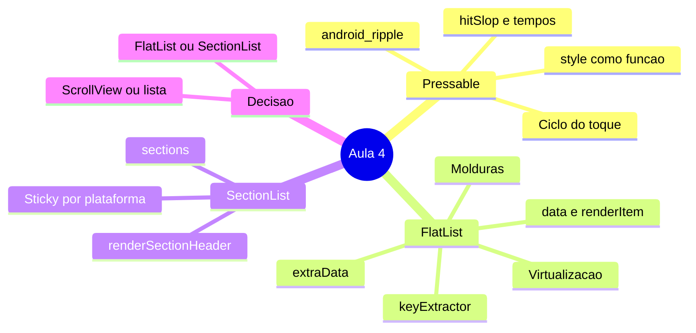
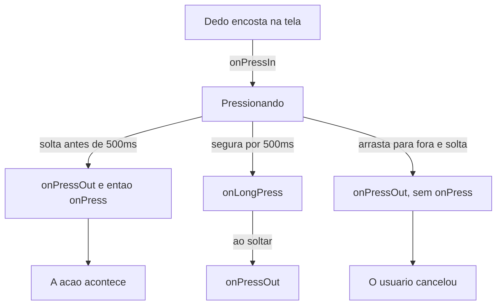
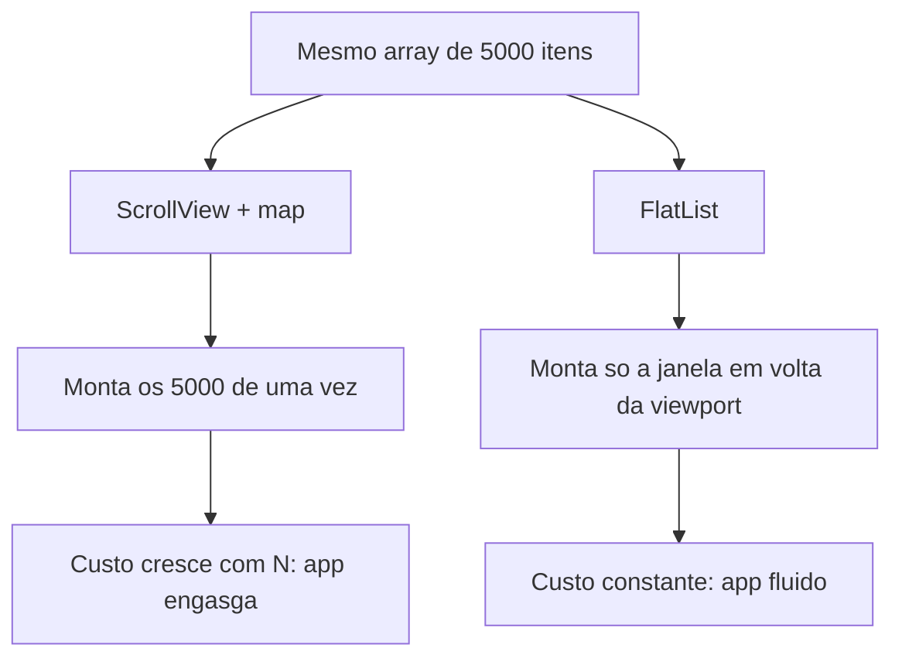
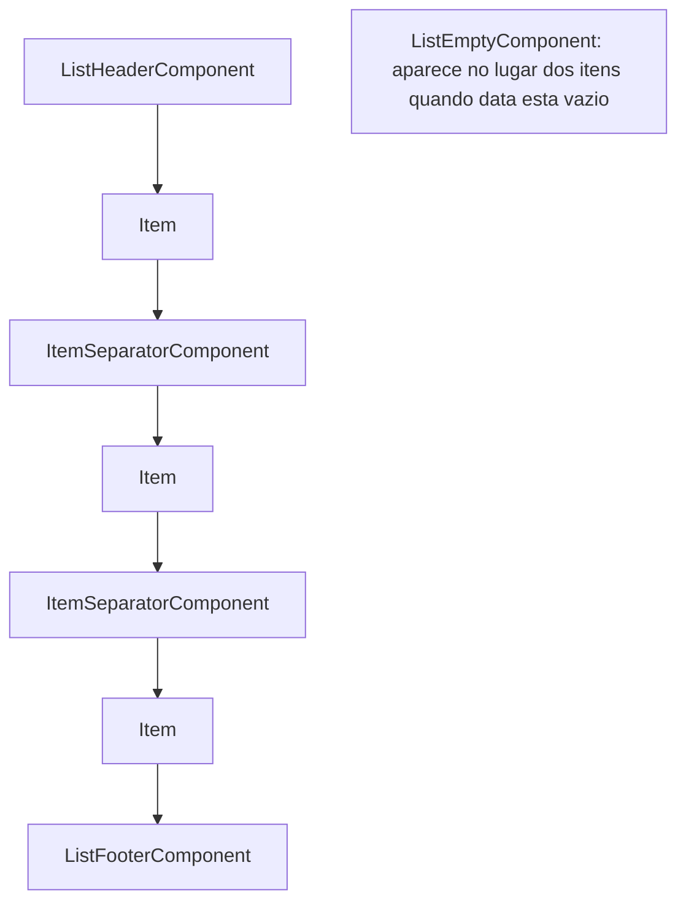
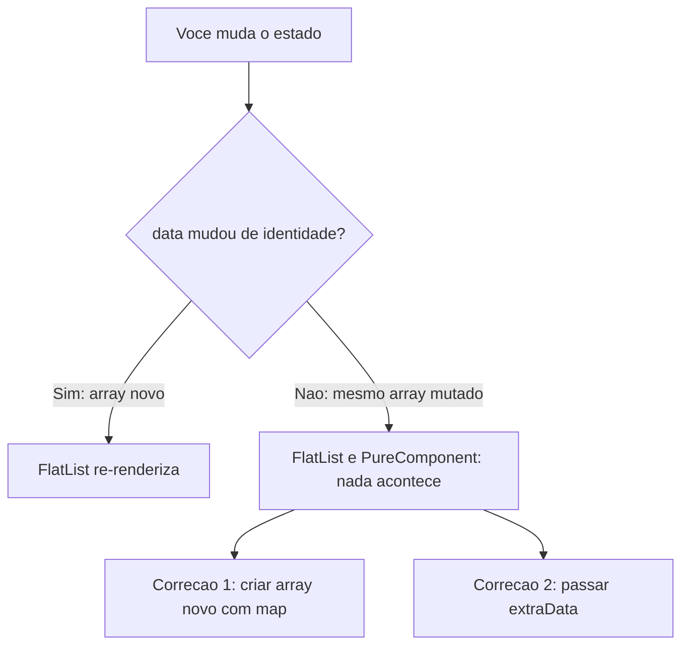
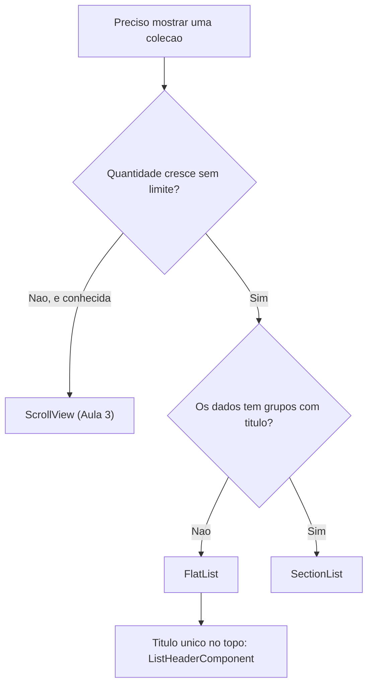

# Notas de Estudo — Aula 4: `Pressable`, `FlatList` e `SectionList`

> **Disciplina:** Desenvolvimento Mobile (2026.2.DM) — CESAR School
> **Dados de versões e ferramentas:** conferidos em **1º de setembro de 2026**. Este material envelhece rápido; as fontes estão no final para você conferir por conta própria.

---

## Visão geral

Esta aula responde três perguntas:

1. **Como faço qualquer coisa reagir ao toque, com aparência minha?** → `Pressable`.
2. **Como mostro uma lista longa sem travar o telefone?** → `FlatList`.
3. **E quando os dados já vêm em grupos?** → `SectionList`.

O fio condutor vem da Aula 3, onde duas coisas ficaram em aberto. Primeiro: o `Button` não aceita `style`, e o remendo foi `<Text onPress>`. Segundo: a `ScrollView` monta **todos** os filhos de uma vez, o que é perfeito para um formulário de oito campos e péssimo para uma lista que cresce. Hoje as duas dívidas são pagas.



> **Leitura do diagrama:** o mapa mostra os quatro blocos da aula. Os três primeiros são o caminho "como o toque funciona → como a lista funciona → como a lista com grupos funciona"; o quarto é o critério de escolha entre eles.

> 📌 **Sobre o escopo:** esta aula cobre **`Pressable`, `FlatList` e `SectionList`**, apoiada em tudo que veio das Aulas 1 a 3 (`View`, `Text`, `Image`, `TextInput`, `ScrollView`, `Button`, `Switch`, `StyleSheet`, Flexbox e `useState`). Animação de toque, gestos, navegação, busca de dados em rede e as ferramentas de memoização do React aparecem mais adiante na disciplina — quando chegarem, elas vão se encaixar exatamente nos ganchos que esta aula deixa preparados.

> 📱 **Sobre os exemplos deste material:** o domínio é o **Rastreador de Micro-hábitos** (`Habito`) — um dos dois projetos da disciplina. Se o seu grupo ficou com o **App de Gestão e Rotina Pet**, use o **`practice.md`**: são as mesmas práticas, com os mesmos scaffolds, no domínio `Pet` (e ele traz a tabela de equivalência no final).

**O domínio, retomado da Aula 3** — é a base de todos os exemplos daqui:

```tsx
type StatusHabito = 'pendente' | 'concluido' | 'pulado';

interface Habito {
  id: string;
  titulo: string;
  categoria: string;
  status: StatusHabito;
  streakDias: number;
}
```

---

# Parte 1 — `Pressable`

## 1.1 Por que ele existe

Na Aula 3 você tinha três formas de reagir a um toque, e todas com limite:

| O que você tinha | O limite |
|---|---|
| `Button` | aparência do sistema; **não aceita `style`** |
| `<Text onPress>` | funciona, mas o alvo é só o texto e não há feedback visual |
| `Switch` | é um liga/desliga, não uma ação |

`Pressable` remove o limite. Ele é um **componente que envolve qualquer coisa e reporta o toque**. Não desenha borda, não desenha fundo, não muda cor sozinho. Toda a aparência continua vindo do que você já sabe: `View`, `Text`, `StyleSheet` e Flexbox.

### 🚪 Analogia: o tapete sensor da porta automática

O tapete não tem aparência própria e não abre porta nenhuma. Ele só avisa: *"alguém pisou aqui"*. O que acontece depois é decisão do sistema. `Pressable` é o tapete; o `<View>` estilizado por dentro é o que a pessoa enxerga e o `onPress` é o que acontece depois.

**Consequência prática:** um `Pressable` vazio é invisível e parece quebrado. Ele **precisa** de filhos.

```tsx
import { Pressable, Text, View, StyleSheet } from 'react-native';

export function BotaoSalvar({ onSalvar }: { onSalvar: () => void }) {
  return (
    <Pressable onPress={onSalvar} style={styles.botao}>
      <Text style={styles.rotulo}>Salvar hábito</Text>
    </Pressable>
  );
}

const styles = StyleSheet.create({
  botao: {
    paddingVertical: 14,
    paddingHorizontal: 20,
    borderRadius: 12,
    backgroundColor: '#FF6002',
    alignItems: 'center',
  },
  rotulo: { color: '#FFFFFF', fontSize: 16, fontWeight: '600' },
});
```

Repare que **nada** aí é novo além do `Pressable`: o estilo é o mesmo `StyleSheet.create` da Aula 3, e o `alignItems: 'center'` é o mesmo Flexbox.

## 1.2 O ciclo de vida do toque

Este é o conteúdo que mais rende no semestre, porque explica bugs que você vai encontrar sozinho depois.



> **Leitura do diagrama:** o toque começa em `onPressIn`, quando o dedo encosta, e daí saem três caminhos. Se o dedo solta antes de 500 ms, dispara `onPressOut` e em seguida **`onPress`** — a ação acontece. Se fica mais de 500 ms, dispara `onLongPress`, e o `onPressOut` ainda acontece ao soltar. Se o dedo é arrastado para fora e solto lá, dispara só `onPressOut`: o usuário cancelou. (Existe ainda o `onPressMove`, disparado enquanto o dedo se move sem soltar.)

**A regra que você precisa levar da aula:**

> **`onPress` dispara quando o dedo SOLTA, não quando encosta.**
> Ação vai em `onPress`. Feedback visual vai no `pressed`.

Isso não é detalhe. Quem coloca a ação em `onPressIn` cria dois bugs de uma vez: a ação acontece cedo demais, e o usuário **perde a chance de cancelar** arrastando o dedo para fora antes de soltar — que é o gesto que todo mundo usa sem pensar quando percebe que apertou errado.

| Callback | Quando usar |
|---|---|
| `onPress` | **a ação.** Salvar, marcar, abrir, alternar |
| `onPressIn` | efeito que precisa ser instantâneo e é **reversível** (som, vibração leve) |
| `onPressOut` | desfazer algo que começou no `onPressIn` |
| `onLongPress` | ação secundária: menu de contexto, "excluir", seleção múltipla |
| `onPressMove` | casos raros de arrastar; quase nunca na disciplina |

## 1.3 `style` como função — a única sintaxe nova da aula

Na Aula 3, `style` aceitava um objeto ou um array de objetos. No `Pressable`, ele aceita também **uma função** que recebe `{ pressed }` e devolve o estilo.

```tsx
// Aula 3 — array com condicional vinda do estado
<View style={[styles.card, concluido && styles.cardConcluido]} />

// Aula 4 — o MESMO array, mas quem decide é o framework
<Pressable style={({ pressed }) => [styles.card, pressed && styles.cardPressionado]}>
  <Text>Beber água</Text>
</Pressable>
```

**Não é uma regra nova de estilo.** É a mesma precedência de array da Aula 3 — o último objeto vence no conflito, e `false` é descartado sem erro. O que mudou é **quem** entrega o booleano: antes era o seu `useState`, agora é o próprio `Pressable`.

```tsx
const styles = StyleSheet.create({
  card: {
    backgroundColor: '#FFFFFF',
    padding: 16,
    borderRadius: 12,
    boxShadow: '0 2px 8px rgba(0,0,0,0.12)',   // Aula 3: boxShadow, não o quarteto shadow*
  },
  cardPressionado: {
    backgroundColor: '#F3E9DC',
    opacity: 0.9,
  },
});
```

> 💡 **O que isso substitui:** na web você escreveria `:active`. Aqui não existe pseudo-classe — e não existe `:hover`, porque não existe mouse. O estado do toque chega **por parâmetro**, não por seletor. É a mesma lição da Aula 3: o CSS não foi portado, foi substituído.

### `children` também aceita função

Quando o **conteúdo** (e não só o estilo) precisa mudar:

```tsx
<Pressable onPress={marcarConcluido}>
  {({ pressed }) => <Text>{pressed ? 'Soltando...' : 'Marcar concluído'}</Text>}
</Pressable>
```

Use com moderação. Na maioria dos casos, mudar o estilo basta.

## 1.4 Área e tempo do toque

Quatro props que quase ninguém usa e que resolvem reclamações reais de usuário.

| Sintoma | Prop | Default |
|---|---|---|
| O alvo é pequeno e o usuário erra o toque | `hitSlop` | nenhum |
| O toque cancela se o dedo escorrega um pouco | `pressRetentionOffset` | `{top:20, left:20, right:20, bottom:30}` |
| O item "acende" enquanto você só está rolando a lista | `unstable_pressDelay` | nenhum |
| 500 ms de long press é demais (ou de menos) | `delayLongPress` | `500` |

### `hitSlop` — o mais útil dos quatro

```tsx
<Pressable onPress={remover} hitSlop={12}>
  <Text style={styles.iconeRemover}>✕</Text>
</Pressable>
```

`hitSlop` aumenta a área **sensível** ao redor do componente sem mudar **nada** do layout. O ✕ continua do mesmo tamanho na tela; o que cresce é a região que aceita o toque. Aceita um número (aplicado nos quatro lados) ou um objeto `{ top, bottom, left, right }`.

🔴 **O erro correspondente:** aumentar o `padding` para "melhorar o toque". Isso muda o layout — empurra os vizinhos, quebra o alinhamento e cria buracos entre os itens. `padding` é aparência; `hitSlop` é área de toque. São coisas diferentes.

### `unstable_pressDelay` — a prop que você vai querer na Parte 2

```tsx
<Pressable onPress={abrirHabito} unstable_pressDelay={80}>
```

Espera 80 ms antes de chamar `onPressIn`. Dentro de uma lista, isso evita que o item pisque enquanto o dedo está apenas iniciando uma rolagem. O prefixo `unstable_` avisa que o **nome** pode mudar numa versão futura — não que a coisa não funcione.

### `pressRetentionOffset` — por que "arrastar um pouquinho" não cancela

O default já é generoso (20 px em três lados, 30 embaixo). É por isso que você consegue mexer o dedo um pouco sem perder o toque. Só mexa se tiver um motivo concreto.

## 1.5 Android: `android_ripple`

```tsx
<Pressable
  onPress={marcar}
  android_ripple={{ color: '#FFB132', borderless: false }}
  style={({ pressed }) => [styles.card, pressed && styles.cardPressionado]}
>
```

- Liga a "ondinha" nativa do Android. **No iOS não faz nada** — e isso é o comportamento correto, não um bug.
- O campo `color` aceita cor comum **e** `PlatformColor`, o que permite referenciar um atributo de tema do sistema; nesse caso a ondinha se atualiza sozinha quando o aparelho troca entre claro e escuro.
- `android_disableSound` desliga o som do toque.

> 📌 **A lição de fundo:** props com prefixo de plataforma (`android_`) são um contrato honesto. O framework está dizendo, no próprio nome, "isto só existe de um lado". É muito melhor do que uma prop que silenciosamente não faz nada em metade dos aparelhos — que é o problema do `stickySectionHeadersEnabled` que você vai ver na Parte 3.

## 1.6 Acessibilidade em duas props

```tsx
<Pressable
  onPress={marcarConcluido}
  accessibilityRole="button"
  accessibilityLabel="Marcar hábito Beber água como concluído"
  disabled={carregando}
>
```

- `accessibilityRole="button"` diz à tecnologia assistiva que aquilo é um botão. Sem isso, o leitor de tela anuncia um agrupamento sem propósito. (Existe também a prop `role`, mais nova, que tem **precedência** sobre `accessibilityRole` e usa o mesmo valor `"button"`.)
- `accessibilityLabel` é o que o leitor de tela vai falar. Escreva a **ação**, não o desenho: "Marcar como concluído" é melhor que "check".
- `disabled` desliga o toque **e** informa o estado.

## 1.7 O que você vai encontrar por aí

Praticamente todo tutorial de React Native na internet monta botões com **`TouchableOpacity`**. Você vai esbarrar nisso em respostas de Stack Overflow, em vídeos e em código de colegas.

A documentação oficial do próprio `TouchableOpacity` traz um aviso no topo da página:

> *"If you're looking for a more extensive and future-proof way to handle touch-based input, check out the Pressable API."*

Ou seja: quando você encontrar um exemplo com `TouchableOpacity`, a tradução é direta — troque pelo `Pressable`, e o feedback de opacidade que o componente antigo dava de graça você escreve explicitamente com `pressed`. **A API do `TouchableOpacity` não é assunto desta disciplina**; saber que ele existe e por que não usá-lo, é.

---

# Parte 2 — `FlatList`

## 2.1 O problema

Você já sabe montar uma lista com o que aprendeu na Aula 3:

```tsx
// ❌ Funciona com 5 itens. Trava com 5 000.
<ScrollView>
  {habitos.map((h) => <CardHabito key={h.id} habito={h} />)}
</ScrollView>
```

Isso **não está errado por princípio**. A `ScrollView` cumpre o contrato dela: montar todos os filhos de uma vez. Para um formulário de oito campos, é exatamente o que você quer. O erro é usá-la para conteúdo que **cresce sem limite**.

Com 5 000 hábitos, o React Native monta 5 000 componentes antes de desenhar o primeiro pixel. O app abre depois de segundos, come memória e engasga ao rolar.

### 🚄 Analogia: a janela do trem

A paisagem tem 300 km. A janela tem um metro. O trem não carrega a paisagem inteira dentro do vagão — ele mostra o pedaço que está passando, mais um pouco antes e um pouco depois, e descarta o resto. Se você acelerar demais, vê borrão: é o conteúdo que ainda não deu tempo de aparecer.

`FlatList` faz isso com os seus itens. O nome disso é **virtualização**.



> **Leitura do diagrama:** o diagrama parte do mesmo array de 5 000 itens e segue os dois caminhos. Pela `ScrollView` com `.map()`, os 5 000 itens são montados e o custo cresce junto com o tamanho do dado. Pela `FlatList`, só a janela em volta do que está visível é montada, e o custo não depende de quantos itens existem no total.

### O vocabulário oficial

Aprenda estes quatro termos. Eles fazem você conseguir **descrever** o problema em vez de dizer "está lento":

- **Viewport** — a área visível na tela.
- **Janela (window)** — a área em que os itens ficam montados. Bem maior que a viewport.
- **Área em branco (blank area)** — o vazio que aparece quando você rola mais rápido do que a lista consegue renderizar.
- **`VirtualizedList`** — o componente que está por baixo do `FlatList` e do `SectionList`. Você não vai usá-lo diretamente, mas **precisa reconhecer o nome**, porque ele aparece na mensagem de erro mais comum de listas (§2.9).

## 2.2 O mínimo funcional

Duas props obrigatórias: `data` e `renderItem`.

```tsx
import { FlatList, Text, View, StyleSheet } from 'react-native';

const HABITOS: Habito[] = [
  { id: '1', titulo: 'Beber água',       categoria: 'saúde',  status: 'pendente',  streakDias: 4 },
  { id: '2', titulo: 'Alongar 5 min',    categoria: 'corpo',  status: 'concluido', streakDias: 12 },
  { id: '3', titulo: 'Ler 10 páginas',   categoria: 'mente',  status: 'pendente',  streakDias: 0 },
];

// Declarada FORA do componente: criada uma única vez, não a cada render. Ver §2.9.
function renderHabito({ item }: { item: Habito }) {
  return (
    <View style={styles.item}>
      <Text style={styles.titulo}>{item.titulo}</Text>
      <Text style={styles.legenda}>{item.categoria} · {item.streakDias} dias</Text>
    </View>
  );
}

export default function TelaHabitos() {
  return (
    <FlatList
      style={styles.lista}
      data={HABITOS}
      renderItem={renderHabito}
    />
  );
}

const styles = StyleSheet.create({
  lista:   { flex: 1 },
  item:    { paddingVertical: 12, paddingHorizontal: 16 },
  titulo:  { fontSize: 16, fontWeight: '600' },
  legenda: { fontSize: 13, color: '#6b6459' },
});
```

**Compare com o `.map()`:** o corpo do `renderHabito` é exatamente o que ia dentro do `map`. O que mudou é **quem chama** a função e **quando** — agora é a lista, sob demanda, conforme você rola.

`renderItem` recebe um objeto com `{ item, index, separators }`. Na prática você quase sempre usa só `item`; `index` aparece quando você quer numerar, e `separators` quase nunca.

## 2.3 `keyExtractor` — e o mito de que é obrigatório

🔴 **O que quase todo tutorial diz:** *"sempre defina `keyExtractor`."*

🟢 **O que a documentação diz:** o extractor padrão checa **`item.key`**, depois **`item.id`**, e só então cai no **índice**.

Ou seja: se o seu objeto tem `id` — e o `Habito` tem —, você **não precisa escrever nada**. Escrever `keyExtractor={(item) => item.id}` é ruído: repete o comportamento que já é o default.

**Escreva `keyExtractor` quando o identificador tiver outro nome:**

```tsx
<FlatList
  data={habitos}
  renderItem={renderHabito}
  keyExtractor={(item) => item.codigo}   // não é `key` nem `id`
/>
```

**O que é de fato errado:** cair no índice numa lista que **reordena, filtra ou remove** itens. Aí o React associa o estado à posição, e não ao dado. O sintoma é inconfundível: você marca o segundo hábito como concluído, aplica um filtro, e o "concluído" aparece no item errado.

> É a mesma discussão de `key` em `.map()` que você já viu em React na web. A regra também é a mesma: **a chave identifica o dado, não a posição.**

## 2.4 As molduras da lista



> **Leitura do diagrama:** o cabeçalho vem antes de todos os itens e o rodapé depois de todos; o separador aparece **entre** os itens, nunca no topo nem no fim. O componente de lista vazia é o único que não convive com os itens — ele ocupa o lugar deles quando `data` está vazio.

| Prop | Para quê |
|---|---|
| `ListHeaderComponent` | título da tela, busca, filtros — **rola junto** com a lista |
| `ListFooterComponent` | total, aviso de fim, indicador de "carregando mais" |
| `ListEmptyComponent` | **estado vazio** |
| `ItemSeparatorComponent` | a linha entre itens |
| `contentContainerStyle` | `padding` e `gap` do conteúdo que rola |

```tsx
function Separador() {
  return <View style={styles.separador} />;
}

function ListaVazia() {
  return (
    <View style={styles.vazio}>
      <Text style={styles.vazioTitulo}>Nenhum hábito por aqui</Text>
      <Text style={styles.legenda}>Toque em “Novo hábito” para começar.</Text>
    </View>
  );
}

const Cabecalho = <Text style={styles.cabecalho}>Hábitos de hoje</Text>;

<FlatList
  style={styles.lista}
  contentContainerStyle={styles.conteudo}
  data={habitos}
  renderItem={renderHabito}
  ItemSeparatorComponent={Separador}
  ListEmptyComponent={ListaVazia}
  ListHeaderComponent={Cabecalho}
/>
```

### `ListEmptyComponent` não é caso de borda

Lista vazia é um **estado de produto**, não um detalhe: primeiro acesso do usuário, filtro sem resultado, busca sem match. Uma tela em branco parece bug para quem está usando. Se você entregar uma lista sem estado vazio, ela está incompleta — e isso conta nos critérios de avaliação.

### 🔴 Dois erros comuns nas molduras

**1. Separar itens com `marginBottom` em cada um.**

```tsx
// ❌ sobra margem depois do último item
item: { paddingVertical: 12, marginBottom: 8 }

// ✅ o separador não existe nas pontas
ItemSeparatorComponent={Separador}

// ✅ alternativa para espaço uniforme: o contêiner é uma View flex (Aula 3)
contentContainerStyle={{ gap: 8, padding: 16 }}
```

**2. Passar uma arrow anônima nas props de moldura.**

```tsx
// ❌ cria um TIPO de componente novo a cada render → o React desmonta e remonta
<FlatList ListHeaderComponent={() => <Cabecalho />} ... />

// ✅ passe o elemento
<FlatList ListHeaderComponent={<Cabecalho />} ... />

// ✅ ou uma referência estável, definida fora do componente
<FlatList ListHeaderComponent={Cabecalho} ... />
```

O sintoma clássico do erro é assustador e parece não ter explicação: você põe um `TextInput` de busca no cabeçalho, e **ele perde o foco a cada tecla digitada**. É o cabeçalho sendo remontado a cada render.

## 2.5 A lista que não atualiza

Este é o bug de lista número 1 do semestre.



> **Leitura do diagrama:** a `FlatList` só re-renderiza quando alguma prop muda de identidade. Se você alterar o objeto dentro do mesmo array, o array continua sendo o mesmo — e a lista não percebe. As duas saídas são criar um array novo (a correção da causa) ou avisar a lista pela prop `extraData` (a correção do sintoma).

A documentação é explícita: `FlatList` é um **`PureComponent`**, ou seja, *não re-renderiza se as props continuarem shallow-equal*.

```tsx
// ❌ mutou o objeto: `habitos` continua sendo o MESMO array. A lista não muda.
function concluir(id: string) {
  const alvo = habitos.find((h) => h.id === id);
  if (alvo) alvo.status = 'concluido';
  setHabitos(habitos);
}

// ✅ array novo, objeto novo: identidade muda, a lista re-renderiza
function concluir(id: string) {
  setHabitos((atuais) =>
    atuais.map((h) => (h.id === id ? { ...h, status: 'concluido' } : h)),
  );
}
```

### E quando o dado que muda **não** está em `data`?

Aí sim entra `extraData`. Exemplo: os itens selecionados vivem num `Set` à parte, e o `renderItem` lê esse `Set`.

```tsx
<FlatList
  data={habitos}
  renderItem={renderHabito}
  extraData={selecionados}   // marcador: "algo de fora do data mudou"
/>
```

**Prefira sempre a imutabilidade.** `extraData` conserta o sintoma; tratar o dado como imutável conserta a causa. A própria descrição da prop na documentação usa a palavra *immutably*.

> 📌 **O outro lado do mesmo contrato:** a documentação avisa que o **estado interno de um item não é preservado** quando ele sai da janela de renderização. Se você guardar "está expandido" dentro do componente do item, isso se perde ao rolar para longe e voltar. Todo dado do item precisa estar **no dado**.

## 2.6 Colunas, horizontal e recarregar

```tsx
<FlatList
  data={habitos}
  renderItem={renderHabito}
  numColumns={2}
  columnWrapperStyle={{ gap: 12 }}
/>
```

- `numColumns` só funciona com `horizontal={false}`, e a documentação avisa: **os itens devem ter a mesma altura** — layout tipo masonry não é suportado.
- `columnWrapperStyle` estiliza a **linha** gerada quando `numColumns > 1`.
- `horizontal` transforma a lista num carrossel.

**Puxar para atualizar**, sem componente extra:

```tsx
const [atualizando, setAtualizando] = useState(false);

<FlatList
  data={habitos}
  renderItem={renderHabito}
  refreshing={atualizando}
  onRefresh={() => {
    setAtualizando(true);
    setHabitos(recarregarDoMock());
    setAtualizando(false);
  }}
/>
```

**Rolagem infinita**, com dados locais:

```tsx
<FlatList
  data={visiveis}
  renderItem={renderHabito}
  onEndReachedThreshold={0.5}          // dispara faltando meia tela para o fim
  onEndReached={() => setVisiveis((v) => [...v, ...TODOS.slice(v.length, v.length + 20)])}
/>
```

> Buscar essa próxima página de uma API é assunto das Aulas 10 a 12. Hoje o array já está inteiro na memória; o que estamos exercitando é **o gatilho**, não a rede.

## 2.7 Os botões de ajuste

| Prop | Default | O que faz |
|---|---|---|
| `initialNumToRender` | `10` | quantos itens no primeiro lote |
| `windowSize` | `21` | tamanho da janela, em múltiplos da viewport (10 acima + 10 abaixo + 1) |
| `maxToRenderPerBatch` | `10` | itens por lote a cada rolagem |
| `updateCellsBatchingPeriod` | `50` ms | intervalo entre lotes |
| `removeClippedSubviews` | `true` no Android, `false` fora | desanexa da hierarquia nativa as views fora da viewport |
| `getItemLayout` | — | dispensa a medição quando a altura é fixa e conhecida |

**A regra: não mexa antes de medir.** Todo ajuste aqui é uma **troca**, não um ganho grátis:

- `windowSize` maior → menos área em branco, mais memória.
- `maxToRenderPerBatch` maior → menos área em branco, mais tempo de JavaScript travando a interface.
- `initialNumToRender` menor → abre mais rápido, mas pode abrir com espaço em branco se não cobrir a tela.

🔴 **Sobre `removeClippedSubviews`, seja cético.** A própria documentação avisa que a implementação **pode ter bugs** — conteúdo sumindo, principalmente no iOS, sobretudo com `transform` e posicionamento absoluto — e que **não economiza memória significativa**, porque as views são desanexadas, não desalocadas.

🟢 **`getItemLayout` é o único quase sempre vantajoso** — desde que a altura do item seja fixa e conhecida. A documentação chega a sugerir que, se seus itens têm altura muito variável, vale reconsiderar o design do item.

## 2.8 `Pressable` dentro da lista

É aqui que as duas metades da aula se encontram: o item de lista que reage ao toque.

```tsx
type ItemProps = { habito: Habito; onAlternar: (id: string) => void };

function ItemHabito({ habito, onAlternar }: ItemProps) {
  const concluido = habito.status === 'concluido';
  return (
    <Pressable
      onPress={() => onAlternar(habito.id)}
      unstable_pressDelay={80}
      android_ripple={{ color: '#FFB132' }}
      accessibilityRole="button"
      accessibilityLabel={`Alternar hábito ${habito.titulo}`}
      style={({ pressed }) => [styles.item, pressed && styles.itemPressionado]}
    >
      <Text style={[styles.titulo, concluido && styles.tituloConcluido]}>{habito.titulo}</Text>
      <Text style={styles.legenda}>{habito.categoria} · {habito.streakDias} dias</Text>
    </Pressable>
  );
}
```

Três detalhes que valem a pena:

1. **`unstable_pressDelay`** evita o item piscar quando o dedo só está iniciando a rolagem.
2. O `renderItem` continua **fora** do componente de tela; quem precisa de props é o `ItemHabito`.
3. `concluido` é derivado do **dado**, não de um `useState` dentro do item — porque o estado interno do item não sobrevive à saída da janela (§2.5).

## 2.9 Os três erros que você vai cometer

### 1. `FlatList` dentro de `ScrollView`

```
VirtualizedLists should never be nested inside plain ScrollViews with the same
orientation because it can break windowing and other functionality — use another
VirtualizedList-backed container instead.
```

**Por que acontece:** você quer que "a tela inteira role", então envolve tudo numa `ScrollView`. **Por que é grave:** a `ScrollView` dá altura infinita à lista, a janela deixa de fazer sentido e **todos** os itens são montados. Você reintroduziu exatamente o problema que veio resolver.

**Correção:** não aninhe. O que vinha antes da lista vira `ListHeaderComponent`; o que vinha depois, `ListFooterComponent`.

### 2. `renderItem` como arrow anônima no JSX

```tsx
// ❌ função nova a cada render
<FlatList data={habitos} renderItem={({ item }) => <ItemHabito habito={item} />} />

// ✅ dentro do escopo desta aula: declarada fora do componente, criada uma vez só
function renderHabito({ item }: { item: Habito }) {
  return <ItemHabito habito={item} onAlternar={alternarGlobal} />;
}
<FlatList data={habitos} renderItem={renderHabito} />
```

> 🧩 **Nota honesta sobre o limite de hoje:** existe uma ferramenta do próprio React feita para manter a função **dentro** do componente sem recriá-la a cada render, e outra para evitar que um item se redesenhe à toa. Elas são a resposta "de manual" para este problema — e **não são assunto desta aula**: chegam na **Aula 6, sobre Hooks**. Até lá, mover a função para fora do componente resolve o mesmo problema com JavaScript comum. Guarde a pergunta; ela vai ser respondida.

### 3. Lista sem altura

```tsx
// ❌ nada aparece
<View>
  <FlatList data={habitos} renderItem={renderHabito} />
</View>

// ✅
<View style={{ flex: 1 }}>
  <FlatList data={habitos} renderItem={renderHabito} />
</View>
```

É a mesma regra da Aula 3: **Flexbox distribui espaço que existe**. Antes de culpar a lista, pergunte se o contêiner tem tamanho.

---

# Parte 3 — `SectionList`

## 3.1 Quando usar

**A pergunta única:** *os meus dados têm grupos com título?*

- Hábitos por período do dia (manhã / tarde / noite) → `SectionList`.
- Contatos por letra inicial → `SectionList`.
- Tarefas por status → `SectionList`.
- Uma lista corrida de hábitos → `FlatList`.

**O que NÃO justifica trocar de componente:** querer um título no topo da tela. Isso é `ListHeaderComponent` numa `FlatList`.

## 3.2 O formato de `sections`

```tsx
const SECOES = [
  { title: 'Manhã', data: [habito1, habito2] },
  { title: 'Noite', data: [habito3] },
];
```

🔴 **Fato zumbi:** *"a seção precisa ter `title`"*. **Não precisa.** A documentação define **`data`** como o campo obrigatório da seção; `key`, `renderItem`, `ItemSeparatorComponent` e `keyExtractor` são opcionais **por seção**.

`title` é um campo **seu**. Você o inventa e o lê dentro do `renderSectionHeader`. Podia se chamar `periodo`, `letra` ou `rotulo` — o componente não faz ideia:

```tsx
const SECOES = [
  { periodo: 'Manhã', data: [habito1, habito2] },
  { periodo: 'Noite', data: [habito3] },
];

<SectionList
  sections={SECOES}
  renderItem={renderHabito}
  renderSectionHeader={({ section }) => (
    <Text style={styles.cabecalhoSecao}>{section.periodo}</Text>
  )}
/>
```

Uma diferença útil em relação à `FlatList`: o `renderItem` do `SectionList` recebe também **`section`**, então dá para renderizar o mesmo item de forma diferente conforme o grupo.

## 3.3 Cabeçalhos, rodapés e separadores de seção

```tsx
<SectionList
  style={{ flex: 1 }}
  sections={SECOES}
  renderItem={renderHabito}
  renderSectionHeader={({ section }) => <Text style={styles.cabecalhoSecao}>{section.title}</Text>}
  renderSectionFooter={({ section }) => (
    <Text style={styles.legenda}>{section.data.length} hábito(s)</Text>
  )}
  ItemSeparatorComponent={Separador}
  SectionSeparatorComponent={EspacoSecao}
  ListEmptyComponent={ListaVazia}
  stickySectionHeadersEnabled
/>
```

| Componente | Onde aparece |
|---|---|
| `renderSectionHeader` | no topo de cada seção |
| `renderSectionFooter` | no fim de cada seção |
| `ItemSeparatorComponent` | **entre** itens, nunca nas pontas |
| `SectionSeparatorComponent` | **no topo e no fim** de cada seção |

A confusão clássica é entre os dois separadores. Fixe assim: `ItemSeparatorComponent` cuida do espaço **dentro** do grupo; `SectionSeparatorComponent` cuida do espaço **em volta** do grupo.

## 3.4 🔴 O bug "funciona no meu celular"

`stickySectionHeadersEnabled` faz o cabeçalho da seção grudar no topo enquanto você rola, até o próximo empurrá-lo. O default **não é o mesmo nas duas plataformas**:

| Plataforma | Default |
|---|---|
| iOS | **`true`** |
| Android | **`false`** |

O aluno com iPhone vê o cabeçalho grudar. O com Android, não. Nenhum dos dois está com o app quebrado — os dois estão com o app **indefinido**.

**A correção é declarar a prop explicitamente**, com o valor que o seu produto quer, nos dois lados:

```tsx
<SectionList sections={SECOES} renderItem={renderHabito} stickySectionHeadersEnabled />
```

> 📌 **A lição de fundo, que vale muito além desta prop:** *default de plataforma é decisão de produto disfarçada de omissão.* Toda vez que você omite uma prop cujo default difere entre iOS e Android, você entregou a decisão para o sistema operacional — e o seu app passa a ser dois apps diferentes.

## 3.5 De dados planos para seções

Na vida real o dado chega plano e o agrupamento é seu. Isso é **transformação de dado**, não trabalho do componente:

```tsx
type Secao = { title: string; data: Habito[] };

function agruparPorStatus(habitos: Habito[]): Secao[] {
  const rotulos: Record<StatusHabito, string> = {
    pendente:  'Pendentes',
    concluido: 'Concluídos',
    pulado:    'Pulados',
  };
  const ordem: StatusHabito[] = ['pendente', 'concluido', 'pulado'];

  return ordem
    .map((status) => ({
      title: rotulos[status],
      data: habitos.filter((h) => h.status === status),
    }))
    .filter((secao) => secao.data.length > 0);   // não mostrar grupo vazio
}
```

Repare: JavaScript comum. Nada de biblioteca, nada de hook. **O `SectionList` não agrupa nada** — ele desenha o agrupamento que você entregou. Confundir isso é a origem de metade da confusão com esse componente.

O `.filter` no final é uma decisão de produto: seção vazia com cabeçalho é ruído visual. Se o seu produto quiser mostrar "Concluídos — nenhum ainda", basta não filtrar e tratar o caso no `renderSectionFooter`.

## 3.6 `FlatList` × `SectionList` — o resumo



> **Leitura do diagrama:** duas perguntas decidem tudo. A primeira separa `ScrollView` de lista virtualizada, e o critério é se a quantidade de itens cresce sem limite. A segunda separa `FlatList` de `SectionList`, e o critério é se o dado tem grupos. Um título único no topo não é grupo — é cabeçalho de lista.

| | `FlatList` | `SectionList` |
|---|---|---|
| Prop de dados | `data` (array) | `sections` (array de `{ data }`) |
| Cabeçalho por grupo | não tem | `renderSectionHeader` |
| Cabeçalho da lista | `ListHeaderComponent` | `ListHeaderComponent` |
| `renderItem` recebe | `{ item, index, separators }` | `{ item, index, section, separators }` |
| Sticky header | — | `stickySectionHeadersEnabled` (default difere!) |
| Por baixo | `VirtualizedList` | `VirtualizedList` |

Quase tudo que você aprendeu de `FlatList` vale para o `SectionList`: `keyExtractor`, `ItemSeparatorComponent`, `ListEmptyComponent`, `extraData`, `initialNumToRender`, `refreshing`/`onRefresh`, `onEndReached`. **O que muda é o formato do dado e o cabeçalho por grupo.**

## 3.7 E as bibliotecas de lista? (contexto, fora do escopo)

Existem bibliotecas de terceiros focadas em desempenho de lista; a mais conhecida é o `@shopify/flash-list`. Elas resolvem casos de lista muito pesada, e você vai encontrá-las em projetos de mercado.

**A disciplina ensina o que vem no framework**, por dois motivos: é o que você encontra em qualquer código base, e é a base conceitual para entender qualquer substituto — virtualização, janela, `keyExtractor` e imutabilidade são os mesmos conceitos em todas elas. Trocar de biblioteca é fácil depois que se entende o problema; o contrário, não.

---

# Parte 4 — Juntando tudo

A tela completa: `SectionList` agrupando por status, itens tocáveis com `Pressable`, separador, estado vazio e pull-to-refresh.

```tsx
import { useState } from 'react';
import { Pressable, SectionList, StyleSheet, Text, View } from 'react-native';

type StatusHabito = 'pendente' | 'concluido' | 'pulado';

interface Habito {
  id: string;
  titulo: string;
  categoria: string;
  status: StatusHabito;
  streakDias: number;
}

type Secao = { title: string; data: Habito[] };

const MOCK: Habito[] = [
  { id: '1', titulo: 'Beber água',     categoria: 'saúde', status: 'pendente',  streakDias: 4 },
  { id: '2', titulo: 'Alongar 5 min',  categoria: 'corpo', status: 'concluido', streakDias: 12 },
  { id: '3', titulo: 'Ler 10 páginas', categoria: 'mente', status: 'pendente',  streakDias: 0 },
  { id: '4', titulo: 'Meditar',        categoria: 'mente', status: 'pulado',    streakDias: 2 },
];

function agruparPorStatus(habitos: Habito[]): Secao[] {
  const rotulos: Record<StatusHabito, string> = {
    pendente: 'Pendentes', concluido: 'Concluídos', pulado: 'Pulados',
  };
  const ordem: StatusHabito[] = ['pendente', 'concluido', 'pulado'];
  return ordem
    .map((s) => ({ title: rotulos[s], data: habitos.filter((h) => h.status === s) }))
    .filter((secao) => secao.data.length > 0);
}

function Separador() {
  return <View style={styles.separador} />;
}

function ListaVazia() {
  return (
    <View style={styles.vazio}>
      <Text style={styles.vazioTitulo}>Nenhum hábito por aqui</Text>
      <Text style={styles.legenda}>Toque em “Novo hábito” para começar.</Text>
    </View>
  );
}

type ItemProps = { habito: Habito; onAlternar: (id: string) => void };

function ItemHabito({ habito, onAlternar }: ItemProps) {
  const concluido = habito.status === 'concluido';
  return (
    <Pressable
      onPress={() => onAlternar(habito.id)}
      unstable_pressDelay={80}
      hitSlop={4}
      android_ripple={{ color: '#FFB132' }}
      accessibilityRole="button"
      accessibilityLabel={`Alternar hábito ${habito.titulo}`}
      style={({ pressed }) => [styles.item, pressed && styles.itemPressionado]}
    >
      <View style={styles.itemTexto}>
        <Text style={[styles.titulo, concluido && styles.tituloConcluido]}>{habito.titulo}</Text>
        <Text style={styles.legenda}>{habito.categoria} · {habito.streakDias} dias</Text>
      </View>
      <Text style={styles.marcador}>{concluido ? '✓' : '○'}</Text>
    </Pressable>
  );
}

export default function TelaHabitos() {
  const [habitos, setHabitos] = useState<Habito[]>(MOCK);
  const [atualizando, setAtualizando] = useState(false);

  function alternar(id: string) {
    setHabitos((atuais) =>
      atuais.map((h) =>
        h.id === id
          ? { ...h, status: h.status === 'concluido' ? 'pendente' : 'concluido' }
          : h,
      ),
    );
  }

  function recarregar() {
    setAtualizando(true);
    setHabitos(MOCK);
    setAtualizando(false);
  }

  return (
    <View style={styles.tela}>
      <SectionList
        sections={agruparPorStatus(habitos)}
        renderItem={({ item }) => <ItemHabito habito={item} onAlternar={alternar} />}
        renderSectionHeader={({ section }) => (
          <Text style={styles.cabecalhoSecao}>{section.title}</Text>
        )}
        renderSectionFooter={({ section }) => (
          <Text style={styles.rodapeSecao}>{section.data.length} hábito(s)</Text>
        )}
        ItemSeparatorComponent={Separador}
        ListEmptyComponent={ListaVazia}
        stickySectionHeadersEnabled
        refreshing={atualizando}
        onRefresh={recarregar}
        contentContainerStyle={styles.conteudo}
      />
    </View>
  );
}

const styles = StyleSheet.create({
  tela:            { flex: 1, backgroundColor: '#FEF7EE' },
  conteudo:        { padding: 16, paddingBottom: 32 },
  cabecalhoSecao:  { fontSize: 13, fontWeight: '700', textTransform: 'uppercase',
                     color: '#6b6459', backgroundColor: '#FEF7EE', paddingVertical: 8 },
  rodapeSecao:     { fontSize: 12, color: '#6b6459', paddingBottom: 16 },
  item:            { flexDirection: 'row', alignItems: 'center', justifyContent: 'space-between',
                     gap: 12, backgroundColor: '#FFFFFF', padding: 16, borderRadius: 12,
                     boxShadow: '0 2px 8px rgba(0,0,0,0.08)' },
  itemPressionado: { backgroundColor: '#F3E9DC' },
  itemTexto:       { flex: 1, gap: 2 },
  titulo:          { fontSize: 16, fontWeight: '600', color: '#191919' },
  tituloConcluido: { textDecorationLine: 'line-through', color: '#6b6459' },
  legenda:         { fontSize: 13, color: '#6b6459' },
  marcador:        { fontSize: 20, color: '#FF6002' },
  separador:       { height: 10 },
  vazio:           { alignItems: 'center', gap: 6, paddingVertical: 48 },
  vazioTitulo:     { fontSize: 17, fontWeight: '600', color: '#191919' },
});
```

Vale notar o que **não** mudou em relação à Aula 3: todo o `StyleSheet.create` continua sendo estilo comum, com `gap` em vez de margens, `boxShadow` em vez do quarteto antigo, array de estilos com condicional, e Flexbox distribuindo o espaço. A Aula 4 acrescentou dois componentes; não substituiu nada.

> ⚠️ Neste exemplo o `renderItem` está inline porque ele precisa do `alternar`, que vive dentro do componente. É a exceção honesta à regra de §2.9: a alternativa dentro do escopo de hoje seria mover o estado para fora, o que pioraria o código. Guarde a incômoda — a Aula 6 resolve isso direito.

---

## Erros comuns (consulte antes de pedir ajuda)

| Sintoma | Causa | Correção |
|---|---|---|
| A ação acontece antes de eu soltar o dedo | Ação em `onPressIn` | Mover para `onPress` |
| `pressed` "não existe" | `style` continua array, não função | `style={({ pressed }) => [...]}` |
| O `Pressable` não aparece na tela | Ele não desenha nada sozinho | Pôr uma `View`/`Text` estilizada dentro |
| O usuário erra o toque no ícone pequeno | Alvo pequeno demais | `hitSlop`, não `padding` |
| `android_ripple` "não funciona" no iPhone | Prop de plataforma | É o comportamento correto |
| App demora a abrir com muitos itens | `.map()` dentro de `ScrollView` | `FlatList` |
| Warning de `VirtualizedList` aninhada | `FlatList` dentro de `ScrollView` | Usar `ListHeaderComponent` / `ListFooterComponent` |
| A lista não aparece | Contêiner sem altura | `flex: 1` (Aula 3) |
| A lista não atualiza depois de mudar o estado | Mutou o objeto; `FlatList` é `PureComponent` | Criar array novo (`map` + spread), ou `extraData` |
| O "concluído" pula para o item errado ao filtrar | Chave por índice | `keyExtractor` com identificador estável |
| Sobra margem depois do último item | `marginBottom` em cada item | `ItemSeparatorComponent` ou `gap` no `contentContainerStyle` |
| O `TextInput` do cabeçalho perde o foco a cada tecla | `ListHeaderComponent={() => <X/>}` | Passar o elemento ou referência estável |
| Tela em branco quando não há dados | Falta estado vazio | `ListEmptyComponent` |
| `section.title` sai `undefined` | O campo é seu, não da API | Incluí-lo ao montar o array de seções |
| O cabeçalho gruda no iPhone e não no Android | Default difere | Declarar `stickySectionHeadersEnabled` |
| "Está lento" e eu mexi em `windowSize` no chute | Ajuste sem medição | Reverter; todo ajuste é troca |
| Texto solto dentro do `renderItem` | Erro clássico da Aula 3 | Envolver em `<Text>` |

---

## Perguntas para autoavaliação

Responda sem olhar as notas. Se travar em alguma, o número da seção está ao lado.

1. Por que a ação de um botão vai em `onPress` e não em `onPressIn`? Cite as **duas** consequências de errar isso. *(§1.2)*
2. Escreva de cabeça a assinatura do `style` do `Pressable` que escurece o card enquanto pressionado. *(§1.3)*
3. Qual a diferença entre aumentar o `padding` e usar `hitSlop`? *(§1.4)*
4. Um `Pressable` vazio: o que aparece na tela? Por quê? *(§1.1)*
5. Explique virtualização usando os quatro termos: viewport, janela, área em branco, `VirtualizedList`. *(§2.1)*
6. Tenho 12 campos num formulário. `ScrollView` ou `FlatList`? Justifique pelo **contrato**, não pelo número. *(§2.1, §3.6)*
7. Meu objeto de dados tem `id`. Preciso escrever `keyExtractor`? E se o campo se chamasse `codigo`? *(§2.3)*
8. Cite duas causas para "mudei o estado e a lista não atualizou", com a correção de cada uma. *(§2.5)*
9. Por que `FlatList` dentro de `ScrollView` é pior do que apenas "não recomendado"? *(§2.9)*
10. Qual a diferença entre `ItemSeparatorComponent` e `SectionSeparatorComponent`? *(§3.3)*
11. O campo `title` de uma seção é obrigatório? O que a documentação diz que é obrigatório? *(§3.2)*
12. O cabeçalho da seção gruda no iPhone da sua dupla e não gruda no seu Android. Quem está errado, e qual a correção? *(§3.4)*
13. Quem agrupa os dados: você ou o `SectionList`? *(§3.5)*
14. Por que `removeClippedSubviews` não é "otimização grátis"? *(§2.7)*

---

## Leitura recomendada

**Antes da próxima aula (Aula 5 — sensores do dispositivo):**

- Reler [Pressable](https://reactnative.dev/docs/pressable) inteira. É uma página curta e você já entende tudo nela.
- Percorrer a lista de props de [FlatList](https://reactnative.dev/docs/flatlist) e marcar as que você **não** usou hoje. Não precisa decorar; precisa saber que existem.
- Ler [Optimizing FlatList configuration](https://reactnative.dev/docs/optimizing-flatlist-configuration) — 10 minutos, e é onde estão os números de default deste material.

**Prática sugerida (~30 min):** pegue a tela da Parte 4 e troque o agrupamento de "por status" para "por categoria", sem mudar nada além da função `agruparPorStatus`. Se você precisou mexer no JSX, o agrupamento estava no lugar errado.

---

## Fontes dos dados citados

Verificadas em **1º de setembro de 2026**.

**React Native — os componentes desta aula**
- [Pressable](https://reactnative.dev/docs/pressable) — ciclo de vida do toque, `style` como função, `hitSlop`, `pressRetentionOffset` (default `{bottom:30, left:20, right:20, top:20}`), `delayLongPress` (default `500`), `unstable_pressDelay`, `android_ripple`, `android_disableSound`, `onPressMove`
- [FlatList](https://reactnative.dev/docs/flatlist) — `data`, `renderItem`, `keyExtractor` (default `key` → `id` → índice), `ItemSeparatorComponent`, `ListHeaderComponent`, `ListFooterComponent`, `ListEmptyComponent`, `numColumns`, `columnWrapperStyle`, `extraData` e a nota de `PureComponent`, `getItemLayout`, `initialNumToRender` (default `10`)
- [SectionList](https://reactnative.dev/docs/sectionlist) — formato de `sections` (`data` é o campo obrigatório), `renderSectionHeader`, `renderSectionFooter`, `SectionSeparatorComponent`, `stickySectionHeadersEnabled` (iOS `true` / Android `false`)
- [Optimizing FlatList configuration](https://reactnative.dev/docs/optimizing-flatlist-configuration) — glossário (viewport, janela, áreas em branco), `windowSize` (`21`), `maxToRenderPerBatch` (`10`), `updateCellsBatchingPeriod` (`50` ms), `removeClippedSubviews` e suas ressalvas
- [VirtualizedList](https://reactnative.dev/docs/virtualizedlist) — o componente por baixo dos dois
- [TouchableOpacity](https://reactnative.dev/docs/touchableopacity) — o aviso no topo apontando para o `Pressable`
- [Accessibility](https://reactnative.dev/docs/accessibility) — `accessibilityRole`, `accessibilityLabel`, precedência de `role`
- [Core Components and APIs](https://reactnative.dev/docs/components-and-apis)

**Versões**
- [Expo SDK 57 — changelog](https://expo.dev/changelog/sdk-57) — 30/06/2026; React Native 0.86 + React 19.2
- [React Native 0.87](https://reactnative.dev/blog/2026/08/11/react-native-0.87) — 11/08/2026; ainda **não** é a versão do SDK 57

**Contexto (fora do escopo)**
- [`@shopify/flash-list`](https://github.com/Shopify/flash-list)

**Bibliografia da disciplina**
- Capítulo 7 — Listas e rolagem, em *React Native: Desenvolvimento de aplicativos mobile com React* (Escudelario & Pinho, 2020)
