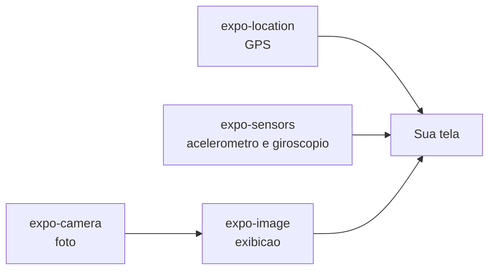
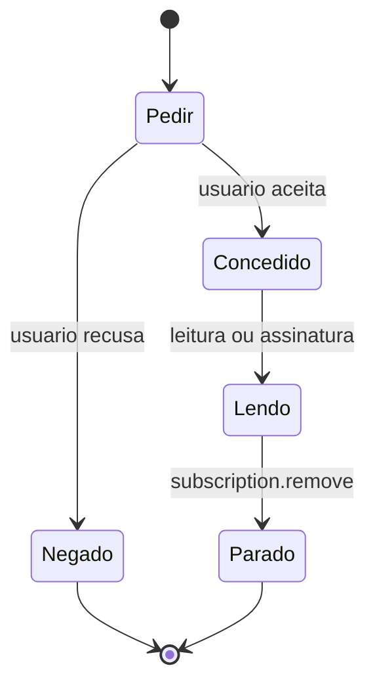
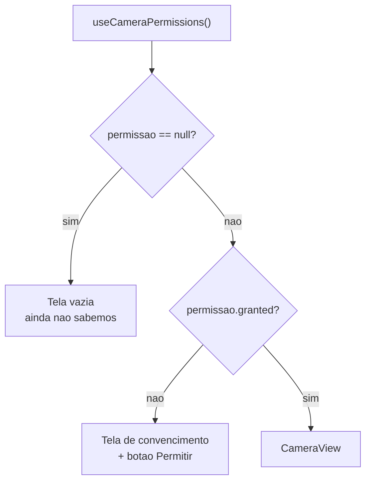

<!--
Slides em Markdown compatíveis com Marp.
Para exportar:  npx @marp-team/marp-cli@latest presentation.md -o aula5.pdf
Os blocos de comentário HTML são notas do apresentador (não aparecem no slide).
Materiais irmãos: student-notes.md · exercises.md · practice.md (equivalência Pet).

>>> PARA PROJETAR EM SALA, USE `presentation.html` (reveal.js). <<<
Este arquivo .md é a fonte em Markdown, para leitura rápida no editor e para
quem preferir Marp. O Marp NÃO renderiza blocos ```mermaid nativamente — os
diagramas aparecem como código. A versão HTML renderiza tudo e ainda tem
modo apresentador, visão geral e navegação por teclado.

Para gerar o PDF com a identidade visual preservada:
    node tools/slides-to-pdf.mjs "aulas/aula-05-sensores-camera/presentation.html"
-->

# Desenvolvimento Mobile

## Aula 5 — Sensores do dispositivo

CESAR School · 2026.2

<!--
Antes de começar: esta é a aula que MAIS depende de hardware real.
Confirmar em voz alta que todo mundo tem celular carregado, Expo Go
instalado e cabo. Quem não tiver, formar dupla AGORA.

O iOS Simulator não tem câmera, acelerômetro nem giroscópio.

Dizer também qual arquivo cada grupo segue: exercises.md (Hábito) ou
practice.md (Pet).
-->

---

<!-- _class: lead -->

## Até ontem, seu app só sabia **o que você digitou nele**.

### Hoje ele descobre onde está, como está sendo segurado e o que está vendo.

<!--
Essa é a virada da aula. Até a Aula 4, todo dado nascia dentro do app:
useState, um array, o teclado.

A partir de hoje o dado vem DE FORA — do hardware, pelo sistema operacional.
E o SO não entrega de graça.
-->

---

## O sistema operacional não entrega de graça

1. Ele **pergunta ao dono do aparelho** antes → permissão
2. Ele entrega **quando conseguir** → é assíncrono, e pode falhar
3. Ele **cobra bateria** enquanto você lê

### Não existe `const local = pegarLocalizacao()`.

<!--
Martelar os três. Eles explicam por que TODA função da aula é async
e por que TODA tem um caminho de erro.
-->

---

## Agenda — 3 horas

| Bloco | Tempo |
|---|---|
| Abertura + a virada do dia | 8 min |
| **1.** O contrato de três tempos | 17 min |
| **2.** GPS com `expo-location` | 30 min |
| ☕ Intervalo | 10 min |
| **3.** Checkpoint — permissão e GPS | 7 min |
| **4.** Acelerômetro e giroscópio (`expo-sensors`) | 25 min |
| **5.** Câmera (`expo-camera`) | 28 min |
| **6.** `expo-image` | 15 min |
| **7.** Checkpoint — sensores e imagem | 7 min |
| **8.** Hands-on guiado | 25 min |
| **9.** Atividade aplicada + fechamento | 8 min |

---

## Quatro pacotes, um contrato só



### Os três primeiros **produzem** dado. O quarto **mostra**.

<!--
Ler o diagrama em voz alta: os três de sensor alimentam a tela direto;
a câmera é a única que passa por um intermediário.
-->

---

## Ao final da aula você deve conseguir

1. Descrever o contrato **permissão → leitura → parada**
2. Tratar `granted`, `canAskAgain: false` e "serviço desligado" **de formas diferentes**
3. Escolher entre **leitura pontual** e **assinatura contínua**
4. Obter a posição com a `Accuracy` certa e ler `coords` corretamente
5. Ler acelerômetro e giroscópio sabendo **o que** cada um mede e **em que unidade**
6. Montar a tela de câmera com o gate de permissão de **três** estados
7. Exibir a imagem com `contentFit`, `placeholder` e `transition`

---

# Parte 1

## O contrato de três tempos

---

## Um sensor não é uma variável

| É... | Porque |
|---|---|
| **compartilhado** | outros apps querem o mesmo hardware |
| **protegido** | o SO exige consentimento do dono |
| **caro** | cada leitura custa bateria |

### Toda API de sensor é `async` e **pode dizer não**.

---

## Os três tempos



### O tempo 3 é o que todo mundo esquece.

<!--
Desenhar na lousa ANTES de abrir código.
É o esqueleto que se repete nos quatro pacotes e é o que a turma
tem que levar da aula.
-->

---

## O mesmo contrato, quatro pacotes

| Pacote | Pedir | Ler | Parar |
|---|---|---|---|
| `expo-location` | `requestForegroundPermissionsAsync()` | `getCurrentPositionAsync()` · `watchPositionAsync()` | `subscription.remove()` |
| `expo-sensors` | — | `Accelerometer.addListener()` · `Gyroscope.addListener()` | `subscription.remove()` |
| `expo-camera` | `useCameraPermissions()` | `takePictureAsync()` | desmontar o `CameraView` |
| `expo-image` | — | — | — |

---

<!-- _class: lead -->

## Por que acelerômetro e giroscópio **não pedem permissão**?

### Pergunte à turma antes de responder.

<!--
Resposta: porque eles não identificam a pessoa nem o lugar.
Localização, câmera e microfone dizem ONDE você está e COMO você é.

A regra: a permissão acompanha o RISCO À PRIVACIDADE, não o hardware.
Bom mapa mental para o resto do curso.
-->

---

## 🔴 Permissão é um **estado**, não um evento

O usuário pode revogar nas Configurações **com o app rodando**.

| Campo | Para quê |
|---|---|
| `status` | `'granted'` / `'denied'` / `'undetermined'` |
| `granted` | o mesmo, como booleano |
| `canAskAgain` | **se `false`, o diálogo não aparece mais** |
| `expires` | normalmente `'never'` |

### Consulte **toda vez que for usar**.

---

## 🔴 `canAskAgain: false`

O sistema **não vai mostrar o diálogo de novo**. Por mais vezes que você chame `request...`.

Seu botão "Permitir" virou um botão que não faz nada.

**A única saída:**
1. **Explicar** por que o app precisa daquilo
2. **Levar às Configurações** do sistema

### Insistir com o mesmo botão é o que a maioria dos apps faz. E está errado.

---

## As duas formas de perguntar

**Quando a permissão importa só na hora da ação:**

```tsx
const { status } = await Location.requestForegroundPermissionsAsync();
```

**Quando a tela inteira depende dela:**

```tsx
const [permissao, pedirPermissao] = useCameraPermissions();
```

### O segundo devolve o mesmo formato do `useState`. Não é conceito novo.

<!--
Amarrar: um valor e uma função que mexe nele; chamada no topo do
componente, sempre, sem if em volta.

Usamos a forma 1 no GPS e a forma 2 na câmera, de propósito.
-->

---

<!-- _class: lead -->

# 🚰 O copo e a torneira

### `getCurrentPositionAsync` enche um copo. `watchPositionAsync` **abre a torneira**.

<!--
Torneira aberta gasta água — aqui, bateria — e alaga a casa se você
esquecer de fechar.
-->

---

## A pergunta que decide: um valor, ou um fluxo?

| Situação | O quê |
|---|---|
| "Onde eu estou **agora**?" | copo — `getCurrentPositionAsync` |
| "O trajeto **enquanto** eu corro" | torneira — `watchPositionAsync` |
| "O usuário chacoalhou?" | torneira — `addListener` (não há copo) |
| "Tirar uma foto" | copo — `takePictureAsync` |

### 🔴 Toda torneira aberta tem uma torneira fechada **no mesmo arquivo**.

---

## 🧩 Nota honesta: o que ainda não temos

Num app de verdade, a torneira abre quando a tela aparece e fecha quando ela sai.

A ferramenta do React que faz isso é assunto da **Aula 6**.

**Hoje:** você liga e desliga **no botão**, e guarda a assinatura num `useState`.

### 🔴 Se sair da tela com o sensor ligado, ele **continua ligado**.

<!--
Dizer isso em voz alta e sem rodeio. É um vazamento real e proposital.
É o gancho da Aula 6, e vamos repetir mais duas vezes hoje.
-->

---

## O `app.json` — escreva agora, não em novembro

```json
["expo-location", {
  "locationWhenInUsePermission":
    "Precisamos da sua localização para registrar onde o treino aconteceu."
}]
```

⚠️ No **Expo Go** funciona **mesmo sem** isso (herda as permissões do Expo Go).
Na **build de verdade** (Aula 13), **não funciona**.

### E escreva um texto honesto. O usuário lê antes de decidir.

---

# Parte 2

## GPS com `expo-location`

---

## `npx expo install`, não `npm install`

```bash
npx expo install expo-location expo-sensors expo-camera expo-image
```

O `expo install` escolhe a versão **compatível com o seu SDK**.
O `npm install` pega a mais nova — que pode não ser essa.

### "Versão mais nova ≠ versão que você usa" — Aula 1, agora no seu terminal.

---

## O copo

```tsx
import * as Location from 'expo-location';

const { status, canAskAgain } = await Location.requestForegroundPermissionsAsync();

const posicao = await Location.getCurrentPositionAsync({
  accuracy: Location.Accuracy.Balanced,
});
```

### ⏱️ Dentro de prédio, com o GPS frio: **vários segundos**.

<!--
Demonstrar AO VIVO, no aparelho, com a tela espelhada. Cronometrar.
O número real da sala é o melhor argumento do bloco seguinte.

A tela precisa de um estado "buscando..." — isso é useState, eles já sabem.
-->

---

## `Accuracy`: precisão é uma **compra**

| Nível | Erro | Custo |
|---|---|---|
| `Lowest` | ~3 km | mínimo |
| `Low` | ~1 km | baixo |
| `Balanced` | ~100 m | médio — **default** |
| `High` | ~10 m | alto |
| `Highest` | o melhor disponível | muito alto |
| `BestForNavigation` | o melhor, para navegação | o mais caro |

### Você paga em **tempo de espera** e em **bateria**.

---

## Escolha em voz alta

| O app faz | O que pedir |
|---|---|
| Previsão do tempo da cidade | `Low` |
| Em que academia o treino foi | `Balanced` ou `High` |
| Trajeto de uma corrida | `High` · `BestForNavigation` |

### 🔴 O erro: `Highest` "por garantia". Garantia de gastar bateria.

---

## 🔴 `accuracy` **não** é nota de qualidade

```ts
coords: {
  latitude, longitude,
  accuracy,          // RAIO de incerteza, em METROS
  altitude, altitudeAccuracy,
  heading,           // graus — só faz sentido em movimento
  speed              // m/s  — idem
}
```

### `accuracy: 65` = "em algum lugar num círculo de **65 metros**".

<!--
Desenhar o círculo na lousa. Quase sempre resolve na hora.

Isso muda como você EXIBE o dado: "perto da Rua X (±65 m)", não uma
bolinha exata num ponto que o app não tem como saber.
-->

---

## O padrão de UX que vale a aula inteira

```tsx
const ultima = await Location.getLastKnownPositionAsync({ maxAge: 60000 });
if (ultima) setPosicao(ultima);        // algo na tela AGORA

const atual = await Location.getCurrentPositionAsync({ /* ... */ });
setPosicao(atual);                      // o dado bom, quando chegar
```

### 50 ms de resposta em vez de 6 segundos de *spinner*.

---

## A torneira

```tsx
const assinatura = await Location.watchPositionAsync(
  { accuracy: Location.Accuracy.High, timeInterval: 5000, distanceInterval: 10 },
  (posicao) => setPosicao(posicao),
);

assinatura.remove();   // ← não é opcional
```

`timeInterval` e `distanceInterval` são **filtros**.

### 🔴 `timeInterval` é **Android-only**. `distanceInterval` vale nos dois.

<!--
A tipagem do pacote marca timeInterval como @platform android. No iPhone
ela é ignorada silenciosamente: compila, não avisa, não faz nada.

Mesma armadilha do stickySectionHeadersEnabled da Aula 4. Declarar.

E distanceInterval ainda é o mais econômico: parado, o app não recebe nada.
-->

---

## 🔴 Permissão concedida ≠ GPS ligado

```tsx
const ligado = await Location.hasServicesEnabledAsync();
```

| Situação | O usuário resolve em |
|---|---|
| Permissão negada | Configurações **do app** |
| Serviço desligado | Configurações **do sistema** |

### Uma mensagem genérica para os dois = desinstalação.

---

## Coordenada → endereço

```tsx
const enderecos = await Location.reverseGeocodeAsync({ latitude, longitude });
// street, district, city, region, postalCode, country
```

**"Boa Viagem, Recife"** em vez de `-8.1234, -34.9012`.

### ⚠️ A doc avisa: é caro. Uma chamada por registro — **nunca** dentro do `watch`.

---

## ✋ Fora do escopo — e a turma vai perguntar

| Assunto | Por quê |
|---|---|
| Mostrar num **mapa** | biblioteca de terceiro, não está no cronograma |
| Localização em **segundo plano** | exige *development build* |
| **Geofencing** | idem |

### Hoje, a coordenada é **texto**.

<!--
Alguém VAI pedir mapa. "Ótima pergunta, e não é o assunto de hoje."
Estacionar e seguir.
-->

---

<!-- _class: lead -->

# ✋ Checkpoint 1

### 60 segundos em duplas, e a gente responde em voz alta.

---

## Checkpoint 1

1. Quais são os **três tempos**? Qual não existe no `getCurrentPositionAsync`?
2. `canAskAgain: false`. O que o seu botão "Permitir" deve fazer?
3. `accuracy: 65`. O que é esse 65? Bom ou ruim?
4. Previsão do tempo da cidade: qual `Accuracy`, e por que **não** `Highest`?
5. "Permissão negada" × "serviço desligado": a mensagem pode ser a mesma?

<!--
Se travar: voltar à torneira e à tabela dos três tempos, não inventar
imagem nova. Na 3, desenhar o círculo.
-->

---

# Parte 3

## Acelerômetro e giroscópio

---

## 🔴 O pacote **não** se chama `expo-gyroscope`

O cronograma da disciplina diz "Expo Gyroscope". **Esse pacote não existe.**

```tsx
import { Accelerometer, Gyroscope } from 'expo-sensors';
```

### Quando um nome não resolve, procure o **pacote guarda-chuva**.

<!--
Dizer explicitamente que o cronograma está com o nome errado. O aluno
precisa disso para conseguir instalar a biblioteca.

Aconteceria igual com expo-accelerometer.
-->

---

## O que cada um mede

| | Acelerômetro | Giroscópio |
|---|---|---|
| Mede | **translação** + gravidade | **rotação** |
| Unidade | **g** (1 g = 9,81 m/s²) | **rad/s** |
| Parado na mesa | **não dá zero** | **dá zero** |
| Responde a | empurrão, chacoalhada, inclinação | "estou girando, e quão rápido" |

---

<!-- _class: lead -->

# 🚌 O passageiro do ônibus

### O **solavanco** da freada é o acelerômetro. O **rodopio** da curva é o giroscópio.

<!--
Pegar o telefone na mão e fazer os dois movimentos na frente da turma.
-->

---

## 🔴 O acelerômetro parado **não** marca zero

Telefone parado na mesa:

- **Giroscópio:** ≈ `0` nos três eixos
- **Acelerômetro:** magnitude ≈ **1 g**

### Não é bug. É a gravidade, que não desliga.

<!--
DEMONSTRAR. Telefone na mesa, os dois números na tela projetada.
É a demo mais convincente do bloco.

E é por isso que o acelerômetro serve para detectar INCLINAÇÃO:
parado, aquele vetor de 1 g aponta para baixo.
-->

---

## A API — a mesma para os dois

```tsx
const disponivel = await Gyroscope.isAvailableAsync();   // simulador não tem

Gyroscope.setUpdateInterval(100);

const assinatura = Gyroscope.addListener(({ x, y, z, timestamp }) => {
  setDados({ x, y, z });
});

assinatura.remove();
```

### 🔴 `removeAllListeners()` está **deprecado**. Quase todo tutorial usa.

---

## 🔴 `setUpdateInterval` é um **pedido**

```tsx
Accelerometer.setUpdateInterval(16);
Accelerometer.addListener(setDados);   // ❌ 60 setState por segundo
```

**60 `setState`/s = 60 renderizações/s.** Numa tela com `FlatList`, derruba o app.

⚠️ Android 12+ limita a **200 Hz** por padrão — proteção de privacidade.

---

## As duas correções

**1. Aumente o intervalo.** O olho não lê 60 números por segundo.

```tsx
Accelerometer.setUpdateInterval(100);   // ✅ 10 Hz
```

**2. Só chame `setState` quando o resultado mudar.**

```tsx
setChacoalhou((anterior) => (anterior === agora ? anterior : agora));
```

### 🧩 A ferramenta "certa" para isso usa recursos que ainda não vimos.

---

## 🔴 Chacoalhada: use a **magnitude**

```tsx
const magnitude = Math.sqrt(x * x + y * y + z * z);   // parado ≈ 1 g
const chacoalhou = magnitude > 1.8;                    // limiar EMPÍRICO
```

Olhando só o `x`, uma chacoalhada de cima para baixo **passa batido**.

### A magnitude é **independente da orientação** do aparelho.

<!--
O limiar 1.8 não vem da documentação. É empírico — testar no aparelho.
Dizer isso é honesto e ensina que nem tudo tem número oficial.
-->

---

## Simulador e emulador

| Ambiente | Acelerômetro / Giroscópio |
|---|---|
| **Aparelho físico** | ✅ o único jeito de verdade |
| **Android Emulator** | ⚠️ sensores virtuais nos *extended controls* |
| **iOS Simulator** | ❌ não tem — e é para isso que serve `isAvailableAsync()` |

### Este é o bloco que menos tolera simulador.

---

# Parte 4

## Câmera com `expo-camera`

---

## 🔴 O tutorial que você vai achar **não compila**

| O tutorial de 2023 | O que compila hoje |
|---|---|
| `import { Camera }` | `import { CameraView, useCameraPermissions }` |
| `<Camera type={Camera.Constants.Type.back} />` | `<CameraView facing="back" />` |
| `CameraType.back` (enum) | a string `'back'` |
| `Camera.requestCameraPermissionsAsync()` | `useCameraPermissions()` |
| `expo-camera/legacy` | **removido no SDK 52** |
| `onBarCodeScanned` | `onBarcodeScanned` |

### Quando um exemplo não compila: abra a **documentação da sua versão**.

---

## O gate de permissão tem **três** estados



### São **duas** perguntas, não uma.

---

## Os três caminhos de `return`

```tsx
const [permissao, pedirPermissao] = useCameraPermissions();

if (!permissao) return <View />;                    // ainda não sabemos

if (!permissao.granted) {                           // sabemos, e não temos
  return (
    <View style={estilos.centro}>
      <Text>Precisamos da câmera para registrar sua foto.</Text>
      <Pressable onPress={pedirPermissao}><Text>Permitir</Text></Pressable>
    </View>
  );
}

return <CameraView style={estilos.camera} facing={lado} />;
```

### O único nome novo aqui é o `useCameraPermissions`.

---

## 🔴 `null` **não** é "negado"

`permissao` começa `null` = *"a resposta ainda não chegou"*.

Se você juntar os dois primeiros casos, a tela de "precisamos da câmera" **pisca para todo mundo** — inclusive para quem autorizou há semanas.

### A tela do estado 2 não é uma tela de erro. É o seu **argumento de venda**.

---

## 🔴 `CameraView` sem altura = tela preta

```tsx
const estilos = StyleSheet.create({
  camera: { flex: 1 },   // ← sem isso, você não vê nada
});
```

### Antes de debugar permissão, confira o estilo.

<!--
Preparar a quebra proposital: mostrar o CameraView sem flex:1,
a tela preta, e a turma achando que é a permissão.
-->

---

## As props que são estado

| Prop | Valores | Default |
|---|---|---|
| `facing` | `'back'` / `'front'` | `'back'` |
| `flash` | `'off'` / `'on'` / `'auto'` / `'screen'` | `'off'` |
| `enableTorch` | booleano | `false` |
| `zoom` | **0 a 1** | `0` |
| `mode` | `'picture'` / `'video'` | `'picture'` |

### 🔴 `zoom` vai de **0 a 1**, não "2x". E `flash` ≠ `enableTorch`.

---

## 🧩 Tirar a foto precisa de uma **referência**

A forma canônica é `useRef`. Ela é **Aula 6**.

```tsx
const [camera, setCamera] = useState<CameraView | null>(null);

<CameraView ref={setCamera} style={estilos.camera} facing={lado} />
```

1. A prop `ref` **aceita uma função**
2. O React **chama** essa função com o componente montado
3. `setCamera` **é** uma função

### Não é hook novo. É o `useState` que vocês já usam.

<!--
Ir devagar aqui. É o ponto delicado da aula.

Dizer a limitação em voz alta: useRef é melhor porque não causa uma
renderização a mais. Mas é nome novo, e é Aula 6.
-->

---

## `takePictureAsync`

```tsx
async function tirarFoto() {
  if (!camera) return;                                   // ainda é null no 1º render
  const foto = await camera.takePictureAsync({ quality: 0.7 });
  if (foto) setFotoUri(foto.uri);
}
```

```ts
{ uri, width, height, base64?, exif?, format }
```

### Não peça `base64` sem precisar. Para exibir, o `uri` basta.

---

## 🔴 A foto **não** foi para a galeria

O `uri` aponta para o **cache do aplicativo**: `file:///.../Caches/...`

Se o sistema limpar o cache, **ela some**.

### Salvar de verdade é outro pacote, e não está no nosso programa.

<!--
Alguém VAI perguntar como salvar na galeria.
"Ótima pergunta, e não é o assunto de hoje."

Mas dizer a verdade sobre a limitação: eles precisam saber para não
prometerem ao usuário algo que o app não faz.
-->

---

# Parte 5

## `expo-image`

---

## "A Aula 3 já ensinou `Image`. Por que outro?"

| O `expo-image` traz | O problema que resolve |
|---|---|
| Cache em memória e disco | a mesma imagem baixada de novo a cada rolagem |
| `placeholder` | o retângulo cinza piscando |
| `transition` | a imagem aparecendo com corte seco |
| `contentFit` | recorte com a semântica do CSS |
| `recyclingKey` | a **foto do item anterior** aparecendo |

### Não é moda. É a lista de problemas que aparecem quando o app cresce.

---

## Fechando o ciclo da aula

```tsx
import { Image } from 'expo-image';

<Image
  source={{ uri: fotoUri }}
  style={estilos.previa}
  contentFit="cover"
  transition={300}
/>
```

### Sensor → dado → tela. O `uri` do `takePictureAsync` entra aqui.

---

## ⚠️ `Image` e `Image` têm o **mesmo nome**

`expo-image` e `react-native` exportam ambos um `Image`.

- Importar os dois no mesmo arquivo → **erro de compilação**
- Importar o **errado** → **bug silencioso**: `contentFit` não faz nada

### 🔴 "O `contentFit` não funciona" → confira o **import**. É a causa nº 1.

---

## 🔴 `resizeMode` está **deprecado** no `expo-image`

| `contentFit` | Comportamento |
|---|---|
| `cover` | preenche, **cortando** — **default** |
| `contain` | cabe inteira, com **sobra** |
| `fill` | estica, **distorcendo** |
| `none` · `scale-down` | sem ajuste · o menor entre os dois |

### Os valores agora são os do CSS `object-fit` — iguais nas três plataformas.

---

## `placeholder` e `transition`

```tsx
<Image
  source={{ uri: fotoUri }}
  placeholder={{ blurhash }}
  placeholderContentFit="cover"
  transition={300}
/>
```

Blurhash: uma **string curta** que representa como a imagem *parece*.

### O problema resolvido é de **layout**: sem placeholder, a lista **pula**.

---

## 🍳 `cachePolicy` — a cozinha

| Valor | Onde |
|---|---|
| `'none'` | não guarda |
| `'disk'` | **default** |
| `'memory'` | some ao fechar o app |
| `'memory-disk'` | os dois |

**Memória** = a bancada. **Disco** = o armário. **Rede** = o supermercado.

---

## 🔴 Quando **não** trocar

Uma logo local com `require()` **não precisa de nada disso**. Já está no bundle.

**Troque quando houver:** imagem **remota**, **lista**, ou **espera perceptível**.

### Saber quando **não** usar uma ferramenta é parte de saber usá-la.

---

<!-- _class: lead -->

# ✋ Checkpoint 2

---

## Checkpoint 2

1. Telefone parado na mesa: o que marca o giroscópio? E o acelerômetro? Por quê?
2. Detectar chacoalhada: qual sensor, e por que a **magnitude**?
3. Por que o gate da câmera tem **três** `return`s? O que quebra se juntar dois?
4. Como tiramos a foto **sem** `useRef`? Qual a desvantagem?
5. `contentFit` não faz efeito. Qual é a **primeira** coisa que você confere?

<!--
Na 1, repetir a demonstração do telefone na mesa.
Na 5, a resposta é o IMPORT.
-->

---

# Hands-on

## 25 minutos · `exercises.md` (Hábito) ou `practice.md` (Pet)

| # | Exercício | Tempo |
|---|---|---|
| 1 | Associação: qual pacote resolve o sintoma | 4 min |
| 2 | Caça ao erro: a tela de câmera de 2023 | 5 min |
| 3 | Complete: o botão "Onde eu estou" | 6 min |
| 4 | Complete: o detector de chacoalhada | 6 min |
| 5 | Complete: câmera e prévia | 4 min |

<!--
Circular com a lista curta: import do Image errado, CameraView sem flex:1,
remove() ausente, Accuracy.Highest sem motivo, tela de permissão piscando.

Corrigir NA HORA. O objetivo é acurácia, não criatividade.
-->

---

## Atividade aplicada — "O registro com contexto"

A mesma lista da Aula 4, agora com dados que **ninguém precisou digitar**.

**O que se avalia:**

1. Os **três tempos** aparecem no código: pede, lê, **para**
2. Os estados de falha estão na tela, e são **diferentes** entre si
3. A `Accuracy` está **justificada** no README
4. Nenhuma torneira aberta sem `remove()`
5. `contentFit` explícito, import conferido

---

<!-- _class: lead -->

## Vocês ligaram o sensor **no braço**, com um botão.

### E eu admiti duas vezes que ele continua ligado quando vocês saem da tela.

<!--
Fechar exatamente assim, palavra por palavra:

"Isso não é um defeito de vocês — é uma ferramenta que eu ainda não
apresentei. Na próxima aula ela chega, e vocês vão voltar neste código
para consertá-lo."

Aula 6: Hooks — useState, useEffect, useContext.
-->

---

## Atalhos da apresentação

| Tecla | Ação |
|---|---|
| `→` / espaço · `←` | avançar · voltar |
| `S` | modo apresentador (notas + cronômetro) |
| `F` | tela cheia |
| `O` ou `Esc` | visão geral dos slides |
| `B` ou `.` | tela preta |
| `?` | todos os atalhos |
