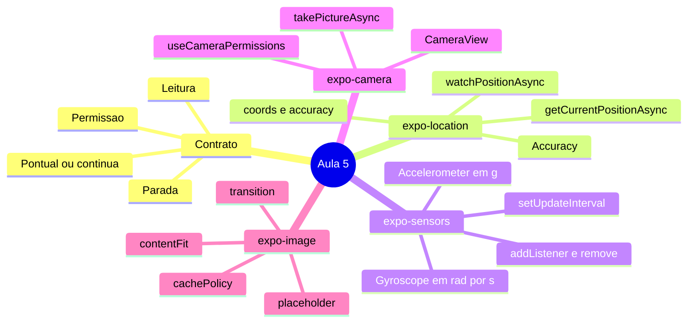
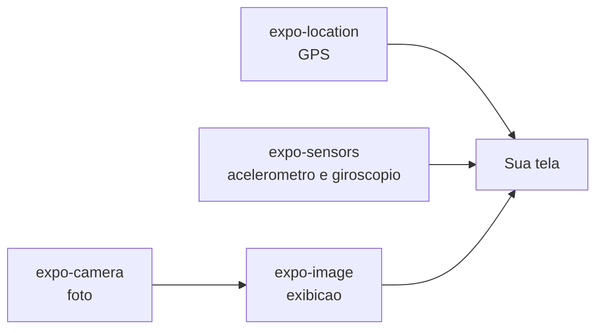
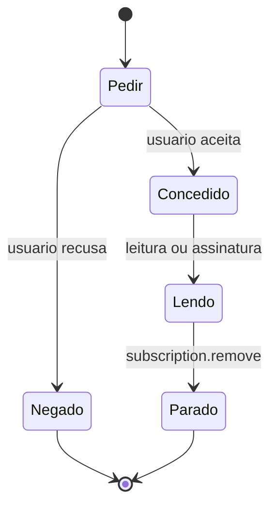
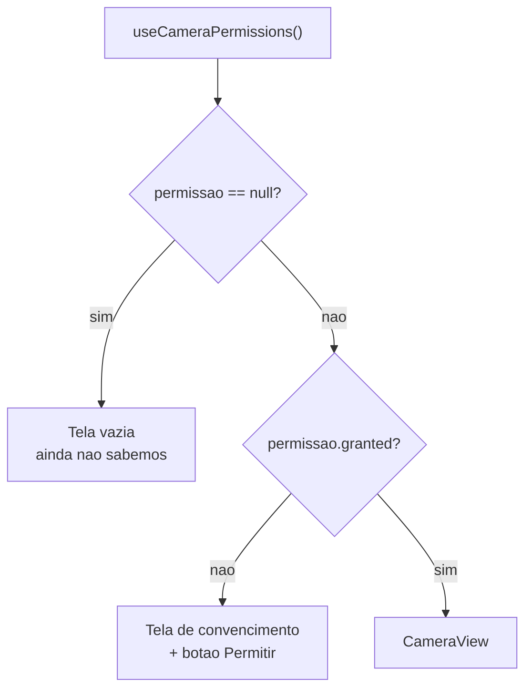
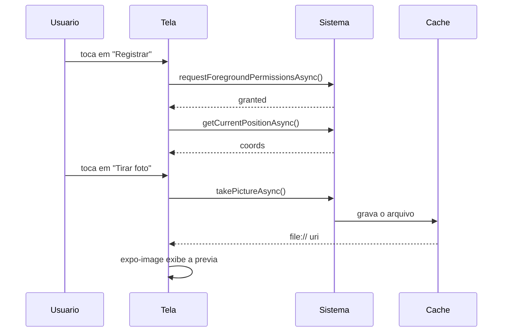

# Notas de Estudo — Aula 5: sensores do dispositivo (GPS, acelerômetro, giroscópio e câmera)

> **Disciplina:** Desenvolvimento Mobile (2026.2.DM) — CESAR School
> **Dados de versões e ferramentas:** conferidos em **1º de setembro de 2026**. Este material envelhece rápido; as fontes estão no final para você conferir por conta própria.

---

## Visão geral

Até a Aula 4, o seu app só sabia **o que você digitou nele**. `TextInput`, `useState`, uma `FlatList`. Todo dado nascia dentro do próprio aplicativo.

A partir de hoje, o dado vem **de fora** — do hardware, através do sistema operacional. E isso muda três coisas de uma vez:

1. O sistema **pergunta ao dono do aparelho** antes de te entregar qualquer coisa.
2. A entrega é **assíncrona** e **pode falhar**.
3. Enquanto você lê, **a bateria está sendo gasta**.

Esta aula responde quatro perguntas:

1. **Onde o aparelho está?** → `expo-location`
2. **Como o aparelho está sendo movido e girado?** → `expo-sensors` (`Accelerometer` e `Gyroscope`)
3. **O que a câmera está vendo, e como eu capturo isso?** → `expo-camera`
4. **Como eu mostro bem a imagem que resultou?** → `expo-image`



> **Leitura do diagrama:** o mapa mostra os cinco blocos da aula. O primeiro — o **contrato** — é o esqueleto que se repete em todos os outros; os três seguintes são os pacotes que **produzem** dado a partir do hardware; o último é o pacote que **mostra** o que a câmera produziu.

**O arco da aula, em uma frase:** os três primeiros pacotes produzem dado; o quarto exibe.



> **Leitura do diagrama:** os três pacotes de sensor alimentam a tela diretamente com dados do hardware; a câmera é o único que passa por um intermediário — o arquivo capturado vira pixel na tela através do `expo-image`.

> 📌 **Sobre o escopo:** esta aula cobre **GPS com `expo-location`**, **acelerômetro e giroscópio com `expo-sensors`**, **câmera com `expo-camera`** e **exibição de imagem com `expo-image`**, apoiada em tudo que veio das Aulas 1 a 4 (`View`, `Text`, `TextInput`, `ScrollView`, `StyleSheet`, Flexbox, `useState`, `Pressable`, `FlatList`, `SectionList`). Navegação entre telas, salvar a foto na galeria, mapas, rede e as ferramentas do React para controlar ciclo de vida aparecem mais adiante na disciplina — quando chegarem, elas vão se encaixar exatamente nos ganchos que esta aula deixa preparados. Este material **diz onde estão esses ganchos**, em vez de fingir que não existem.

> 📱 **Sobre os exemplos deste material:** o domínio é o **Rastreador de Micro-hábitos** (`Habito`) — um dos dois projetos da disciplina. Se o seu grupo ficou com o **App de Gestão e Rotina Pet**, use o **`practice.md`**: são as mesmas práticas, com os mesmos scaffolds, no domínio `Pet` (e ele traz a tabela de equivalência no final).

**O domínio, retomado da Aula 4, com dois campos novos** — é a base de todos os exemplos daqui:

```tsx
type StatusHabito = 'pendente' | 'concluido' | 'pulado';

interface Habito {
  id: string;
  titulo: string;
  categoria: string;
  status: StatusHabito;
  streakDias: number;
  // novidades da Aula 5:
  local?: { latitude: number; longitude: number; precisaoMetros: number };
  fotoUri?: string;
}
```

Os dois campos são **opcionais** de propósito: o usuário pode negar a permissão, e o app tem que continuar funcionando. Um hábito sem foto e sem local ainda é um hábito.

---

# Parte 1 — O contrato de três tempos

## 1.1 Um sensor não é uma variável

Um sensor é um **recurso compartilhado, protegido e caro**:

- **compartilhado** — outros apps querem o mesmo hardware ao mesmo tempo;
- **protegido** — o sistema exige consentimento explícito do dono do aparelho;
- **caro** — cada leitura custa bateria, e uma leitura **contínua** custa bateria o tempo todo.

A consequência prática aparece na assinatura de toda função da aula: **elas são `async` e podem dizer não**. Não existe isto:

```tsx
const local = pegarLocalizacao();   // ❌ não existe nada parecido com isso
```

Existe isto:

```tsx
const { status } = await Location.requestForegroundPermissionsAsync();  // pode ser negado
const posicao = await Location.getCurrentPositionAsync({ /* ... */ });  // pode demorar
```

## 1.2 Os três tempos



> **Leitura do diagrama:** o app pede permissão; se for negada, o caminho termina ali e a sua tela precisa dizer isso ao usuário; se for concedida, começa a leitura, que só termina quando **o seu código** a encerra. O sistema não desliga o sensor por você.

| Tempo | O que é | Quando não existe |
|---|---|---|
| **1. Permissão** | perguntar, e tratar o "não" | acelerômetro e giroscópio, no uso desta aula |
| **2. Leitura** | pontual ou contínua | nunca — é o motivo de tudo |
| **3. Parada** | encerrar a leitura contínua | quando a leitura é pontual |

**Esse esqueleto é o que você leva desta aula.** Os quatro pacotes só mudam os nomes:

| Pacote | Pedir | Ler | Parar |
|---|---|---|---|
| `expo-location` | `requestForegroundPermissionsAsync()` | `getCurrentPositionAsync()` / `watchPositionAsync()` | `subscription.remove()` |
| `expo-sensors` | — (acelerômetro e giroscópio não pedem) | `Accelerometer.addListener()` / `Gyroscope.addListener()` | `subscription.remove()` |
| `expo-camera` | `useCameraPermissions()` | `takePictureAsync()` | — (basta desmontar o `CameraView`) |
| `expo-image` | — (não é sensor) | — | — |

### Por que acelerômetro e giroscópio não pedem permissão?

Vale pensar antes de ler a resposta.

Porque eles **não identificam a pessoa nem o lugar**. Saber que o aparelho está inclinado 12 graus não diz nada sobre quem você é ou onde está. Já **localização, câmera e microfone** dizem exatamente isso — e por isso são protegidos.

**A regra por trás:** *a permissão acompanha o risco à privacidade, não o hardware*. É um bom mapa mental para os pacotes que você vai encontrar no resto do curso.

## 1.3 Permissão é um estado, não um evento

> 🔴 **O erro de modelo mental mais comum da aula:** "eu peço permissão uma vez, na primeira abertura, e pronto."

**Não.** O usuário pode entrar nas Configurações e revogar a permissão **com o app instalado e rodando**. Permissão é um **estado atual**, que você consulta **toda vez que vai usar**.

O objeto devolvido — o `PermissionResponse` — tem quatro campos:

| Campo | Para quê |
|---|---|
| `status` | `'granted'` / `'denied'` / `'undetermined'` |
| `granted` | o mesmo, como booleano — é o que você vai usar em 90% dos casos |
| `canAskAgain` | **se for `false`, o diálogo do sistema não vai mais aparecer** |
| `expires` | quando expira (normalmente `'never'`) |

### 🔴 `canAskAgain: false` — a situação que separa app amador de app profissional

Quando esse campo vem `false`, o sistema **não vai mostrar o diálogo de novo**, por mais vezes que você chame `request...`. O seu botão "Permitir" virou um botão que não faz nada.

A única saída é:

1. **explicar** por que o app precisa daquilo (em texto, na tela — não num alerta), e
2. **oferecer um caminho para as Configurações** do sistema.

Insistir com o mesmo botão é o comportamento errado, e é o que a maioria dos apps faz.

### As duas formas de perguntar

**Forma 1 — chamada direta, dentro do `onPress`.** Quando a permissão só importa **no momento da ação**:

```tsx
async function registrarLocal() {
  const { status, canAskAgain } = await Location.requestForegroundPermissionsAsync();
  if (status !== 'granted') {
    setErro(canAskAgain ? 'permissao-negada' : 'permissao-bloqueada');
    return;
  }
  // ... segue a leitura
}
```

**Forma 2 — o par `[estado, função]`.** Quando **a tela inteira** depende do estado da permissão:

```tsx
const [permissao, pedirPermissao] = useCameraPermissions();
```

> 💡 **Isso não é um conceito novo.** A forma 2 devolve **exatamente o mesmo formato do `useState`** que você já usa desde a Aula 3 — um valor e uma função que mexe nele — e segue a mesma regra: **chamada no topo do componente, sempre, sem `if` em volta**.

Nesta aula usamos a forma 1 no GPS e a forma 2 na câmera, de propósito, para você ver as duas. O `expo-location` também tem a forma 2 (`Location.useForegroundPermissions()`), se você preferir.

## 1.4 Leitura pontual × assinatura contínua

### 🚰 Analogia: o copo e a torneira

`getCurrentPositionAsync` é **encher um copo**: você pede, espera, recebe, acabou.

`watchPositionAsync` é **abrir a torneira**: começa a jorrar e **não para sozinha**. Torneira aberta gasta água — aqui, bateria — e alaga a casa se você esquecer.

A pergunta que decide é sempre a mesma: **"eu preciso de um valor, ou de um fluxo?"**

| Situação | O que usar |
|---|---|
| "Onde eu estou **agora**, para registrar este treino?" | copo — `getCurrentPositionAsync` |
| "Desenhar o trajeto **enquanto** eu corro" | torneira — `watchPositionAsync` |
| "O usuário chacoalhou o telefone?" | torneira — `addListener` (não existe copo aqui) |
| "Tirar uma foto" | copo — `takePictureAsync` |

> ⚠️ **A regra:** toda torneira aberta tem que ter uma torneira fechada **no mesmo arquivo**. Se você escreveu `addListener` ou `watchPositionAsync` e não escreveu `remove()`, o código está **incompleto** — mesmo que a tela funcione.

### 🧩 Nota honesta sobre o que ainda não temos

Num app de verdade, você abre a torneira quando a tela aparece e fecha quando a tela sai. A ferramenta do React que faz isso chama-se `useEffect`, e ela é assunto da **Aula 6**.

Nesta aula, **você liga e desliga a torneira no botão** — com o `Pressable` da Aula 4 —, e guarda a assinatura num `useState`. Funciona, é código válido, e tem uma consequência real que este material **não vai esconder de você**:

> 🔴 **Se você sair da tela com o sensor ligado, ele continua ligado.** A bateria continua sendo gasta. Isso é um vazamento, e ele é proposital: é o problema que a Aula 6 vem resolver. Quando ela chegar, volte neste código.

## 1.5 O `app.json` e o config plugin

Cada pacote traz um **config plugin**, que escreve — na hora de gerar a build — os textos que o iOS mostra no diálogo de permissão (`Info.plist`) e as permissões que o Android declara (`AndroidManifest.xml`):

```json
{
  "expo": {
    "plugins": [
      ["expo-location", {
        "locationWhenInUsePermission": "Precisamos da sua localização para registrar onde o treino aconteceu."
      }],
      ["expo-camera", {
        "cameraPermission": "Precisamos da câmera para você registrar a foto do seu progresso."
      }]
    ]
  }
}
```

> ⚠️ **A pegadinha:** no **Expo Go**, o seu app herda as permissões do próprio Expo Go — então **funciona mesmo sem** o plugin. Na hora de gerar a build de verdade (Aula 13), **não funciona**. Escreva o plugin agora, enquanto o assunto está fresco, e não descubra isso em novembro.

E escreva um texto **honesto**. O usuário lê essa frase antes de decidir. *"Este app precisa da sua localização"* não convence ninguém; *"para registrar onde o treino aconteceu"* convence.

---

# Parte 2 — GPS com `expo-location`

## 2.1 Instalação

```bash
npx expo install expo-location expo-sensors expo-camera expo-image
```

> 💡 **`npx expo install`, não `npm install`.** O `expo install` escolhe a versão **compatível com o SDK do seu projeto**; o `npm install` pega a mais nova, que pode não ser a que o SDK 57 suporta. É o mesmo princípio de *"versão mais nova ≠ versão que você usa"* da Aula 1, agora aplicado ao seu terminal.

## 2.2 Pedir a permissão

```tsx
import * as Location from 'expo-location';

const { status, canAskAgain } = await Location.requestForegroundPermissionsAsync();
```

| Função | Para quê |
|---|---|
| `requestForegroundPermissionsAsync()` | pede "enquanto o app estiver aberto" — **a nossa** |
| `getForegroundPermissionsAsync()` | **consulta sem pedir** — útil para desenhar a tela antes de incomodar |
| `requestBackgroundPermissionsAsync()` | "mesmo com o app fechado" — **fora do escopo**, e não funciona no Expo Go |

## 2.3 O copo: `getCurrentPositionAsync`

```tsx
const posicao = await Location.getCurrentPositionAsync({
  accuracy: Location.Accuracy.Balanced,
});
```

> ⏱️ **Ele pode demorar.** Dentro de um prédio, com o GPS "frio", a primeira leitura leva **vários segundos**. A sua tela precisa de um estado de "buscando..." — e isso é `useState`, que você já sabe fazer.

## 2.4 `Accuracy`: a troca que quase ninguém faz conscientemente

| Nível | Erro aproximado | Custo |
|---|---|---|
| `Accuracy.Lowest` | ~3 km | mínimo |
| `Accuracy.Low` | ~1 km | baixo |
| `Accuracy.Balanced` | ~100 m | médio — **o default** |
| `Accuracy.High` | ~10 m | alto |
| `Accuracy.Highest` | o melhor disponível | muito alto |
| `Accuracy.BestForNavigation` | o melhor, otimizado para navegação | o mais caro de todos |

**Precisão não é uma virtude, é uma compra.** Você paga em **tempo de espera** e em **bateria**.

| O que o app faz | O que pedir |
|---|---|
| Mostrar a previsão do tempo da cidade | `Low` — e pedir `Highest` aqui é desperdício puro |
| Registrar em que academia o treino aconteceu | `Balanced` ou `High` |
| Desenhar o trajeto de uma corrida | `High` ou `BestForNavigation` |

> 🔴 **O erro:** usar `Highest` "por garantia". Garantia de quê? De gastar mais bateria e demorar mais para entregar uma informação que ninguém vai usar naquela precisão.

## 2.5 O que vem dentro

```ts
{
  coords: {
    latitude: number,
    longitude: number,
    accuracy: number | null,          // RAIO de incerteza, em METROS
    altitude: number | null,
    altitudeAccuracy: number | null,
    heading: number | null,           // direção, em graus
    speed: number | null              // velocidade, em m/s
  },
  timestamp: number,
  mocked?: boolean                    // só no Android
}
```

### 🔴 `accuracy` é a armadilha do bloco

**Não é "qualidade de 0 a 100".** É o **raio do círculo** dentro do qual o aparelho acha que você está.

`accuracy: 65` significa: *"em algum lugar dentro de um círculo de 65 metros de raio"*. Quanto **menor**, melhor.

Isso muda como você exibe o dado. Um app honesto mostra *"perto da Rua X (±65 m)"*, não uma bolinha exata num ponto que ele não tem como saber.

### `heading` e `speed` só existem em movimento

Parado, vêm zerados ou `null`. **Não é bug.** O aparelho calcula direção e velocidade comparando posições sucessivas; sem movimento, não há o que comparar.

### `mocked` (só Android)

O sistema avisa quando a localização foi **falsificada** por um app de mock. Existe porque isso é um problema real em apps de entrega, ponto eletrônico e jogos baseados em localização.

## 2.6 A resposta instantânea: `getLastKnownPositionAsync`

```tsx
const ultima = await Location.getLastKnownPositionAsync({
  maxAge: 60000,          // não aceito nada com mais de 1 minuto
  requiredAccuracy: 100,  // nem com raio maior que 100 m
});
```

Devolve a **última posição que o sistema já tinha guardada** — quase instantâneo — ou `null` se não houver nenhuma que atenda aos seus critérios.

> 💡 **O padrão de UX que vale a aula inteira:** mostre a **última conhecida imediatamente** e busque a **atual em seguida**, atualizando a tela quando ela chegar. O usuário vê algo em 50 ms, em vez de encarar um *spinner* por 6 segundos.

```tsx
const ultima = await Location.getLastKnownPositionAsync({ maxAge: 60000 });
if (ultima) setPosicao(ultima);                     // 1. algo na tela AGORA
const atual = await Location.getCurrentPositionAsync({ accuracy: Location.Accuracy.Balanced });
setPosicao(atual);                                   // 2. o dado bom, quando chegar
```

## 2.7 A torneira: `watchPositionAsync`

```tsx
const assinatura = await Location.watchPositionAsync(
  {
    accuracy: Location.Accuracy.High,
    timeInterval: 5000,       // no máximo a cada 5 s
    distanceInterval: 10,     // ou a cada 10 metros percorridos
  },
  (posicao) => setPosicao(posicao),
);

// mais tarde, obrigatoriamente:
assinatura.remove();
```

| Opção | O que faz | Plataforma |
|---|---|---|
| `accuracy` | mesma enum de `getCurrentPositionAsync` | ambas |
| `timeInterval` | intervalo mínimo entre avisos, em **ms** | ⚠️ **só Android** |
| `distanceInterval` | distância mínima entre avisos, em **metros** | ambas |

> 🔴 **`timeInterval` é Android-only.** A tipagem do pacote marca a prop como `@platform android` — no iPhone ela é **ignorada silenciosamente**. A prop existe, compila, não dá aviso, e não faz nada de um dos lados. É a mesma armadilha do `stickySectionHeadersEnabled` da Aula 4.

> 💡 **`distanceInterval` é o mais econômico dos dois — e o único que vale nas duas plataformas.** Com ele, se o usuário estiver parado, o app simplesmente **não recebe nada**, e não gasta.

Sem essas duas opções, o comportamento padrão depende da `accuracy` escolhida, e costuma ser mais frequente do que você precisa.

## 2.8 Permissão concedida ≠ GPS ligado

```tsx
const ligado = await Location.hasServicesEnabledAsync();
```

**São dois estados diferentes, e o usuário resolve cada um num lugar diferente:**

| Situação | O que dizer | Onde o usuário resolve |
|---|---|---|
| Permissão negada | "o app não pode usar sua localização" | Configurações **do app** |
| Serviço desligado | "a localização do aparelho está desligada" | Configurações **do sistema** |

> 🔴 Tratar os dois com a mesma mensagem genérica — *"erro ao obter localização"* — é o motivo de metade das avaliações de uma estrela em app store. O usuário não sabe o que fazer, então desinstala.

## 2.9 Coordenada → endereço: `reverseGeocodeAsync`

```tsx
const enderecos = await Location.reverseGeocodeAsync({ latitude, longitude });
const primeiro = enderecos[0];
// primeiro.street, .district, .city, .region, .postalCode, .country ...
```

Serve para mostrar o que o usuário realmente consegue ler: **"Boa Viagem, Recife"**, e não `-8.1234, -34.9012`.

> ⚠️ **O aviso está na própria documentação:** geocoding é **caro**, e muitas chamadas seguidas resultam em erro. **Chame uma vez, no momento em que o dado é registrado — nunca dentro de um `watchPositionAsync`.**

O caminho inverso existe: `geocodeAsync('Rua da Aurora, Recife')` devolve coordenadas.

## 2.10 O que fica para depois

| Assunto | Por que não agora |
|---|---|
| Mostrar num **mapa** | biblioteca de terceiro; não está no cronograma. Hoje, coordenada é **texto** |
| **Localização em segundo plano** (`startLocationUpdatesAsync`) | exige *development build*; não funciona no Expo Go |
| **Geofencing** (`startGeofencingAsync`) | idem, e depende do `expo-task-manager` |

---

# Parte 3 — Acelerômetro e giroscópio com `expo-sensors`

## 3.1 🔴 O pacote não se chama `expo-gyroscope`

O cronograma da disciplina diz *"Expo Gyroscope"*. **Esse pacote não existe.** Se você digitar `npx expo install expo-gyroscope`, não vai instalar nada.

O pacote é **`expo-sensors`**, e os dois sensores saem do mesmo import:

```tsx
import { Accelerometer, Gyroscope } from 'expo-sensors';
```

> 💡 **Lição de método:** quando um nome de pacote não resolve, procure o **pacote guarda-chuva**. Aconteceria igual com `expo-accelerometer`. Bibliotecas costumam agrupar coisas da mesma família.

## 3.2 O que cada um mede — a distinção que todo mundo erra

| | Acelerômetro | Giroscópio |
|---|---|---|
| Mede | **aceleração linear** (translação) + gravidade | **velocidade angular** (rotação) |
| Unidade | **g** — 1 g = 9,81 m/s² | **rad/s** |
| Parado na mesa | **não dá zero** | **dá zero**, em qualquer orientação |
| Responde a | "fui empurrado / chacoalhado / estou inclinado" | "estou girando, e com que rapidez" |

### 🚌 Analogia: o passageiro do ônibus

Você sente o **solavanco** quando o motorista freia — isso é o **acelerômetro**.

Você sente o **rodopio** quando o ônibus faz a curva — isso é o **giroscópio**.

São sensações diferentes, e uma não substitui a outra. É por isso que os dois sensores existem separados.

### 🔴 O acelerômetro parado **não** marca zero

Deixe o telefone parado na mesa e leia os dois:

- **Giroscópio:** ≈ `0` nos três eixos. Nada está girando.
- **Acelerômetro:** a **magnitude do vetor fica em torno de 1 g**. Porque **a gravidade não desliga**.

**Isso não é bug, é física.** E é exatamente por isso que o acelerômetro serve para detectar **inclinação**: parado, aquele vetor de 1 g aponta para baixo, e a forma como ele se distribui entre `x`, `y` e `z` diz **como o aparelho está posicionado**.

### A consequência prática

| Você quer saber... | Use |
|---|---|
| "o usuário **chacoalhou** o telefone?" | acelerômetro |
| "o telefone está **inclinado**? para que lado?" | acelerômetro |
| "o usuário **girou** o telefone, e quão rápido?" | giroscópio |

Escolher errado é o bug mais comum deste bloco.

## 3.3 A API — que é a mesma para os dois

```tsx
import { Gyroscope } from 'expo-sensors';

// 1. o hardware existe neste aparelho?
const disponivel = await Gyroscope.isAvailableAsync();

// 2. com que frequência eu quero ser avisado?
Gyroscope.setUpdateInterval(100);

// 3. abrir a torneira
const assinatura = Gyroscope.addListener(({ x, y, z, timestamp }) => {
  setDados({ x, y, z });
});

// 4. fechar a torneira
assinatura.remove();
```

| Função | O que faz |
|---|---|
| `isAvailableAsync()` | o aparelho tem esse sensor? **Sempre cheque** — simulador não tem |
| `addListener(cb)` | assina; devolve a assinatura. Payload: `{ x, y, z, timestamp }` |
| `setUpdateInterval(ms)` | pede a frequência |
| `assinatura.remove()` | encerra **aquela** assinatura |
| `getListenerCount()` | quantos listeners estão ativos — útil para depurar vazamento |

> 🔴 **Zumbi ativo:** `removeAllListeners()` está **deprecado**. Quase todo tutorial ainda usa. Use `assinatura.remove()`.

O `timestamp` do payload vem em **segundos**.

## 3.4 `setUpdateInterval` é um pedido, não uma garantia

Você pede em **milissegundos**; o sistema entrega **o que der**. `16` ms ≈ 60 Hz.

> ⚠️ **No Android 12 e acima, a taxa é limitada a 200 Hz** por padrão. É uma proteção de privacidade: sensor rápido demais permite inferir coisas sobre a pessoa que ela não autorizou (o que ela digitou, por exemplo).

### 🔴 O erro de desempenho do bloco

```tsx
Accelerometer.setUpdateInterval(16);
Accelerometer.addListener(setDados);      // ❌ 60 setState por segundo
```

**60 chamadas de `setState` por segundo = 60 renderizações da sua tela por segundo.** Numa tela que também tem uma `FlatList`, isso derruba o app.

**As duas correções:**

**1. Aumente o intervalo.** Para mostrar um número na tela, `100` ms (10 Hz) é mais que suficiente — o olho humano não lê 60 números por segundo.

```tsx
Accelerometer.setUpdateInterval(100);     // ✅
```

**2. Guarde no estado só o que a tela mostra.** Se você só precisa de "chacoalhou ou não", calcule dentro do listener e chame `setState` **apenas quando o resultado mudar**:

```tsx
const assinatura = Accelerometer.addListener(({ x, y, z }) => {
  const magnitude = Math.sqrt(x * x + y * y + z * z);
  const agora = magnitude > 1.8;
  setChacoalhou((anterior) => (anterior === agora ? anterior : agora));
});
```

> 🧩 **Nota honesta:** existem ferramentas feitas exatamente para separar "taxa do sensor" de "taxa de renderização". Elas usam recursos do React e bibliotecas de animação que ainda não estão no programa. As duas medidas acima são as certas para o nosso caso e não dependem de nada novo.

## 3.5 Uso concreto 1 — detectar chacoalhada

```tsx
const magnitude = Math.sqrt(x * x + y * y + z * z);   // parado ≈ 1 g
const chacoalhou = magnitude > 1.8;                    // limiar empírico
```

### Por que a magnitude, e não `x` sozinho?

**Porque o usuário chacoalha em qualquer direção.** Se você olhar só o `x`, uma chacoalhada de cima para baixo (que mexe o `z`) passa despercebida.

A magnitude do vetor é **independente da orientação** do aparelho — ela responde "o quanto ele foi sacudido", não "para que lado". Esse é o insight do exercício.

> 💡 **O limiar `1.8` é empírico.** Não existe número certo na documentação. Teste no seu aparelho e ajuste: muito baixo, dispara ao andar; muito alto, exige um chacoalhão violento.

## 3.6 Uso concreto 2 — nível de bolha

Com o aparelho **parado**, os eixos `x` e `y` contam de que lado ele está pendendo. Perfeitamente plano sobre a mesa, os dois ficam perto de zero.

Dá para mover uma `View` na tela usando `x` e `y` como deslocamento — com `StyleSheet` e Flexbox da Aula 3, **sem nenhuma animação**. É posição direta, recalculada a cada leitura:

```tsx
<View style={[estilos.bolha, { left: 150 + x * 100, top: 150 - y * 100 }]} />
```

## 3.7 O giroscópio, com honestidade

Girando o aparelho, os valores sobem; parando, voltam a zero. **É taxa, não ângulo.**

Para saber *"quanto girou no total"*, você teria que **integrar** a taxa ao longo do tempo — somar `velocidade × intervalo` a cada leitura, e é para isso que o `timestamp` do payload existe. Esse cálculo acumula erro (é o problema clássico do *drift*), e apps sérios combinam giroscópio com acelerômetro e magnetômetro para corrigi-lo.

**Saber que esse caminho existe já é suficiente por hoje.** O que a aula cobra é: você sabe ler o giroscópio, sabe a unidade, e sabe que ele responde rotação, não posição.

## 3.8 Simulador e emulador

| Ambiente | Acelerômetro / Giroscópio |
|---|---|
| **Aparelho físico** | ✅ o único jeito de verdade |
| **Android Emulator** | ⚠️ **sensores virtuais** nos *extended controls* — dá para simular movimento arrastando |
| **iOS Simulator** | ❌ não tem. É para isso que serve o `isAvailableAsync()` |

Este é o bloco da aula que menos tolera simulador. Use o celular.

## 3.9 O que mais existe no mesmo pacote (contexto)

O `expo-sensors` traz também **Magnetometer**, **Barometer**, **DeviceMotion**, **Pedometer** e **LightSensor**. Não entram na disciplina.

> 💡 A API deles é **a mesma** que você acabou de aprender: `isAvailableAsync`, `addListener`, `setUpdateInterval`, `remove()`. Este é o valor de ter aprendido o **contrato** em vez de decorar funções — você já sabe usar cinco sensores que nunca viu.

---

# Parte 4 — Câmera com `expo-camera`

## 4.1 🔴 O zumbi número 1 da aula

O `expo-camera` foi **reescrito**. A maioria dos tutoriais indexados na internet é anterior à reescrita, e **não compila**.

| O tutorial que você vai achar | O que compila hoje |
|---|---|
| `import { Camera } from 'expo-camera'` | `import { CameraView, useCameraPermissions } from 'expo-camera'` |
| `<Camera type={Camera.Constants.Type.back} />` | `<CameraView facing="back" />` |
| `CameraType.back` (enum) | a string `'back'` — `CameraType` sobrevive como **tipo** TypeScript, não como enum |
| `Camera.requestCameraPermissionsAsync()` | `useCameraPermissions()` |
| `import ... from 'expo-camera/legacy'` | **removido no SDK 52** |
| `onBarCodeScanned` | `onBarcodeScanned` (b minúsculo) |
| `import * as Permissions from 'expo-permissions'` | não existe mais; cada pacote traz as suas |

> 💡 **A lição de método vale mais que a tabela:** quando um exemplo da internet não compila, o primeiro lugar a olhar é a **documentação da versão que você está usando** — não o próximo blog. Blogs não são atualizados; documentação é versionada.

## 4.2 O gate de permissão em três estados

Este é o padrão que vale copiar. **Três `return`s, três estados diferentes:**



> **Leitura do diagrama:** a decisão tem **duas** perguntas, não uma. A primeira separa "ainda não sei" de "já sei"; só a segunda separa "tenho" de "não tenho". Juntar as duas é o bug do §4.2.

```tsx
import { CameraView, useCameraPermissions } from 'expo-camera';

export default function TelaCamera() {
  const [permissao, pedirPermissao] = useCameraPermissions();
  const [lado, setLado] = useState<'back' | 'front'>('back');

  // 1. ainda não sabemos
  if (!permissao) return <View />;

  // 2. já sabemos, e não temos
  if (!permissao.granted) {
    return (
      <View style={estilos.centro}>
        <Text style={estilos.aviso}>
          Precisamos da câmera para você registrar a foto do seu progresso.
        </Text>
        <Pressable
          onPress={pedirPermissao}
          style={({ pressed }) => [estilos.botao, pressed && estilos.botaoPressionado]}
        >
          <Text style={estilos.textoBotao}>Permitir</Text>
        </Pressable>
      </View>
    );
  }

  // 3. temos
  return <CameraView style={estilos.camera} facing={lado} />;
}
```

### 🔴 Por que o primeiro `return` existe

**`permissao` começa `null`.** E `null` **não** é "negado" — é *"a resposta ainda não chegou"*.

Se você juntar os dois primeiros casos (`if (!permissao?.granted)`), a tela de "precisamos da câmera" **pisca** por um instante para **todo mundo** — inclusive para quem já concedeu a permissão há semanas. É o bug mais comum desta tela.

> 💡 **A tela do estado 2 não é uma tela de erro — é o seu argumento de venda.** Escreva a frase pensando em quem vai lê-la e decidir.

Repare que o `Pressable` é da Aula 4 e o `StyleSheet` é da Aula 3. **A única coisa nova aqui é o `useCameraPermissions`.**

## 4.3 🔴 `CameraView` precisa de tamanho

Regra da Aula 3, de novo: **o `CameraView` não tem tamanho próprio.** Sem `flex: 1` (ou altura explícita) no estilo, você não vê **nada**.

```tsx
const estilos = StyleSheet.create({
  camera: { flex: 1 },   // ← sem isso, tela preta
});
```

> ⚠️ **Tela preta pode ser falta de altura, não falta de permissão.** Antes de sair debugando permissão, confira o estilo. Esse engano custa muito tempo.

## 4.4 As props que são estado

Todas dirigidas por `useState` + `Pressable` — nada novo além do nome da prop.

| Prop | Valores | Default |
|---|---|---|
| `facing` | `'back'` / `'front'` | `'back'` |
| `flash` | `'off'` / `'on'` / `'auto'` / `'screen'` | `'off'` |
| `enableTorch` | booleano | `false` |
| `zoom` | número de **0 a 1** | `0` |
| `mode` | `'picture'` / `'video'` | `'picture'` |
| `mirror` | booleano (espelhar a frontal) | `false` |
| `animateShutter` | booleano | `true` |
| `onCameraReady` | callback — a câmera terminou de montar | — |
| `onMountError` | callback — não conseguiu montar | — |

### 🔴 Dois enganos frequentes

**`zoom` vai de 0 a 1, não "1x, 2x, 5x".** É **proporção do alcance do aparelho** — por isso o mesmo `0.5` dá zooms diferentes em telefones diferentes. Passar `2` não dá erro; simplesmente não faz o que você espera.

**`flash` é para a foto; `enableTorch` é a lanterna acesa durante o preview.** São coisas diferentes.

Trocar de câmera é `useState` puro:

```tsx
<Pressable onPress={() => setLado((atual) => (atual === 'back' ? 'front' : 'back'))}>
  <Text>Virar câmera</Text>
</Pressable>
```

## 4.5 Tirar a foto: a referência ao componente

Para tirar a foto você precisa **falar com o componente que já está na tela**. Não é uma prop — é um **método**: `takePictureAsync()`. E, para falar com um componente, você precisa de uma **referência** a ele.

### 🧩 A solução canônica é `useRef`, que é Aula 6

Hoje resolvemos com o que já temos — um **callback ref** guardado num `useState`:

```tsx
const [camera, setCamera] = useState<CameraView | null>(null);

<CameraView ref={setCamera} style={estilos.camera} facing={lado} />
```

**Por que isso funciona** — e é importante que não seja mágica para você:

1. A prop `ref` **aceita uma função**.
2. Quando o componente monta, o React **chama essa função**, passando o componente.
3. `setCamera` **é** uma função que recebe um valor e guarda no estado.
4. Quando o componente desmonta, o React chama de novo, com `null` — e o estado se atualiza sozinho.

> 🧩 **A limitação, dita com todas as letras:** a forma que você vai ver em todo lugar usa `useRef`. Ela é melhor, porque **não causa uma renderização a mais**. Mas `useRef` é um nome novo e é assunto da Aula 6. Hoje resolvemos com `useState`, que você já sabe, e o resultado funcional é o mesmo.

## 4.6 `takePictureAsync` e o que ele devolve

```tsx
async function tirarFoto() {
  if (!camera) return;
  const foto = await camera.takePictureAsync({ quality: 0.7 });
  if (foto) setFotoUri(foto.uri);
}
```

```ts
// CameraCapturedPicture
{
  uri: string;         // caminho do arquivo local
  width: number;
  height: number;
  base64?: string;     // só se você pedir
  exif?: object;       // só se você pedir
  format: 'jpg' | 'png';
}
```

- **`if (!camera) return;` não é paranoia.** No primeiro render o estado ainda é `null`. O TypeScript vai exigir isso, e ele está certo.
- **Não peça `base64` sem precisar.** Ele carrega a imagem inteira como texto na memória. Para **exibir na tela**, o `uri` basta e é muito mais barato. Peça `base64` só quando for enviar por uma API que exige (Aulas 10–12).

## 4.7 🔴 Onde a foto foi parar

O `uri` é um caminho local, tipo `file:///.../Caches/.../foto.jpg`. Ele aponta para o **cache do aplicativo**.

> 🔴 **A foto não foi para a galeria do seu celular, e não é permanente.** Se o sistema limpar o cache, ela some. Salvar de verdade é assunto de outro pacote, que não está no nosso programa.

Você precisa saber que essa diferença existe **para não prometer ao usuário algo que o app não faz**. Para o escopo desta aula — capturar e exibir na mesma sessão — o `uri` do cache é suficiente.

## 4.8 O que mais existe (contexto)

| Recurso | O que é |
|---|---|
| `mode="video"` + `recordAsync()` / `stopRecording()` | gravar vídeo — pede uma **segunda** permissão (microfone) |
| `onBarcodeScanned` + `barcodeScannerSettings` | ler QR code e código de barras, no mesmo pacote |

Não entram na disciplina. Servem para você saber que o `expo-camera` faz mais do que a aula mostra.

## 4.9 Simulador e emulador

| Ambiente | Câmera |
|---|---|
| **Aparelho físico** | ✅ o único jeito de verdade |
| **Android Emulator** | ⚠️ tem uma **cena virtual** — serve para testar o fluxo, não a imagem |
| **iOS Simulator** | ❌ **não tem câmera nenhuma.** O preview fica preto |

---

# Parte 5 — `expo-image`

## 5.1 Por que existe um segundo `Image`

A pergunta é legítima: *"a Aula 3 já ensinou `Image`. Por que outro?"*

**A resposta honesta:** não é moda. O `Image` do React Native resolve o caso simples — mostrar um arquivo. O `expo-image` resolve os casos que aparecem quando o app cresce:

| O que o `expo-image` traz | O problema que resolve |
|---|---|
| Cache em **memória e disco** | a mesma imagem baixada de novo a cada vez que a lista rola |
| `placeholder` (blurhash / thumbhash) | o retângulo cinza piscando enquanto a imagem carrega |
| `transition` | a imagem "aparecendo do nada", com corte seco |
| `contentFit` / `contentPosition` | recorte com a semântica do CSS, previsível nas duas plataformas |
| `recyclingKey` | o item de `FlatList` que mostra por um instante a **imagem do item anterior** |

> 💡 **`recyclingKey` conecta direto com a Aula 4.** A `FlatList` **recicla** as células — é assim que ela é rápida. Sem essa prop, a célula reciclada mostra a imagem antiga até a nova chegar. É o bug *"a foto errada apareceu por meio segundo"*.

## 5.2 Fechando o ciclo da aula

```tsx
import { Image } from 'expo-image';

<Image
  source={{ uri: fotoUri }}
  style={estilos.previa}
  contentFit="cover"
  transition={300}
/>
```

O `takePictureAsync` da Parte 4 devolveu um `uri`; ele entra aqui. **Sensor → dado → tela**, o arco inteiro.

### ⚠️ Cuidado com o import

`Image` do `expo-image` e `Image` do `react-native` têm o **mesmo nome**.

- Importar os dois no mesmo arquivo é **erro de compilação** (dá para resolver com `as`, mas evite).
- Importar o **errado** é um **bug silencioso**: a prop `contentFit` simplesmente não faz nada, e nenhum erro aparece.

> 🔴 **"O `contentFit` não funciona"** — a primeira coisa a conferir é o import. É a causa número um.

## 5.3 `contentFit` — e o zumbi do `resizeMode`

| Valor | Comportamento |
|---|---|
| `cover` | preenche a área, **cortando** o excesso — **o default** |
| `contain` | cabe inteira, deixando **sobra** |
| `fill` | estica, **distorcendo** |
| `none` | tamanho original, sem ajuste |
| `scale-down` | o menor entre `none` e `contain` |

> 🔴 **O zumbi:** `resizeMode` **ainda é aceito** pelo `expo-image`, mas só por compatibilidade com o React Native — está **deprecado**. O nome correto é **`contentFit`**, com os valores do CSS `object-fit`.

**Por que isso importa e não é só troca de nome:** os valores agora têm a semântica do CSS, que é a mesma em iOS, Android e web. Menos surpresa entre plataformas — exatamente o tipo de diferença que atormentou a Aula 4 com o cabeçalho fixo do `SectionList`.

`contentPosition` faz o papel do `object-position`: decide **qual parte sobra** quando o `cover` corta. O padrão é o centro. Para foto de pessoa, `'top'` costuma ser melhor — corta os pés, não a cabeça.

## 5.4 `placeholder` e `transition`

```tsx
const blurhash = 'L6PZfSi_.AyE_3t7t7R**0o#DgR4';

<Image
  source={{ uri: fotoUri }}
  placeholder={{ blurhash }}
  placeholderContentFit="cover"
  transition={300}
  style={estilos.previa}
/>
```

**Blurhash e thumbhash** são representações **minúsculas** — uma string curta — de como a imagem *parece*. Você mostra a versão borrada instantaneamente e troca pela real quando ela chega.

> 💡 **O problema real que isso resolve é de layout, não de estética.** Sem placeholder, a área fica vazia e a lista **pula** quando a imagem entra. Com placeholder, o espaço já está ocupado desde o primeiro frame.

`placeholderContentFit` é uma prop separada de propósito: se o placeholder e a imagem final tiverem enquadramentos diferentes, dá um **salto** visível na troca.

`transition={300}` = 300 ms de dissolução. **É um número, não uma biblioteca de animação.**

## 5.5 Cache: `cachePolicy`

| Valor | Onde guarda |
|---|---|
| `'none'` | não guarda |
| `'disk'` | disco — **o default** |
| `'memory'` | memória (some ao fechar o app) |
| `'memory-disk'` | os dois |

### 🍳 Analogia: a cozinha

- A **memória** é a bancada: perto, rápida, pequena.
- O **disco** é o armário: mais lento, cabe muito mais, sobrevive a fechar o app.
- A **rede** é o supermercado: caro e demorado.

`memory-disk` é manter uma cópia na bancada **e** no armário.

Três funções úteis:

```tsx
await Image.prefetch(['https://.../foto.jpg']);   // carrega antes de precisar
Image.clearMemoryCache();
Image.clearDiskCache();
```

## 5.6 Quando **não** trocar

> 💡 **Uma logo local com `require()` não precisa de nada disso.** Ela já está no bundle: não há download, não há cache, não há placeholder que faça sentido.

**A regra:** troque para o `expo-image` quando houver **imagem remota**, **lista** ou **carregamento perceptível**. Fora disso, o `Image` da Aula 3 continua correto — e menos dependência é sempre melhor.

Saber **quando não usar** uma ferramenta é parte de saber usá-la.

---

# Parte 6 — Juntando tudo

A tela completa, com os três pacotes de sensor e o de exibição. É o esqueleto da atividade aplicada.



> **Leitura do diagrama:** o registro tem duas interações do usuário e quatro idas ao sistema. Repare que a foto **não volta direto para a tela** — ela passa pelo cache do app, e o que a tela recebe é um **caminho de arquivo**, que o `expo-image` então lê.

```tsx
import { useState } from 'react';
import { Pressable, StyleSheet, Text, View } from 'react-native';
import * as Location from 'expo-location';
import { Accelerometer } from 'expo-sensors';
import { CameraView, useCameraPermissions } from 'expo-camera';
import { Image } from 'expo-image';

type Local = { latitude: number; longitude: number; precisaoMetros: number };

export default function TelaRegistro() {
  const [permissaoCamera, pedirPermissaoCamera] = useCameraPermissions();
  const [camera, setCamera] = useState<CameraView | null>(null);
  const [local, setLocal] = useState<Local | null>(null);
  const [fotoUri, setFotoUri] = useState<string | null>(null);
  const [erroLocal, setErroLocal] = useState<string | null>(null);
  const [buscando, setBuscando] = useState(false);

  async function registrarLocal() {
    setErroLocal(null);
    setBuscando(true);

    const { status, canAskAgain } = await Location.requestForegroundPermissionsAsync();
    if (status !== 'granted') {
      setErroLocal(
        canAskAgain
          ? 'Sem permissão de localização. Toque de novo para autorizar.'
          : 'Permissão bloqueada. Autorize nas Configurações do sistema.',
      );
      setBuscando(false);
      return;
    }

    if (!(await Location.hasServicesEnabledAsync())) {
      setErroLocal('A localização do aparelho está desligada.');
      setBuscando(false);
      return;
    }

    const posicao = await Location.getCurrentPositionAsync({
      accuracy: Location.Accuracy.Balanced,
    });

    setLocal({
      latitude: posicao.coords.latitude,
      longitude: posicao.coords.longitude,
      precisaoMetros: posicao.coords.accuracy ?? 0,
    });
    setBuscando(false);
  }

  async function tirarFoto() {
    if (!camera) return;
    const foto = await camera.takePictureAsync({ quality: 0.7 });
    if (foto) setFotoUri(foto.uri);
  }

  if (!permissaoCamera) return <View style={estilos.tela} />;

  return (
    <View style={estilos.tela}>
      {permissaoCamera.granted ? (
        <CameraView ref={setCamera} style={estilos.camera} facing="back" />
      ) : (
        <View style={estilos.aviso}>
          <Text style={estilos.textoAviso}>
            Precisamos da câmera para registrar a foto do seu progresso.
          </Text>
          <Pressable onPress={pedirPermissaoCamera} style={estilos.botao}>
            <Text style={estilos.textoBotao}>Permitir câmera</Text>
          </Pressable>
        </View>
      )}

      <View style={estilos.painel}>
        <Pressable
          onPress={tirarFoto}
          style={({ pressed }) => [estilos.botao, pressed && estilos.botaoPressionado]}
        >
          <Text style={estilos.textoBotao}>Tirar foto</Text>
        </Pressable>

        <Pressable
          onPress={registrarLocal}
          style={({ pressed }) => [estilos.botao, pressed && estilos.botaoPressionado]}
        >
          <Text style={estilos.textoBotao}>
            {buscando ? 'Buscando...' : 'Onde eu estou'}
          </Text>
        </Pressable>

        {erroLocal && <Text style={estilos.erro}>{erroLocal}</Text>}

        {local && (
          <Text style={estilos.info}>
            {local.latitude.toFixed(5)}, {local.longitude.toFixed(5)}{' '}
            (±{Math.round(local.precisaoMetros)} m)
          </Text>
        )}

        {fotoUri && (
          <Image
            source={{ uri: fotoUri }}
            style={estilos.previa}
            contentFit="cover"
            transition={300}
          />
        )}
      </View>
    </View>
  );
}

const estilos = StyleSheet.create({
  tela: { flex: 1, backgroundColor: '#111' },
  camera: { flex: 1 },
  aviso: { flex: 1, alignItems: 'center', justifyContent: 'center', padding: 24, gap: 12 },
  textoAviso: { color: '#fff', textAlign: 'center', fontSize: 16 },
  painel: { padding: 16, gap: 12, backgroundColor: '#1b1b1b' },
  botao: { backgroundColor: '#f26522', paddingVertical: 12, borderRadius: 10, alignItems: 'center' },
  botaoPressionado: { opacity: 0.7 },
  textoBotao: { color: '#fff', fontWeight: '700' },
  info: { color: '#eee' },
  erro: { color: '#ff8a80' },
  previa: { width: '100%', height: 160, borderRadius: 12, backgroundColor: '#222' },
});
```

> 🧩 **O que está deliberadamente faltando neste código, e você deve saber:** não há assinatura contínua de sensor aqui — se você acrescentar uma (`Accelerometer.addListener`), **precisa** de um botão para desligá-la, porque não há nada que a desligue quando a tela sai. A ferramenta que faz isso automaticamente chega na Aula 6.

---

## Erros comuns (consulte antes de pedir ajuda)

| Sintoma | Causa provável | Correção |
|---|---|---|
| A tela pisca "precisamos da câmera" para quem já autorizou | falta o `if (!permissao) return` | Três estados, não dois (§4.2) |
| Tela preta no lugar da câmera | `CameraView` sem altura | `flex: 1` no estilo (§4.3) |
| `contentFit` não faz nada | import do `Image` errado | Importar de `expo-image` (§5.2) |
| `takePictureAsync is not a function` | a referência ainda é `null` | `if (!camera) return;` (§4.6) |
| Botão "Permitir" não abre mais o diálogo | `canAskAgain: false` | Mandar para as Configurações (§1.3) |
| "Erro ao obter localização" sempre | permissão OK, mas GPS desligado | `hasServicesEnabledAsync()` (§2.8) |
| O app trava/engasga ao ligar o sensor | 60 `setState` por segundo | `setUpdateInterval(100)` (§3.4) |
| Bateria acabando rápido | torneira aberta sem `remove()` | Todo `addListener` tem um `remove()` (§1.4) |
| A chacoalhada não é detectada | olhando só um eixo | Usar a magnitude (§3.5) |
| Giroscópio marcando zero com o telefone parado | está certo | Acelerômetro é que não zera (§3.2) |
| `npx expo install expo-gyroscope` não instala nada | o pacote não existe | É `expo-sensors` (§3.1) |
| `Camera is not defined` / erro de import | tutorial antigo | `CameraView` (§4.1) |
| `zoom={2}` sem efeito | o intervalo é 0–1 | `zoom={0.5}` (§4.4) |
| A foto some depois de um tempo | está no cache do app | É o comportamento esperado (§4.7) |
| Imagem errada aparece por um instante na lista | célula reciclada da `FlatList` | `recyclingKey` (§5.1) |
| A lista "pula" quando as fotos carregam | sem placeholder | `placeholder` + tamanho fixo (§5.4) |
| A leitura de GPS demora muito | `Accuracy` alta demais | Escolher pelo uso (§2.4) |
| `timeInterval` não faz efeito no iPhone | a prop é Android-only | Usar `distanceInterval` (§2.7) |

---

## Perguntas para autoavaliação

Responda sem olhar o material. Se travar em alguma, o número da seção está do lado.

1. Quais são os **três tempos** do contrato de um sensor? Em qual dos quatro pacotes da aula o terceiro tempo não existe? *(§1.2)*
2. Por que acelerômetro e giroscópio **não pedem permissão**, e localização e câmera pedem? *(§1.2)*
3. O que significa `canAskAgain: false`, e o que o seu botão deve fazer nesse caso? *(§1.3)*
4. `accuracy: 65`. O que é esse 65? Menor é melhor ou pior? *(§2.5)*
5. Por que pedir `Accuracy.Highest` "por garantia" é um erro? *(§2.4)*
6. Qual a diferença entre **permissão negada** e **serviço de localização desligado**? A mensagem na tela pode ser a mesma? *(§2.8)*
7. Explique com suas palavras a diferença entre `getCurrentPositionAsync` e `watchPositionAsync`, usando a analogia da torneira. *(§1.4)*
7b. Qual das duas opções de filtro do `watchPositionAsync` funciona nas **duas** plataformas? *(§2.7)*
8. O telefone está parado na mesa. O que o **giroscópio** marca? E o **acelerômetro**? Por quê? *(§3.2)*
9. Em que unidade cada um dos dois mede? *(§3.2)*
10. Para detectar uma chacoalhada, por que usar a **magnitude** do vetor em vez de olhar só o eixo `x`? *(§3.5)*
11. O que acontece se você chamar `setUpdateInterval(16)` e passar o `setState` direto como listener? *(§3.4)*
12. Por que o gate de permissão da câmera tem **três** `return`s e não dois? O que quebra se você juntar os dois primeiros? *(§4.2)*
13. Como esta aula conseguiu chamar `takePictureAsync` sem usar `useRef`? Qual é a desvantagem? *(§4.5)*
14. Depois de `takePictureAsync`, **onde** a foto está? Ela está salva na galeria? *(§4.7)*
15. `contentFit` não está fazendo efeito. Qual é a **primeira** coisa que você confere? *(§5.2)*
16. Cite duas coisas que o `expo-image` faz e o `Image` do React Native não faz. E diga um caso em que **não** vale a pena trocar. *(§5.1, §5.6)*
17. O que é `recyclingKey`, e com qual componente da Aula 4 ele se relaciona? *(§5.1)*

---

## Leitura recomendada

Em ordem de utilidade para esta aula:

1. [expo-location](https://docs.expo.dev/versions/latest/sdk/location/) — leia a tabela de `Accuracy` e a descrição do `LocationObject`.
2. [expo-camera](https://docs.expo.dev/versions/latest/sdk/camera/) — leia a lista de props do `CameraView` inteira; é curta e cheia de coisa útil.
3. [expo-image](https://docs.expo.dev/versions/latest/sdk/image/) — a seção de props é praticamente um catálogo de problemas resolvidos.
4. [expo-sensors](https://docs.expo.dev/versions/latest/sdk/sensors/) — a página de visão geral já mostra que a API é a mesma para todos.
5. [Permissions (Expo)](https://docs.expo.dev/guides/permissions/) — o guia geral, para consolidar a Parte 1.

---

## Fontes dos dados citados

Verificadas em **1º de setembro de 2026**.

**Documentação oficial do Expo — os quatro pacotes desta aula**
- [expo-location](https://docs.expo.dev/versions/latest/sdk/location/) — `requestForegroundPermissionsAsync`, `getForegroundPermissionsAsync`, `getCurrentPositionAsync`, `getLastKnownPositionAsync` (`maxAge`, `requiredAccuracy`), `watchPositionAsync` (`timeInterval` marcado **`@platform android`** na tipagem; `distanceInterval` cross-platform), `LocationSubscription.remove()`, enum `Accuracy` (Lowest ≈3 km, Low ≈1 km, Balanced ≈100 m, High ≈10 m, Highest, BestForNavigation), forma do `LocationObject` (`coords.accuracy` em metros, `mocked` só no Android), `hasServicesEnabledAsync`, `reverseGeocodeAsync`/`geocodeAsync` e o aviso de que geocoding é caro, config plugin, notas de iOS Simulator (*Features → Location*) e Android Emulator (*Settings → Location*), e a nota de que localização em segundo plano exige *development build*
- [expo-sensors](https://docs.expo.dev/versions/latest/sdk/sensors/) — a lista de sensores do pacote e a API comum (`addListener`, `setUpdateInterval`, `isAvailableAsync`, `requestPermissionsAsync`); a nota do limite de **200 Hz no Android 12+**
- [Accelerometer](https://docs.expo.dev/versions/latest/sdk/accelerometer/) — payload `{ x, y, z, timestamp }` e a unidade em **g** (1 g = 9,81 m/s²)
- [Gyroscope](https://docs.expo.dev/versions/latest/sdk/gyroscope/) — payload `{ x, y, z, timestamp }` em **rad/s**, `timestamp` em segundos, e `removeAllListeners()` marcado como **deprecado** em favor de `subscription.remove()`
- [expo-camera](https://docs.expo.dev/versions/latest/sdk/camera/) — `CameraView` e suas props (`facing`, `flash`, `mode`, `zoom` de 0 a 1, `enableTorch`, `mirror`, `animateShutter`, `onCameraReady`, `onMountError`), `useCameraPermissions`, `takePictureAsync` e a forma do `CameraCapturedPicture`, config plugin (`cameraPermission`, `microphonePermission`), e a seção de **remoções**: o componente `Camera`, o `expo-camera/legacy` e o enum `CameraType`
- [expo-image](https://docs.expo.dev/versions/latest/sdk/image/) — `source`, `contentFit` (valores do `object-fit`), `contentPosition`, `placeholder`, `placeholderContentFit`, `transition`, `cachePolicy` (default `'disk'`), `priority`, `recyclingKey`, `blurRadius`, `Image.prefetch`/`clearMemoryCache`/`clearDiskCache`, e a comparação com o `Image` do React Native (`resizeMode` deprecado, mantido só por compatibilidade)

**Migração e remoções**
- [Expo SDK 52 — changelog](https://expo.dev/changelog/2024-11-12-sdk-52) — remoção do `expo-camera/legacy`
- [expo-camera/next is ready for a close up](https://expo.dev/blog/expo-camera-next) — a reescrita do pacote e a renomeação `onBarCodeScanned` → `onBarcodeScanned`

**Versões**
- [Expo SDK 57 — changelog](https://expo.dev/changelog/sdk-57) — SDK 57 (30/06/2026) = React Native 0.86 + React 19.2
- [npm — expo](https://www.npmjs.com/package/expo) — versões conferidas em 01/09/2026: `expo` 57.0.19, `expo-location` 57.0.15, `expo-sensors` 57.0.2, `expo-camera` 57.0.4, `expo-image` 57.0.4

**Pré-requisitos usados, não reensinados**
- [Pressable](https://reactnative.dev/docs/pressable), [FlatList](https://reactnative.dev/docs/flatlist) — Aula 4
- [Image (React Native)](https://reactnative.dev/docs/image) — Aula 3, e a base de comparação da Parte 5

**Bibliografia da disciplina**
- [Introduction · React Native](https://reactnative.dev/docs/getting-started)
- *React Native: Desenvolvimento de aplicativos mobile com React* — Escudelario & Pinho
